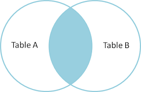
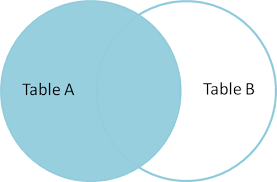
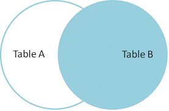
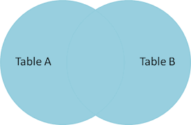

# SQL

<a href="#top" class="button">Go to top</a>

Table of Contents:
1. [Foundations](#foundations)

    Key words: SELECT, FROM, AS, LIMIT, DISTINCT, COUNT, MIN, MAX, AVG, SUM, WHERE, AND, OR, BETWEEN, IN, NULL, LIKE, SUM, AS, ORDER BY, GROUP BY, HAVING.
    

2. [Joins](#joins)

    Key words: INNER JOIN, LEFT JOIN, RIGHT JOIN, FULL JOIN, USING, INTO, CASE.
    
    
3. [Set Operations](#set-operations)

    Key words: UNION, UNION ALL, INTERSECTION, EXCEPT.


4. [Subqueries](#subqueries)

## FOUNDATIONS

*Data: Census data in U.S. states in 2000 and 2008* 


```python
import pandas as pd
import numpy as np
from sqlalchemy import create_engine
import matplotlib.pyplot as plt

engine = create_engine('sqlite:///census.sqlite')
print(engine.table_names())
```

    ['census', 'state_fact']


```python
pd.set_option('display.max_rows', 10)
```

**SELECT, FROM**


```python
pd.read_sql('SELECT * FROM census', engine)
```


<div>
<style>
    .dataframe thead tr:only-child th {
        text-align: right;
    }

    .dataframe thead th {
        text-align: left;
    }

    .dataframe tbody tr th {
        vertical-align: top;
    }
</style>
<table border="0" class="dataframe">
  <thead>
    <tr style="text-align: right;">
      <th></th>
      <th>state</th>
      <th>sex</th>
      <th>age</th>
      <th>pop2000</th>
      <th>pop2008</th>
    </tr>
  </thead>
  <tbody>
    <tr>
      <th>0</th>
      <td>Illinois</td>
      <td>M</td>
      <td>0</td>
      <td>89600</td>
      <td>95012</td>
    </tr>
    <tr>
      <th>1</th>
      <td>Illinois</td>
      <td>M</td>
      <td>1</td>
      <td>88445</td>
      <td>91829</td>
    </tr>
    <tr>
      <th>2</th>
      <td>Illinois</td>
      <td>M</td>
      <td>2</td>
      <td>88729</td>
      <td>89547</td>
    </tr>
    <tr>
      <th>3</th>
      <td>Illinois</td>
      <td>M</td>
      <td>3</td>
      <td>88868</td>
      <td>90037</td>
    </tr>
    <tr>
      <th>4</th>
      <td>Illinois</td>
      <td>M</td>
      <td>4</td>
      <td>91947</td>
      <td>91111</td>
    </tr>
    <tr>
      <th>...</th>
      <td>...</td>
      <td>...</td>
      <td>...</td>
      <td>...</td>
      <td>...</td>
    </tr>
    <tr>
      <th>8767</th>
      <td>Texas</td>
      <td>F</td>
      <td>81</td>
      <td>35378</td>
      <td>44418</td>
    </tr>
    <tr>
      <th>8768</th>
      <td>Texas</td>
      <td>F</td>
      <td>82</td>
      <td>33852</td>
      <td>41838</td>
    </tr>
    <tr>
      <th>8769</th>
      <td>Texas</td>
      <td>F</td>
      <td>83</td>
      <td>30076</td>
      <td>40489</td>
    </tr>
    <tr>
      <th>8770</th>
      <td>Texas</td>
      <td>F</td>
      <td>84</td>
      <td>27961</td>
      <td>36821</td>
    </tr>
    <tr>
      <th>8771</th>
      <td>Texas</td>
      <td>F</td>
      <td>85</td>
      <td>171538</td>
      <td>223439</td>
    </tr>
  </tbody>
</table>
<p>8772 rows × 5 columns</p>
</div>


```python
pd.read_sql('SELECT * FROM state_fact LIMIT 5', engine)
```


<div>
<style>
    .dataframe thead tr:only-child th {
        text-align: right;
    }

    .dataframe thead th {
        text-align: left;
    }

    .dataframe tbody tr th {
        vertical-align: top;
    }
</style>
<table border="0" class="dataframe">
  <thead>
    <tr style="text-align: right;">
      <th></th>
      <th>id</th>
      <th>name</th>
      <th>abbreviation</th>
      <th>country</th>
      <th>type</th>
      <th>sort</th>
      <th>status</th>
      <th>occupied</th>
      <th>notes</th>
      <th>fips_state</th>
      <th>assoc_press</th>
      <th>standard_federal_region</th>
      <th>census_region</th>
      <th>census_region_name</th>
      <th>census_division</th>
      <th>census_division_name</th>
      <th>circuit_court</th>
    </tr>
  </thead>
  <tbody>
    <tr>
      <th>0</th>
      <td>13</td>
      <td>Illinois</td>
      <td>IL</td>
      <td>USA</td>
      <td>state</td>
      <td>10</td>
      <td>current</td>
      <td>occupied</td>
      <td></td>
      <td>17</td>
      <td>Ill.</td>
      <td>V</td>
      <td>2</td>
      <td>Midwest</td>
      <td>3</td>
      <td>East North Central</td>
      <td>7</td>
    </tr>
    <tr>
      <th>1</th>
      <td>30</td>
      <td>New Jersey</td>
      <td>NJ</td>
      <td>USA</td>
      <td>state</td>
      <td>10</td>
      <td>current</td>
      <td>occupied</td>
      <td></td>
      <td>34</td>
      <td>N.J.</td>
      <td>II</td>
      <td>1</td>
      <td>Northeast</td>
      <td>2</td>
      <td>Mid-Atlantic</td>
      <td>3</td>
    </tr>
    <tr>
      <th>2</th>
      <td>34</td>
      <td>North Dakota</td>
      <td>ND</td>
      <td>USA</td>
      <td>state</td>
      <td>10</td>
      <td>current</td>
      <td>occupied</td>
      <td></td>
      <td>38</td>
      <td>N.D.</td>
      <td>VIII</td>
      <td>2</td>
      <td>Midwest</td>
      <td>4</td>
      <td>West North Central</td>
      <td>8</td>
    </tr>
    <tr>
      <th>3</th>
      <td>37</td>
      <td>Oregon</td>
      <td>OR</td>
      <td>USA</td>
      <td>state</td>
      <td>10</td>
      <td>current</td>
      <td>occupied</td>
      <td></td>
      <td>41</td>
      <td>Ore.</td>
      <td>X</td>
      <td>4</td>
      <td>West</td>
      <td>9</td>
      <td>Pacific</td>
      <td>9</td>
    </tr>
    <tr>
      <th>4</th>
      <td>51</td>
      <td>Washington DC</td>
      <td>DC</td>
      <td>USA</td>
      <td>capitol</td>
      <td>10</td>
      <td>current</td>
      <td>occupied</td>
      <td></td>
      <td>11</td>
      <td></td>
      <td>III</td>
      <td>3</td>
      <td>South</td>
      <td>5</td>
      <td>South Atlantic</td>
      <td>D.C.</td>
    </tr>
  </tbody>
</table>
</div>


**Select multiple columns**


```python
pd.read_sql('SELECT state, sex FROM census LIMIT 5', engine)
```


<div>
<style>
    .dataframe thead tr:only-child th {
        text-align: right;
    }

    .dataframe thead th {
        text-align: left;
    }

    .dataframe tbody tr th {
        vertical-align: top;
    }
</style>
<table border="0" class="dataframe">
  <thead>
    <tr style="text-align: right;">
      <th></th>
      <th>state</th>
      <th>sex</th>
    </tr>
  </thead>
  <tbody>
    <tr>
      <th>0</th>
      <td>Illinois</td>
      <td>M</td>
    </tr>
    <tr>
      <th>1</th>
      <td>Illinois</td>
      <td>M</td>
    </tr>
    <tr>
      <th>2</th>
      <td>Illinois</td>
      <td>M</td>
    </tr>
    <tr>
      <th>3</th>
      <td>Illinois</td>
      <td>M</td>
    </tr>
    <tr>
      <th>4</th>
      <td>Illinois</td>
      <td>M</td>
    </tr>
  </tbody>
</table>
</div>


**AS**


```python
pd.read_sql("SELECT 'Learning SQL, yay!' as example", engine)
```


<div>
<style>
    .dataframe thead tr:only-child th {
        text-align: right;
    }

    .dataframe thead th {
        text-align: left;
    }

    .dataframe tbody tr th {
        vertical-align: top;
    }
</style>
<table border="0" class="dataframe">
  <thead>
    <tr style="text-align: right;">
      <th></th>
      <th>example</th>
    </tr>
  </thead>
  <tbody>
    <tr>
      <th>0</th>
      <td>Learning SQL, yay!</td>
    </tr>
  </tbody>
</table>
</div>


```python
pd.read_sql("SELECT 10/3 as result", engine)
# outputs integer
```


<div>
<style>
    .dataframe thead tr:only-child th {
        text-align: right;
    }

    .dataframe thead th {
        text-align: left;
    }

    .dataframe tbody tr th {
        vertical-align: top;
    }
</style>
<table border="0" class="dataframe">
  <thead>
    <tr style="text-align: right;">
      <th></th>
      <th>result</th>
    </tr>
  </thead>
  <tbody>
    <tr>
      <th>0</th>
      <td>3</td>
    </tr>
  </tbody>
</table>
</div>


```python
pd.read_sql("SELECT 10/3. as result", engine)
# outputs float
```


<div>
<style>
    .dataframe thead tr:only-child th {
        text-align: right;
    }

    .dataframe thead th {
        text-align: left;
    }

    .dataframe tbody tr th {
        vertical-align: top;
    }
</style>
<table border="0" class="dataframe">
  <thead>
    <tr style="text-align: right;">
      <th></th>
      <th>result</th>
    </tr>
  </thead>
  <tbody>
    <tr>
      <th>0</th>
      <td>3.333333</td>
    </tr>
  </tbody>
</table>
</div>


**DISTINCT**


```python
pd.read_sql('SELECT DISTINCT state FROM census', engine)
```


<div>
<style>
    .dataframe thead tr:only-child th {
        text-align: right;
    }

    .dataframe thead th {
        text-align: left;
    }

    .dataframe tbody tr th {
        vertical-align: top;
    }
</style>
<table border="0" class="dataframe">
  <thead>
    <tr style="text-align: right;">
      <th></th>
      <th>state</th>
    </tr>
  </thead>
  <tbody>
    <tr>
      <th>0</th>
      <td>Illinois</td>
    </tr>
    <tr>
      <th>1</th>
      <td>New Jersey</td>
    </tr>
    <tr>
      <th>2</th>
      <td>District of Columbia</td>
    </tr>
    <tr>
      <th>3</th>
      <td>North Dakota</td>
    </tr>
    <tr>
      <th>4</th>
      <td>Florida</td>
    </tr>
    <tr>
      <th>...</th>
      <td>...</td>
    </tr>
    <tr>
      <th>46</th>
      <td>Mississippi</td>
    </tr>
    <tr>
      <th>47</th>
      <td>Oklahoma</td>
    </tr>
    <tr>
      <th>48</th>
      <td>New Mexico</td>
    </tr>
    <tr>
      <th>49</th>
      <td>Virginia</td>
    </tr>
    <tr>
      <th>50</th>
      <td>Texas</td>
    </tr>
  </tbody>
</table>
<p>51 rows × 1 columns</p>
</div>


**AGGREGATE FUNCTIONS: COUNT, MIN, MAX, AVG, SUM**


```python
pd.read_sql('SELECT COUNT(*) FROM census', engine)
```


<div>
<style>
    .dataframe thead tr:only-child th {
        text-align: right;
    }

    .dataframe thead th {
        text-align: left;
    }

    .dataframe tbody tr th {
        vertical-align: top;
    }
</style>
<table border="0" class="dataframe">
  <thead>
    <tr style="text-align: right;">
      <th></th>
      <th>COUNT(*)</th>
    </tr>
  </thead>
  <tbody>
    <tr>
      <th>0</th>
      <td>8772</td>
    </tr>
  </tbody>
</table>
</div>


```python
pd.read_sql('SELECT COUNT(DISTINCT state) FROM census', engine)
```


<div>
<style>
    .dataframe thead tr:only-child th {
        text-align: right;
    }

    .dataframe thead th {
        text-align: left;
    }

    .dataframe tbody tr th {
        vertical-align: top;
    }
</style>
<table border="0" class="dataframe">
  <thead>
    <tr style="text-align: right;">
      <th></th>
      <th>COUNT(DISTINCT state)</th>
    </tr>
  </thead>
  <tbody>
    <tr>
      <th>0</th>
      <td>51</td>
    </tr>
  </tbody>
</table>
</div>


```python
pd.read_sql("SELECT state, age, MAX(pop2000) FROM census", engine)
```


<div>
<style>
    .dataframe thead tr:only-child th {
        text-align: right;
    }

    .dataframe thead th {
        text-align: left;
    }

    .dataframe tbody tr th {
        vertical-align: top;
    }
</style>
<table border="0" class="dataframe">
  <thead>
    <tr style="text-align: right;">
      <th></th>
      <th>state</th>
      <th>age</th>
      <th>MAX(pop2000)</th>
    </tr>
  </thead>
  <tbody>
    <tr>
      <th>0</th>
      <td>California</td>
      <td>85</td>
      <td>294583</td>
    </tr>
  </tbody>
</table>
</div>


```python
pd.read_sql("SELECT state, age, MIN(pop2008) FROM census", engine)
```


<div>
<style>
    .dataframe thead tr:only-child th {
        text-align: right;
    }

    .dataframe thead th {
        text-align: left;
    }

    .dataframe tbody tr th {
        vertical-align: top;
    }
</style>
<table border="0" class="dataframe">
  <thead>
    <tr style="text-align: right;">
      <th></th>
      <th>state</th>
      <th>age</th>
      <th>MIN(pop2008)</th>
    </tr>
  </thead>
  <tbody>
    <tr>
      <th>0</th>
      <td>Alaska</td>
      <td>84</td>
      <td>391</td>
    </tr>
  </tbody>
</table>
</div>


**WHERE**


```python
pd.read_sql("SELECT * FROM census WHERE state = 'New York'", engine)
```


<div>
<style>
    .dataframe thead tr:only-child th {
        text-align: right;
    }

    .dataframe thead th {
        text-align: left;
    }

    .dataframe tbody tr th {
        vertical-align: top;
    }
</style>
<table border="0" class="dataframe">
  <thead>
    <tr style="text-align: right;">
      <th></th>
      <th>state</th>
      <th>sex</th>
      <th>age</th>
      <th>pop2000</th>
      <th>pop2008</th>
    </tr>
  </thead>
  <tbody>
    <tr>
      <th>0</th>
      <td>New York</td>
      <td>M</td>
      <td>0</td>
      <td>126237</td>
      <td>128088</td>
    </tr>
    <tr>
      <th>1</th>
      <td>New York</td>
      <td>M</td>
      <td>1</td>
      <td>124008</td>
      <td>125649</td>
    </tr>
    <tr>
      <th>2</th>
      <td>New York</td>
      <td>M</td>
      <td>2</td>
      <td>124725</td>
      <td>121615</td>
    </tr>
    <tr>
      <th>3</th>
      <td>New York</td>
      <td>M</td>
      <td>3</td>
      <td>126697</td>
      <td>120580</td>
    </tr>
    <tr>
      <th>4</th>
      <td>New York</td>
      <td>M</td>
      <td>4</td>
      <td>131357</td>
      <td>122482</td>
    </tr>
    <tr>
      <th>...</th>
      <td>...</td>
      <td>...</td>
      <td>...</td>
      <td>...</td>
      <td>...</td>
    </tr>
    <tr>
      <th>167</th>
      <td>New York</td>
      <td>F</td>
      <td>81</td>
      <td>46381</td>
      <td>50693</td>
    </tr>
    <tr>
      <th>168</th>
      <td>New York</td>
      <td>F</td>
      <td>82</td>
      <td>45599</td>
      <td>48206</td>
    </tr>
    <tr>
      <th>169</th>
      <td>New York</td>
      <td>F</td>
      <td>83</td>
      <td>40525</td>
      <td>47777</td>
    </tr>
    <tr>
      <th>170</th>
      <td>New York</td>
      <td>F</td>
      <td>84</td>
      <td>37436</td>
      <td>43454</td>
    </tr>
    <tr>
      <th>171</th>
      <td>New York</td>
      <td>F</td>
      <td>85</td>
      <td>226378</td>
      <td>273476</td>
    </tr>
  </tbody>
</table>
<p>172 rows × 5 columns</p>
</div>


**AND**


```python
pd.read_sql("SELECT * FROM census WHERE state = 'New York' AND age < 2", engine)
```


<div>
<style>
    .dataframe thead tr:only-child th {
        text-align: right;
    }

    .dataframe thead th {
        text-align: left;
    }

    .dataframe tbody tr th {
        vertical-align: top;
    }
</style>
<table border="0" class="dataframe">
  <thead>
    <tr style="text-align: right;">
      <th></th>
      <th>state</th>
      <th>sex</th>
      <th>age</th>
      <th>pop2000</th>
      <th>pop2008</th>
    </tr>
  </thead>
  <tbody>
    <tr>
      <th>0</th>
      <td>New York</td>
      <td>M</td>
      <td>0</td>
      <td>126237</td>
      <td>128088</td>
    </tr>
    <tr>
      <th>1</th>
      <td>New York</td>
      <td>M</td>
      <td>1</td>
      <td>124008</td>
      <td>125649</td>
    </tr>
    <tr>
      <th>2</th>
      <td>New York</td>
      <td>F</td>
      <td>0</td>
      <td>120355</td>
      <td>122194</td>
    </tr>
    <tr>
      <th>3</th>
      <td>New York</td>
      <td>F</td>
      <td>1</td>
      <td>118219</td>
      <td>119661</td>
    </tr>
  </tbody>
</table>
</div>


**OR**


```python
pd.read_sql("SELECT * FROM census\
             WHERE (state = 'New York' OR state = 'New Jersey')\
             AND (age < 3 OR age > 83)"\
            , engine)
```


<div>
<style>
    .dataframe thead tr:only-child th {
        text-align: right;
    }

    .dataframe thead th {
        text-align: left;
    }

    .dataframe tbody tr th {
        vertical-align: top;
    }
</style>
<table border="0" class="dataframe">
  <thead>
    <tr style="text-align: right;">
      <th></th>
      <th>state</th>
      <th>sex</th>
      <th>age</th>
      <th>pop2000</th>
      <th>pop2008</th>
    </tr>
  </thead>
  <tbody>
    <tr>
      <th>0</th>
      <td>New Jersey</td>
      <td>M</td>
      <td>0</td>
      <td>56983</td>
      <td>58756</td>
    </tr>
    <tr>
      <th>1</th>
      <td>New Jersey</td>
      <td>M</td>
      <td>1</td>
      <td>56686</td>
      <td>57325</td>
    </tr>
    <tr>
      <th>2</th>
      <td>New Jersey</td>
      <td>M</td>
      <td>2</td>
      <td>57011</td>
      <td>55475</td>
    </tr>
    <tr>
      <th>3</th>
      <td>New Jersey</td>
      <td>M</td>
      <td>84</td>
      <td>8864</td>
      <td>10759</td>
    </tr>
    <tr>
      <th>4</th>
      <td>New Jersey</td>
      <td>M</td>
      <td>85</td>
      <td>39309</td>
      <td>54920</td>
    </tr>
    <tr>
      <th>...</th>
      <td>...</td>
      <td>...</td>
      <td>...</td>
      <td>...</td>
      <td>...</td>
    </tr>
    <tr>
      <th>15</th>
      <td>New York</td>
      <td>F</td>
      <td>0</td>
      <td>120355</td>
      <td>122194</td>
    </tr>
    <tr>
      <th>16</th>
      <td>New York</td>
      <td>F</td>
      <td>1</td>
      <td>118219</td>
      <td>119661</td>
    </tr>
    <tr>
      <th>17</th>
      <td>New York</td>
      <td>F</td>
      <td>2</td>
      <td>119577</td>
      <td>116413</td>
    </tr>
    <tr>
      <th>18</th>
      <td>New York</td>
      <td>F</td>
      <td>84</td>
      <td>37436</td>
      <td>43454</td>
    </tr>
    <tr>
      <th>19</th>
      <td>New York</td>
      <td>F</td>
      <td>85</td>
      <td>226378</td>
      <td>273476</td>
    </tr>
  </tbody>
</table>
<p>20 rows × 5 columns</p>
</div>


**BETWEEN**


```python
pd.read_sql("SELECT * FROM census\
             WHERE age BETWEEN 10 and 13"\
            , engine)
```


<div>
<style>
    .dataframe thead tr:only-child th {
        text-align: right;
    }

    .dataframe thead th {
        text-align: left;
    }

    .dataframe tbody tr th {
        vertical-align: top;
    }
</style>
<table border="0" class="dataframe">
  <thead>
    <tr style="text-align: right;">
      <th></th>
      <th>state</th>
      <th>sex</th>
      <th>age</th>
      <th>pop2000</th>
      <th>pop2008</th>
    </tr>
  </thead>
  <tbody>
    <tr>
      <th>0</th>
      <td>Illinois</td>
      <td>M</td>
      <td>10</td>
      <td>97280</td>
      <td>86565</td>
    </tr>
    <tr>
      <th>1</th>
      <td>Illinois</td>
      <td>M</td>
      <td>11</td>
      <td>94029</td>
      <td>86606</td>
    </tr>
    <tr>
      <th>2</th>
      <td>Illinois</td>
      <td>M</td>
      <td>12</td>
      <td>92402</td>
      <td>89596</td>
    </tr>
    <tr>
      <th>3</th>
      <td>Illinois</td>
      <td>M</td>
      <td>13</td>
      <td>89926</td>
      <td>91661</td>
    </tr>
    <tr>
      <th>4</th>
      <td>Illinois</td>
      <td>F</td>
      <td>10</td>
      <td>93569</td>
      <td>82662</td>
    </tr>
    <tr>
      <th>...</th>
      <td>...</td>
      <td>...</td>
      <td>...</td>
      <td>...</td>
      <td>...</td>
    </tr>
    <tr>
      <th>403</th>
      <td>Texas</td>
      <td>M</td>
      <td>13</td>
      <td>166014</td>
      <td>179420</td>
    </tr>
    <tr>
      <th>404</th>
      <td>Texas</td>
      <td>F</td>
      <td>10</td>
      <td>165717</td>
      <td>170182</td>
    </tr>
    <tr>
      <th>405</th>
      <td>Texas</td>
      <td>F</td>
      <td>11</td>
      <td>160176</td>
      <td>170273</td>
    </tr>
    <tr>
      <th>406</th>
      <td>Texas</td>
      <td>F</td>
      <td>12</td>
      <td>159167</td>
      <td>171119</td>
    </tr>
    <tr>
      <th>407</th>
      <td>Texas</td>
      <td>F</td>
      <td>13</td>
      <td>158693</td>
      <td>170903</td>
    </tr>
  </tbody>
</table>
<p>408 rows × 5 columns</p>
</div>


**IN**


```python
pd.read_sql("SELECT * FROM census\
             WHERE state IN ('New York','New Jersey','Pennsylvania') and age = 0"\
            , engine)
```


<div>
<style>
    .dataframe thead tr:only-child th {
        text-align: right;
    }

    .dataframe thead th {
        text-align: left;
    }

    .dataframe tbody tr th {
        vertical-align: top;
    }
</style>
<table border="0" class="dataframe">
  <thead>
    <tr style="text-align: right;">
      <th></th>
      <th>state</th>
      <th>sex</th>
      <th>age</th>
      <th>pop2000</th>
      <th>pop2008</th>
    </tr>
  </thead>
  <tbody>
    <tr>
      <th>0</th>
      <td>New Jersey</td>
      <td>M</td>
      <td>0</td>
      <td>56983</td>
      <td>58756</td>
    </tr>
    <tr>
      <th>1</th>
      <td>New Jersey</td>
      <td>F</td>
      <td>0</td>
      <td>54679</td>
      <td>55841</td>
    </tr>
    <tr>
      <th>2</th>
      <td>Pennsylvania</td>
      <td>M</td>
      <td>0</td>
      <td>72831</td>
      <td>76215</td>
    </tr>
    <tr>
      <th>3</th>
      <td>Pennsylvania</td>
      <td>F</td>
      <td>0</td>
      <td>69756</td>
      <td>72697</td>
    </tr>
    <tr>
      <th>4</th>
      <td>New York</td>
      <td>M</td>
      <td>0</td>
      <td>126237</td>
      <td>128088</td>
    </tr>
    <tr>
      <th>5</th>
      <td>New York</td>
      <td>F</td>
      <td>0</td>
      <td>120355</td>
      <td>122194</td>
    </tr>
  </tbody>
</table>
</div>


**NULL**


```python
pd.read_sql("SELECT * FROM state_fact \
             WHERE notes IS NOT NULL"
            , engine)
# there are empty values but not null values
```


<div>
<style>
    .dataframe thead tr:only-child th {
        text-align: right;
    }

    .dataframe thead th {
        text-align: left;
    }

    .dataframe tbody tr th {
        vertical-align: top;
    }
</style>
<table border="0" class="dataframe">
  <thead>
    <tr style="text-align: right;">
      <th></th>
      <th>id</th>
      <th>name</th>
      <th>abbreviation</th>
      <th>country</th>
      <th>type</th>
      <th>sort</th>
      <th>status</th>
      <th>occupied</th>
      <th>notes</th>
      <th>fips_state</th>
      <th>assoc_press</th>
      <th>standard_federal_region</th>
      <th>census_region</th>
      <th>census_region_name</th>
      <th>census_division</th>
      <th>census_division_name</th>
      <th>circuit_court</th>
    </tr>
  </thead>
  <tbody>
    <tr>
      <th>0</th>
      <td>13</td>
      <td>Illinois</td>
      <td>IL</td>
      <td>USA</td>
      <td>state</td>
      <td>10</td>
      <td>current</td>
      <td>occupied</td>
      <td></td>
      <td>17</td>
      <td>Ill.</td>
      <td>V</td>
      <td>2</td>
      <td>Midwest</td>
      <td>3</td>
      <td>East North Central</td>
      <td>7</td>
    </tr>
    <tr>
      <th>1</th>
      <td>30</td>
      <td>New Jersey</td>
      <td>NJ</td>
      <td>USA</td>
      <td>state</td>
      <td>10</td>
      <td>current</td>
      <td>occupied</td>
      <td></td>
      <td>34</td>
      <td>N.J.</td>
      <td>II</td>
      <td>1</td>
      <td>Northeast</td>
      <td>2</td>
      <td>Mid-Atlantic</td>
      <td>3</td>
    </tr>
    <tr>
      <th>2</th>
      <td>34</td>
      <td>North Dakota</td>
      <td>ND</td>
      <td>USA</td>
      <td>state</td>
      <td>10</td>
      <td>current</td>
      <td>occupied</td>
      <td></td>
      <td>38</td>
      <td>N.D.</td>
      <td>VIII</td>
      <td>2</td>
      <td>Midwest</td>
      <td>4</td>
      <td>West North Central</td>
      <td>8</td>
    </tr>
    <tr>
      <th>3</th>
      <td>37</td>
      <td>Oregon</td>
      <td>OR</td>
      <td>USA</td>
      <td>state</td>
      <td>10</td>
      <td>current</td>
      <td>occupied</td>
      <td></td>
      <td>41</td>
      <td>Ore.</td>
      <td>X</td>
      <td>4</td>
      <td>West</td>
      <td>9</td>
      <td>Pacific</td>
      <td>9</td>
    </tr>
    <tr>
      <th>4</th>
      <td>51</td>
      <td>Washington DC</td>
      <td>DC</td>
      <td>USA</td>
      <td>capitol</td>
      <td>10</td>
      <td>current</td>
      <td>occupied</td>
      <td></td>
      <td>11</td>
      <td></td>
      <td>III</td>
      <td>3</td>
      <td>South</td>
      <td>5</td>
      <td>South Atlantic</td>
      <td>D.C.</td>
    </tr>
    <tr>
      <th>...</th>
      <td>...</td>
      <td>...</td>
      <td>...</td>
      <td>...</td>
      <td>...</td>
      <td>...</td>
      <td>...</td>
      <td>...</td>
      <td>...</td>
      <td>...</td>
      <td>...</td>
      <td>...</td>
      <td>...</td>
      <td>...</td>
      <td>...</td>
      <td>...</td>
      <td>...</td>
    </tr>
    <tr>
      <th>46</th>
      <td>1</td>
      <td>Alabama</td>
      <td>AL</td>
      <td>USA</td>
      <td>state</td>
      <td>10</td>
      <td>current</td>
      <td>occupied</td>
      <td></td>
      <td>1</td>
      <td>Ala.</td>
      <td>IV</td>
      <td>3</td>
      <td>South</td>
      <td>6</td>
      <td>East South Central</td>
      <td>11</td>
    </tr>
    <tr>
      <th>47</th>
      <td>23</td>
      <td>Minnesota</td>
      <td>MN</td>
      <td>USA</td>
      <td>state</td>
      <td>10</td>
      <td>current</td>
      <td>occupied</td>
      <td></td>
      <td>27</td>
      <td>Minn.</td>
      <td>V</td>
      <td>2</td>
      <td>Midwest</td>
      <td>4</td>
      <td>West North Central</td>
      <td>8</td>
    </tr>
    <tr>
      <th>48</th>
      <td>32</td>
      <td>New York</td>
      <td>NY</td>
      <td>USA</td>
      <td>state</td>
      <td>10</td>
      <td>current</td>
      <td>occupied</td>
      <td></td>
      <td>36</td>
      <td>N.Y.</td>
      <td>II</td>
      <td>1</td>
      <td>Northeast</td>
      <td>2</td>
      <td>Mid-Atlantic</td>
      <td>2</td>
    </tr>
    <tr>
      <th>49</th>
      <td>44</td>
      <td>Utah</td>
      <td>UT</td>
      <td>USA</td>
      <td>state</td>
      <td>10</td>
      <td>current</td>
      <td>occupied</td>
      <td></td>
      <td>49</td>
      <td>Utah</td>
      <td>VIII</td>
      <td>4</td>
      <td>West</td>
      <td>8</td>
      <td>Mountain</td>
      <td>10</td>
    </tr>
    <tr>
      <th>50</th>
      <td>48</td>
      <td>West Virginia</td>
      <td>WV</td>
      <td>USA</td>
      <td>state</td>
      <td>10</td>
      <td>current</td>
      <td>occupied</td>
      <td></td>
      <td>54</td>
      <td>W.Va.</td>
      <td>III</td>
      <td>3</td>
      <td>South</td>
      <td>5</td>
      <td>South Atlantic</td>
      <td>4</td>
    </tr>
  </tbody>
</table>
<p>51 rows × 17 columns</p>
</div>


**LIKE**


```python
pd.read_sql("SELECT * FROM state_fact \
             WHERE name LIKE 'New%'"   # wildcar characters: % (0 or many characters), _ (1 character)
            , engine)
# there are empty values but not null values
```


<div>
<style>
    .dataframe thead tr:only-child th {
        text-align: right;
    }

    .dataframe thead th {
        text-align: left;
    }

    .dataframe tbody tr th {
        vertical-align: top;
    }
</style>
<table border="0" class="dataframe">
  <thead>
    <tr style="text-align: right;">
      <th></th>
      <th>id</th>
      <th>name</th>
      <th>abbreviation</th>
      <th>country</th>
      <th>type</th>
      <th>sort</th>
      <th>status</th>
      <th>occupied</th>
      <th>notes</th>
      <th>fips_state</th>
      <th>assoc_press</th>
      <th>standard_federal_region</th>
      <th>census_region</th>
      <th>census_region_name</th>
      <th>census_division</th>
      <th>census_division_name</th>
      <th>circuit_court</th>
    </tr>
  </thead>
  <tbody>
    <tr>
      <th>0</th>
      <td>30</td>
      <td>New Jersey</td>
      <td>NJ</td>
      <td>USA</td>
      <td>state</td>
      <td>10</td>
      <td>current</td>
      <td>occupied</td>
      <td></td>
      <td>34</td>
      <td>N.J.</td>
      <td>II</td>
      <td>1</td>
      <td>Northeast</td>
      <td>2</td>
      <td>Mid-Atlantic</td>
      <td>3</td>
    </tr>
    <tr>
      <th>1</th>
      <td>29</td>
      <td>New Hampshire</td>
      <td>NH</td>
      <td>USA</td>
      <td>state</td>
      <td>10</td>
      <td>current</td>
      <td>occupied</td>
      <td></td>
      <td>33</td>
      <td>N.H.</td>
      <td>I</td>
      <td>1</td>
      <td>Northeast</td>
      <td>1</td>
      <td>New England</td>
      <td>1</td>
    </tr>
    <tr>
      <th>2</th>
      <td>31</td>
      <td>New Mexico</td>
      <td>NM</td>
      <td>USA</td>
      <td>state</td>
      <td>10</td>
      <td>current</td>
      <td>occupied</td>
      <td></td>
      <td>35</td>
      <td>N.M.</td>
      <td>VI</td>
      <td>4</td>
      <td>West</td>
      <td>8</td>
      <td>Mountain</td>
      <td>10</td>
    </tr>
    <tr>
      <th>3</th>
      <td>32</td>
      <td>New York</td>
      <td>NY</td>
      <td>USA</td>
      <td>state</td>
      <td>10</td>
      <td>current</td>
      <td>occupied</td>
      <td></td>
      <td>36</td>
      <td>N.Y.</td>
      <td>II</td>
      <td>1</td>
      <td>Northeast</td>
      <td>2</td>
      <td>Mid-Atlantic</td>
      <td>2</td>
    </tr>
  </tbody>
</table>
</div>


**AS**


```python
pd.read_sql("SELECT SUM(pop2000/1e6) as 'pop2000 in millions' , SUM(pop2008/1e6) as 'pop2008 in millions' \
             FROM census \
             WHERE state == 'New York'"   
            , engine)
```


<div>
<style>
    .dataframe thead tr:only-child th {
        text-align: right;
    }

    .dataframe thead th {
        text-align: left;
    }

    .dataframe tbody tr th {
        vertical-align: top;
    }
</style>
<table border="0" class="dataframe">
  <thead>
    <tr style="text-align: right;">
      <th></th>
      <th>pop2000 in millions</th>
      <th>pop2008 in millions</th>
    </tr>
  </thead>
  <tbody>
    <tr>
      <th>0</th>
      <td>18.978668</td>
      <td>19.465159</td>
    </tr>
  </tbody>
</table>
</div>


**ORDER BY (DESC)**


```python
pd.read_sql("SELECT * FROM census \
             ORDER BY pop2008 DESC"   
            , engine)
```


<div>
<style>
    .dataframe thead tr:only-child th {
        text-align: right;
    }

    .dataframe thead th {
        text-align: left;
    }

    .dataframe tbody tr th {
        vertical-align: top;
    }
</style>
<table border="0" class="dataframe">
  <thead>
    <tr style="text-align: right;">
      <th></th>
      <th>state</th>
      <th>sex</th>
      <th>age</th>
      <th>pop2000</th>
      <th>pop2008</th>
    </tr>
  </thead>
  <tbody>
    <tr>
      <th>0</th>
      <td>California</td>
      <td>F</td>
      <td>85</td>
      <td>294583</td>
      <td>400288</td>
    </tr>
    <tr>
      <th>1</th>
      <td>Florida</td>
      <td>F</td>
      <td>85</td>
      <td>221202</td>
      <td>322186</td>
    </tr>
    <tr>
      <th>2</th>
      <td>California</td>
      <td>M</td>
      <td>18</td>
      <td>252607</td>
      <td>294734</td>
    </tr>
    <tr>
      <th>3</th>
      <td>California</td>
      <td>M</td>
      <td>38</td>
      <td>281214</td>
      <td>292730</td>
    </tr>
    <tr>
      <th>4</th>
      <td>California</td>
      <td>M</td>
      <td>25</td>
      <td>250964</td>
      <td>290319</td>
    </tr>
    <tr>
      <th>...</th>
      <td>...</td>
      <td>...</td>
      <td>...</td>
      <td>...</td>
      <td>...</td>
    </tr>
    <tr>
      <th>8767</th>
      <td>Alaska</td>
      <td>M</td>
      <td>81</td>
      <td>350</td>
      <td>568</td>
    </tr>
    <tr>
      <th>8768</th>
      <td>Alaska</td>
      <td>F</td>
      <td>84</td>
      <td>362</td>
      <td>519</td>
    </tr>
    <tr>
      <th>8769</th>
      <td>Alaska</td>
      <td>M</td>
      <td>82</td>
      <td>310</td>
      <td>469</td>
    </tr>
    <tr>
      <th>8770</th>
      <td>Alaska</td>
      <td>M</td>
      <td>83</td>
      <td>236</td>
      <td>424</td>
    </tr>
    <tr>
      <th>8771</th>
      <td>Alaska</td>
      <td>M</td>
      <td>84</td>
      <td>217</td>
      <td>391</td>
    </tr>
  </tbody>
</table>
<p>8772 rows × 5 columns</p>
</div>


**GROUP BY**


```python
pd.read_sql("SELECT state, SUM(pop2000), SUM(pop2008) FROM census \
             GROUP BY state\
             ORDER BY SUM(pop2008) DESC"
            , engine)
```


<div>
<style>
    .dataframe thead tr:only-child th {
        text-align: right;
    }

    .dataframe thead th {
        text-align: left;
    }

    .dataframe tbody tr th {
        vertical-align: top;
    }
</style>
<table border="0" class="dataframe">
  <thead>
    <tr style="text-align: right;">
      <th></th>
      <th>state</th>
      <th>SUM(pop2000)</th>
      <th>SUM(pop2008)</th>
    </tr>
  </thead>
  <tbody>
    <tr>
      <th>0</th>
      <td>California</td>
      <td>33829442</td>
      <td>36609002</td>
    </tr>
    <tr>
      <th>1</th>
      <td>Texas</td>
      <td>20830810</td>
      <td>24214127</td>
    </tr>
    <tr>
      <th>2</th>
      <td>New York</td>
      <td>18978668</td>
      <td>19465159</td>
    </tr>
    <tr>
      <th>3</th>
      <td>Florida</td>
      <td>15976093</td>
      <td>18257662</td>
    </tr>
    <tr>
      <th>4</th>
      <td>Illinois</td>
      <td>12405300</td>
      <td>12867077</td>
    </tr>
    <tr>
      <th>...</th>
      <td>...</td>
      <td>...</td>
      <td>...</td>
    </tr>
    <tr>
      <th>46</th>
      <td>Alaska</td>
      <td>608588</td>
      <td>664546</td>
    </tr>
    <tr>
      <th>47</th>
      <td>North Dakota</td>
      <td>633621</td>
      <td>634282</td>
    </tr>
    <tr>
      <th>48</th>
      <td>Vermont</td>
      <td>609480</td>
      <td>620602</td>
    </tr>
    <tr>
      <th>49</th>
      <td>District of Columbia</td>
      <td>568103</td>
      <td>588910</td>
    </tr>
    <tr>
      <th>50</th>
      <td>Wyoming</td>
      <td>490336</td>
      <td>529490</td>
    </tr>
  </tbody>
</table>
<p>51 rows × 3 columns</p>
</div>


**HAVING**

Aggregate functions can't be used in WHERE clauses, for that we have HAVING


```python
pd.read_sql("SELECT state, SUM(pop2000), SUM(pop2008) FROM census \
             GROUP BY state\
             HAVING SUM(pop2000)>20e6\
             ORDER BY SUM(pop2008) DESC"
            , engine)
```


<div>
<style>
    .dataframe thead tr:only-child th {
        text-align: right;
    }

    .dataframe thead th {
        text-align: left;
    }

    .dataframe tbody tr th {
        vertical-align: top;
    }
</style>
<table border="0" class="dataframe">
  <thead>
    <tr style="text-align: right;">
      <th></th>
      <th>state</th>
      <th>SUM(pop2000)</th>
      <th>SUM(pop2008)</th>
    </tr>
  </thead>
  <tbody>
    <tr>
      <th>0</th>
      <td>California</td>
      <td>33829442</td>
      <td>36609002</td>
    </tr>
    <tr>
      <th>1</th>
      <td>Texas</td>
      <td>20830810</td>
      <td>24214127</td>
    </tr>
  </tbody>
</table>
</div>


## JOINS

*Data: COUNTRIES database containing information about the most populous world cities as well as country-level economic data, population data, and geographic data.* (PostgreSQL)


```python
import psycopg2

conn = psycopg2.connect("dbname='leaders_db' user='mari' password='cosmo'")
```


```python
engine2 = create_engine('postgresql+psycopg2://mari@localhost/countries_db')
engine2.table_names()
```


    ['cities',
     'countries',
     'languages',
     'economies',
     'currencies',
     'populations',
     'countries_plus',
     'economies2010',
     'economies2015']


```python
pd.read_sql('SELECT * FROM cities', engine2)
```


<div>
<style>
    .dataframe thead tr:only-child th {
        text-align: right;
    }

    .dataframe thead th {
        text-align: left;
    }

    .dataframe tbody tr th {
        vertical-align: top;
    }
</style>
<table border="0" class="dataframe">
  <thead>
    <tr style="text-align: right;">
      <th></th>
      <th>name</th>
      <th>country_code</th>
      <th>city_proper_pop</th>
      <th>metroarea_pop</th>
      <th>urbanarea_pop</th>
    </tr>
  </thead>
  <tbody>
    <tr>
      <th>0</th>
      <td>Abidjan</td>
      <td>CIV</td>
      <td>4765000.0</td>
      <td>NaN</td>
      <td>4765000.0</td>
    </tr>
    <tr>
      <th>1</th>
      <td>Abu Dhabi</td>
      <td>ARE</td>
      <td>1145000.0</td>
      <td>NaN</td>
      <td>1145000.0</td>
    </tr>
    <tr>
      <th>2</th>
      <td>Abuja</td>
      <td>NGA</td>
      <td>1235880.0</td>
      <td>6000000.0</td>
      <td>1235880.0</td>
    </tr>
    <tr>
      <th>3</th>
      <td>Accra</td>
      <td>GHA</td>
      <td>2070460.0</td>
      <td>4010050.0</td>
      <td>2070460.0</td>
    </tr>
    <tr>
      <th>4</th>
      <td>Addis Ababa</td>
      <td>ETH</td>
      <td>3103670.0</td>
      <td>4567860.0</td>
      <td>3103670.0</td>
    </tr>
    <tr>
      <th>...</th>
      <td>...</td>
      <td>...</td>
      <td>...</td>
      <td>...</td>
      <td>...</td>
    </tr>
    <tr>
      <th>231</th>
      <td>Yerevan</td>
      <td>ARM</td>
      <td>1060140.0</td>
      <td>NaN</td>
      <td>1060140.0</td>
    </tr>
    <tr>
      <th>232</th>
      <td>Yokohama</td>
      <td>JPN</td>
      <td>3726170.0</td>
      <td>NaN</td>
      <td>3726170.0</td>
    </tr>
    <tr>
      <th>233</th>
      <td>Zhengzhou</td>
      <td>CHN</td>
      <td>4122090.0</td>
      <td>NaN</td>
      <td>4122090.0</td>
    </tr>
    <tr>
      <th>234</th>
      <td>Zhongshan</td>
      <td>CHN</td>
      <td>3121280.0</td>
      <td>NaN</td>
      <td>3121280.0</td>
    </tr>
    <tr>
      <th>235</th>
      <td>Zunyi</td>
      <td>CHN</td>
      <td>6127010.0</td>
      <td>NaN</td>
      <td>6127010.0</td>
    </tr>
  </tbody>
</table>
<p>236 rows × 5 columns</p>
</div>


```python
pd.read_sql('SELECT * FROM countries', engine2)
```


<div>
<style>
    .dataframe thead tr:only-child th {
        text-align: right;
    }

    .dataframe thead th {
        text-align: left;
    }

    .dataframe tbody tr th {
        vertical-align: top;
    }
</style>
<table border="0" class="dataframe">
  <thead>
    <tr style="text-align: right;">
      <th></th>
      <th>code</th>
      <th>name</th>
      <th>continent</th>
      <th>region</th>
      <th>surface_area</th>
      <th>indep_year</th>
      <th>local_name</th>
      <th>gov_form</th>
      <th>capital</th>
      <th>cap_long</th>
      <th>cap_lat</th>
    </tr>
  </thead>
  <tbody>
    <tr>
      <th>0</th>
      <td>AFG</td>
      <td>Afghanistan</td>
      <td>Asia</td>
      <td>Southern and Central Asia</td>
      <td>652090.0</td>
      <td>1919.0</td>
      <td>Afganistan/Afqanestan</td>
      <td>Islamic Emirate</td>
      <td>Kabul</td>
      <td>69.17610</td>
      <td>34.5228</td>
    </tr>
    <tr>
      <th>1</th>
      <td>NLD</td>
      <td>Netherlands</td>
      <td>Europe</td>
      <td>Western Europe</td>
      <td>41526.0</td>
      <td>1581.0</td>
      <td>Nederland</td>
      <td>Constitutional Monarchy</td>
      <td>Amsterdam</td>
      <td>4.89095</td>
      <td>52.3738</td>
    </tr>
    <tr>
      <th>2</th>
      <td>ALB</td>
      <td>Albania</td>
      <td>Europe</td>
      <td>Southern Europe</td>
      <td>28748.0</td>
      <td>1912.0</td>
      <td>Shqiperia</td>
      <td>Republic</td>
      <td>Tirane</td>
      <td>19.81720</td>
      <td>41.3317</td>
    </tr>
    <tr>
      <th>3</th>
      <td>DZA</td>
      <td>Algeria</td>
      <td>Africa</td>
      <td>Northern Africa</td>
      <td>2381740.0</td>
      <td>1962.0</td>
      <td>Al-Jaza’ir/Algerie</td>
      <td>Republic</td>
      <td>Algiers</td>
      <td>3.05097</td>
      <td>36.7397</td>
    </tr>
    <tr>
      <th>4</th>
      <td>ASM</td>
      <td>American Samoa</td>
      <td>Oceania</td>
      <td>Polynesia</td>
      <td>199.0</td>
      <td>NaN</td>
      <td>Amerika Samoa</td>
      <td>US Territory</td>
      <td>Pago Pago</td>
      <td>-170.69100</td>
      <td>-14.2846</td>
    </tr>
    <tr>
      <th>...</th>
      <td>...</td>
      <td>...</td>
      <td>...</td>
      <td>...</td>
      <td>...</td>
      <td>...</td>
      <td>...</td>
      <td>...</td>
      <td>...</td>
      <td>...</td>
      <td>...</td>
    </tr>
    <tr>
      <th>201</th>
      <td>EST</td>
      <td>Estonia</td>
      <td>Europe</td>
      <td>Baltic Countries</td>
      <td>45227.0</td>
      <td>1991.0</td>
      <td>Eesti</td>
      <td>Republic</td>
      <td>Tallinn</td>
      <td>24.75860</td>
      <td>59.4392</td>
    </tr>
    <tr>
      <th>202</th>
      <td>USA</td>
      <td>United States</td>
      <td>North America</td>
      <td>North America</td>
      <td>9363520.0</td>
      <td>1776.0</td>
      <td>United States</td>
      <td>Federal Republic</td>
      <td>Washington D.C.</td>
      <td>-77.03200</td>
      <td>38.8895</td>
    </tr>
    <tr>
      <th>203</th>
      <td>VIR</td>
      <td>Virgin Islands, U.S.</td>
      <td>North America</td>
      <td>Caribbean</td>
      <td>347.0</td>
      <td>NaN</td>
      <td>Virgin Islands of the United States</td>
      <td>US Territory</td>
      <td>Charlotte Amalie</td>
      <td>-64.89630</td>
      <td>18.3358</td>
    </tr>
    <tr>
      <th>204</th>
      <td>ZWE</td>
      <td>Zimbabwe</td>
      <td>Africa</td>
      <td>Eastern Africa</td>
      <td>390757.0</td>
      <td>1980.0</td>
      <td>Zimbabwe</td>
      <td>Republic</td>
      <td>Harare</td>
      <td>31.06720</td>
      <td>-17.8312</td>
    </tr>
    <tr>
      <th>205</th>
      <td>PSE</td>
      <td>Palestine</td>
      <td>Asia</td>
      <td>Middle East</td>
      <td>6257.0</td>
      <td>NaN</td>
      <td>Filastin</td>
      <td>Autonomous Area</td>
      <td>None</td>
      <td>NaN</td>
      <td>NaN</td>
    </tr>
  </tbody>
</table>
<p>206 rows × 11 columns</p>
</div>


```python
pd.read_sql('SELECT * FROM economies', engine2)
```


<div>
<style>
    .dataframe thead tr:only-child th {
        text-align: right;
    }

    .dataframe thead th {
        text-align: left;
    }

    .dataframe tbody tr th {
        vertical-align: top;
    }
</style>
<table border="0" class="dataframe">
  <thead>
    <tr style="text-align: right;">
      <th></th>
      <th>econ_id</th>
      <th>code</th>
      <th>year</th>
      <th>income_group</th>
      <th>gdp_percapita</th>
      <th>gross_savings</th>
      <th>inflation_rate</th>
      <th>total_investment</th>
      <th>unemployment_rate</th>
      <th>exports</th>
      <th>imports</th>
    </tr>
  </thead>
  <tbody>
    <tr>
      <th>0</th>
      <td>1</td>
      <td>AFG</td>
      <td>2010</td>
      <td>Low income</td>
      <td>539.667</td>
      <td>37.133</td>
      <td>2.179</td>
      <td>30.402</td>
      <td>NaN</td>
      <td>46.394</td>
      <td>24.381</td>
    </tr>
    <tr>
      <th>1</th>
      <td>2</td>
      <td>AFG</td>
      <td>2015</td>
      <td>Low income</td>
      <td>615.091</td>
      <td>21.466</td>
      <td>-1.549</td>
      <td>18.602</td>
      <td>NaN</td>
      <td>-49.110</td>
      <td>-7.294</td>
    </tr>
    <tr>
      <th>2</th>
      <td>3</td>
      <td>AGO</td>
      <td>2010</td>
      <td>Upper middle income</td>
      <td>3599.270</td>
      <td>23.534</td>
      <td>14.480</td>
      <td>14.433</td>
      <td>NaN</td>
      <td>-3.266</td>
      <td>-21.076</td>
    </tr>
    <tr>
      <th>3</th>
      <td>4</td>
      <td>AGO</td>
      <td>2015</td>
      <td>Upper middle income</td>
      <td>3876.200</td>
      <td>-0.425</td>
      <td>10.287</td>
      <td>9.552</td>
      <td>NaN</td>
      <td>6.721</td>
      <td>-21.778</td>
    </tr>
    <tr>
      <th>4</th>
      <td>5</td>
      <td>ALB</td>
      <td>2010</td>
      <td>Upper middle income</td>
      <td>4098.130</td>
      <td>20.011</td>
      <td>3.605</td>
      <td>31.305</td>
      <td>14.00</td>
      <td>10.645</td>
      <td>-8.013</td>
    </tr>
    <tr>
      <th>...</th>
      <td>...</td>
      <td>...</td>
      <td>...</td>
      <td>...</td>
      <td>...</td>
      <td>...</td>
      <td>...</td>
      <td>...</td>
      <td>...</td>
      <td>...</td>
      <td>...</td>
    </tr>
    <tr>
      <th>375</th>
      <td>376</td>
      <td>ZAF</td>
      <td>2015</td>
      <td>Upper middle income</td>
      <td>5721.150</td>
      <td>16.460</td>
      <td>4.575</td>
      <td>20.892</td>
      <td>25.35</td>
      <td>3.858</td>
      <td>5.367</td>
    </tr>
    <tr>
      <th>376</th>
      <td>377</td>
      <td>ZMB</td>
      <td>2010</td>
      <td>Lower middle income</td>
      <td>1456.160</td>
      <td>37.404</td>
      <td>8.500</td>
      <td>29.878</td>
      <td>NaN</td>
      <td>20.521</td>
      <td>32.638</td>
    </tr>
    <tr>
      <th>377</th>
      <td>378</td>
      <td>ZMB</td>
      <td>2015</td>
      <td>Lower middle income</td>
      <td>1310.350</td>
      <td>39.177</td>
      <td>10.107</td>
      <td>42.791</td>
      <td>NaN</td>
      <td>-11.100</td>
      <td>3.726</td>
    </tr>
    <tr>
      <th>378</th>
      <td>379</td>
      <td>ZWE</td>
      <td>2010</td>
      <td>Low income</td>
      <td>765.418</td>
      <td>16.109</td>
      <td>3.045</td>
      <td>23.921</td>
      <td>NaN</td>
      <td>NaN</td>
      <td>NaN</td>
    </tr>
    <tr>
      <th>379</th>
      <td>380</td>
      <td>ZWE</td>
      <td>2015</td>
      <td>Low income</td>
      <td>1002.560</td>
      <td>5.563</td>
      <td>-2.410</td>
      <td>13.822</td>
      <td>NaN</td>
      <td>NaN</td>
      <td>NaN</td>
    </tr>
  </tbody>
</table>
<p>380 rows × 11 columns</p>
</div>


```python
pd.read_sql('SELECT * FROM populations', engine2)
```


<div>
<style>
    .dataframe thead tr:only-child th {
        text-align: right;
    }

    .dataframe thead th {
        text-align: left;
    }

    .dataframe tbody tr th {
        vertical-align: top;
    }
</style>
<table border="0" class="dataframe">
  <thead>
    <tr style="text-align: right;">
      <th></th>
      <th>pop_id</th>
      <th>country_code</th>
      <th>year</th>
      <th>fertility_rate</th>
      <th>life_expectancy</th>
      <th>size</th>
    </tr>
  </thead>
  <tbody>
    <tr>
      <th>0</th>
      <td>20</td>
      <td>ABW</td>
      <td>2010</td>
      <td>1.704</td>
      <td>74.9535</td>
      <td>101597.0</td>
    </tr>
    <tr>
      <th>1</th>
      <td>19</td>
      <td>ABW</td>
      <td>2015</td>
      <td>1.647</td>
      <td>75.5736</td>
      <td>103889.0</td>
    </tr>
    <tr>
      <th>2</th>
      <td>2</td>
      <td>AFG</td>
      <td>2010</td>
      <td>5.746</td>
      <td>58.9708</td>
      <td>27962200.0</td>
    </tr>
    <tr>
      <th>3</th>
      <td>1</td>
      <td>AFG</td>
      <td>2015</td>
      <td>4.653</td>
      <td>60.7172</td>
      <td>32526600.0</td>
    </tr>
    <tr>
      <th>4</th>
      <td>12</td>
      <td>AGO</td>
      <td>2010</td>
      <td>6.416</td>
      <td>50.6542</td>
      <td>21220000.0</td>
    </tr>
    <tr>
      <th>...</th>
      <td>...</td>
      <td>...</td>
      <td>...</td>
      <td>...</td>
      <td>...</td>
      <td>...</td>
    </tr>
    <tr>
      <th>429</th>
      <td>352</td>
      <td>ZAF</td>
      <td>2015</td>
      <td>2.339</td>
      <td>57.4409</td>
      <td>55012000.0</td>
    </tr>
    <tr>
      <th>430</th>
      <td>431</td>
      <td>ZMB</td>
      <td>2010</td>
      <td>5.687</td>
      <td>56.3839</td>
      <td>13917400.0</td>
    </tr>
    <tr>
      <th>431</th>
      <td>430</td>
      <td>ZMB</td>
      <td>2015</td>
      <td>5.284</td>
      <td>60.7857</td>
      <td>16211800.0</td>
    </tr>
    <tr>
      <th>432</th>
      <td>433</td>
      <td>ZWE</td>
      <td>2010</td>
      <td>4.048</td>
      <td>49.5747</td>
      <td>13973900.0</td>
    </tr>
    <tr>
      <th>433</th>
      <td>432</td>
      <td>ZWE</td>
      <td>2015</td>
      <td>3.856</td>
      <td>59.1611</td>
      <td>15602800.0</td>
    </tr>
  </tbody>
</table>
<p>434 rows × 6 columns</p>
</div>


```python
pd.read_sql('SELECT * FROM languages', engine2)
```


<div>
<style>
    .dataframe thead tr:only-child th {
        text-align: right;
    }

    .dataframe thead th {
        text-align: left;
    }

    .dataframe tbody tr th {
        vertical-align: top;
    }
</style>
<table border="0" class="dataframe">
  <thead>
    <tr style="text-align: right;">
      <th></th>
      <th>lang_id</th>
      <th>code</th>
      <th>name</th>
      <th>percent</th>
      <th>official</th>
    </tr>
  </thead>
  <tbody>
    <tr>
      <th>0</th>
      <td>1</td>
      <td>AFG</td>
      <td>Dari</td>
      <td>50.0</td>
      <td>True</td>
    </tr>
    <tr>
      <th>1</th>
      <td>2</td>
      <td>AFG</td>
      <td>Pashto</td>
      <td>35.0</td>
      <td>True</td>
    </tr>
    <tr>
      <th>2</th>
      <td>3</td>
      <td>AFG</td>
      <td>Turkic</td>
      <td>11.0</td>
      <td>False</td>
    </tr>
    <tr>
      <th>3</th>
      <td>4</td>
      <td>AFG</td>
      <td>Other</td>
      <td>4.0</td>
      <td>False</td>
    </tr>
    <tr>
      <th>4</th>
      <td>5</td>
      <td>ALB</td>
      <td>Albanian</td>
      <td>98.8</td>
      <td>True</td>
    </tr>
    <tr>
      <th>...</th>
      <td>...</td>
      <td>...</td>
      <td>...</td>
      <td>...</td>
      <td>...</td>
    </tr>
    <tr>
      <th>950</th>
      <td>951</td>
      <td>ZWE</td>
      <td>Sotho</td>
      <td>NaN</td>
      <td>True</td>
    </tr>
    <tr>
      <th>951</th>
      <td>952</td>
      <td>ZWE</td>
      <td>Tonga</td>
      <td>NaN</td>
      <td>True</td>
    </tr>
    <tr>
      <th>952</th>
      <td>953</td>
      <td>ZWE</td>
      <td>Tswana</td>
      <td>NaN</td>
      <td>True</td>
    </tr>
    <tr>
      <th>953</th>
      <td>954</td>
      <td>ZWE</td>
      <td>Venda</td>
      <td>NaN</td>
      <td>True</td>
    </tr>
    <tr>
      <th>954</th>
      <td>955</td>
      <td>ZWE</td>
      <td>Xhosa</td>
      <td>NaN</td>
      <td>True</td>
    </tr>
  </tbody>
</table>
<p>955 rows × 5 columns</p>
</div>


```python
pd.read_sql('SELECT * FROM currencies', engine2)
```


<div>
<style>
    .dataframe thead tr:only-child th {
        text-align: right;
    }

    .dataframe thead th {
        text-align: left;
    }

    .dataframe tbody tr th {
        vertical-align: top;
    }
</style>
<table border="0" class="dataframe">
  <thead>
    <tr style="text-align: right;">
      <th></th>
      <th>curr_id</th>
      <th>code</th>
      <th>basic_unit</th>
      <th>curr_code</th>
      <th>frac_unit</th>
      <th>frac_perbasic</th>
    </tr>
  </thead>
  <tbody>
    <tr>
      <th>0</th>
      <td>1</td>
      <td>AFG</td>
      <td>Afghan afghani</td>
      <td>AFN</td>
      <td>Pul</td>
      <td>100.0</td>
    </tr>
    <tr>
      <th>1</th>
      <td>2</td>
      <td>ALB</td>
      <td>Albanian lek</td>
      <td>ALL</td>
      <td>Qindarke</td>
      <td>100.0</td>
    </tr>
    <tr>
      <th>2</th>
      <td>3</td>
      <td>DZA</td>
      <td>Algerian dinar</td>
      <td>DZD</td>
      <td>Santeem</td>
      <td>100.0</td>
    </tr>
    <tr>
      <th>3</th>
      <td>4</td>
      <td>AND</td>
      <td>Euro</td>
      <td>EUR</td>
      <td>Cent</td>
      <td>100.0</td>
    </tr>
    <tr>
      <th>4</th>
      <td>5</td>
      <td>AGO</td>
      <td>Angolan kwanza</td>
      <td>AOA</td>
      <td>Centimo</td>
      <td>100.0</td>
    </tr>
    <tr>
      <th>...</th>
      <td>...</td>
      <td>...</td>
      <td>...</td>
      <td>...</td>
      <td>...</td>
      <td>...</td>
    </tr>
    <tr>
      <th>219</th>
      <td>220</td>
      <td>ZWE</td>
      <td>Euro</td>
      <td>EUR</td>
      <td>Cent</td>
      <td>100.0</td>
    </tr>
    <tr>
      <th>220</th>
      <td>221</td>
      <td>ZWE</td>
      <td>Indian rupee</td>
      <td>INR</td>
      <td>Paisa</td>
      <td>100.0</td>
    </tr>
    <tr>
      <th>221</th>
      <td>222</td>
      <td>ZWE</td>
      <td>Japanese yen</td>
      <td>JPY</td>
      <td>Sen</td>
      <td>100.0</td>
    </tr>
    <tr>
      <th>222</th>
      <td>223</td>
      <td>ZWE</td>
      <td>South African rand</td>
      <td>ZAR</td>
      <td>Cent</td>
      <td>100.0</td>
    </tr>
    <tr>
      <th>223</th>
      <td>224</td>
      <td>ZWE</td>
      <td>United States dollar</td>
      <td>USD</td>
      <td>Cent</td>
      <td>100.0</td>
    </tr>
  </tbody>
</table>
<p>224 rows × 6 columns</p>
</div>


**INNER JOIN**




```python
pd.read_sql("SELECT cities.name AS city, countries.name AS country, region\
             FROM cities\
             INNER JOIN countries \
             ON cities.country_code = countries.code",engine2)
```


<div>
<style>
    .dataframe thead tr:only-child th {
        text-align: right;
    }

    .dataframe thead th {
        text-align: left;
    }

    .dataframe tbody tr th {
        vertical-align: top;
    }
</style>
<table border="0" class="dataframe">
  <thead>
    <tr style="text-align: right;">
      <th></th>
      <th>city</th>
      <th>country</th>
      <th>region</th>
    </tr>
  </thead>
  <tbody>
    <tr>
      <th>0</th>
      <td>Abidjan</td>
      <td>Cote d'Ivoire</td>
      <td>Western Africa</td>
    </tr>
    <tr>
      <th>1</th>
      <td>Abu Dhabi</td>
      <td>United Arab Emirates</td>
      <td>Middle East</td>
    </tr>
    <tr>
      <th>2</th>
      <td>Abuja</td>
      <td>Nigeria</td>
      <td>Western Africa</td>
    </tr>
    <tr>
      <th>3</th>
      <td>Accra</td>
      <td>Ghana</td>
      <td>Western Africa</td>
    </tr>
    <tr>
      <th>4</th>
      <td>Addis Ababa</td>
      <td>Ethiopia</td>
      <td>Eastern Africa</td>
    </tr>
    <tr>
      <th>...</th>
      <td>...</td>
      <td>...</td>
      <td>...</td>
    </tr>
    <tr>
      <th>225</th>
      <td>Yerevan</td>
      <td>Armenia</td>
      <td>Middle East</td>
    </tr>
    <tr>
      <th>226</th>
      <td>Yokohama</td>
      <td>Japan</td>
      <td>Eastern Asia</td>
    </tr>
    <tr>
      <th>227</th>
      <td>Zhengzhou</td>
      <td>China</td>
      <td>Eastern Asia</td>
    </tr>
    <tr>
      <th>228</th>
      <td>Zhongshan</td>
      <td>China</td>
      <td>Eastern Asia</td>
    </tr>
    <tr>
      <th>229</th>
      <td>Zunyi</td>
      <td>China</td>
      <td>Eastern Asia</td>
    </tr>
  </tbody>
</table>
<p>230 rows × 3 columns</p>
</div>


```python
pd.read_sql("SELECT c.code AS country_code, name, year, inflation_rate\
             FROM countries AS c\
             INNER JOIN economies AS e\
             ON c.code = e.code;",engine2) # or USING (code)
```


<div>
<style>
    .dataframe thead tr:only-child th {
        text-align: right;
    }

    .dataframe thead th {
        text-align: left;
    }

    .dataframe tbody tr th {
        vertical-align: top;
    }
</style>
<table border="0" class="dataframe">
  <thead>
    <tr style="text-align: right;">
      <th></th>
      <th>country_code</th>
      <th>name</th>
      <th>year</th>
      <th>inflation_rate</th>
    </tr>
  </thead>
  <tbody>
    <tr>
      <th>0</th>
      <td>AFG</td>
      <td>Afghanistan</td>
      <td>2010</td>
      <td>2.179</td>
    </tr>
    <tr>
      <th>1</th>
      <td>AFG</td>
      <td>Afghanistan</td>
      <td>2015</td>
      <td>-1.549</td>
    </tr>
    <tr>
      <th>2</th>
      <td>AGO</td>
      <td>Angola</td>
      <td>2010</td>
      <td>14.480</td>
    </tr>
    <tr>
      <th>3</th>
      <td>AGO</td>
      <td>Angola</td>
      <td>2015</td>
      <td>10.287</td>
    </tr>
    <tr>
      <th>4</th>
      <td>ALB</td>
      <td>Albania</td>
      <td>2010</td>
      <td>3.605</td>
    </tr>
    <tr>
      <th>...</th>
      <td>...</td>
      <td>...</td>
      <td>...</td>
      <td>...</td>
    </tr>
    <tr>
      <th>365</th>
      <td>ZAF</td>
      <td>South Africa</td>
      <td>2015</td>
      <td>4.575</td>
    </tr>
    <tr>
      <th>366</th>
      <td>ZMB</td>
      <td>Zambia</td>
      <td>2010</td>
      <td>8.500</td>
    </tr>
    <tr>
      <th>367</th>
      <td>ZMB</td>
      <td>Zambia</td>
      <td>2015</td>
      <td>10.107</td>
    </tr>
    <tr>
      <th>368</th>
      <td>ZWE</td>
      <td>Zimbabwe</td>
      <td>2010</td>
      <td>3.045</td>
    </tr>
    <tr>
      <th>369</th>
      <td>ZWE</td>
      <td>Zimbabwe</td>
      <td>2015</td>
      <td>-2.410</td>
    </tr>
  </tbody>
</table>
<p>370 rows × 4 columns</p>
</div>


```python
pd.read_sql("SELECT c.code, name, region, e.year, fertility_rate, unemployment_rate\
             FROM countries AS c\
             INNER JOIN populations AS p\
             ON c.code = p.country_code\
             INNER JOIN economies as e\
             ON c.code = e.code WHERE e.year = p.year;",engine2)
```


<div>
<style>
    .dataframe thead tr:only-child th {
        text-align: right;
    }

    .dataframe thead th {
        text-align: left;
    }

    .dataframe tbody tr th {
        vertical-align: top;
    }
</style>
<table border="0" class="dataframe">
  <thead>
    <tr style="text-align: right;">
      <th></th>
      <th>code</th>
      <th>name</th>
      <th>region</th>
      <th>year</th>
      <th>fertility_rate</th>
      <th>unemployment_rate</th>
    </tr>
  </thead>
  <tbody>
    <tr>
      <th>0</th>
      <td>AFG</td>
      <td>Afghanistan</td>
      <td>Southern and Central Asia</td>
      <td>2010</td>
      <td>5.746</td>
      <td>NaN</td>
    </tr>
    <tr>
      <th>1</th>
      <td>AFG</td>
      <td>Afghanistan</td>
      <td>Southern and Central Asia</td>
      <td>2015</td>
      <td>4.653</td>
      <td>NaN</td>
    </tr>
    <tr>
      <th>2</th>
      <td>AGO</td>
      <td>Angola</td>
      <td>Central Africa</td>
      <td>2010</td>
      <td>6.416</td>
      <td>NaN</td>
    </tr>
    <tr>
      <th>3</th>
      <td>AGO</td>
      <td>Angola</td>
      <td>Central Africa</td>
      <td>2015</td>
      <td>5.996</td>
      <td>NaN</td>
    </tr>
    <tr>
      <th>4</th>
      <td>ALB</td>
      <td>Albania</td>
      <td>Southern Europe</td>
      <td>2010</td>
      <td>1.663</td>
      <td>14.00</td>
    </tr>
    <tr>
      <th>...</th>
      <td>...</td>
      <td>...</td>
      <td>...</td>
      <td>...</td>
      <td>...</td>
      <td>...</td>
    </tr>
    <tr>
      <th>365</th>
      <td>ZAF</td>
      <td>South Africa</td>
      <td>Southern Africa</td>
      <td>2015</td>
      <td>2.339</td>
      <td>25.35</td>
    </tr>
    <tr>
      <th>366</th>
      <td>ZMB</td>
      <td>Zambia</td>
      <td>Eastern Africa</td>
      <td>2010</td>
      <td>5.687</td>
      <td>NaN</td>
    </tr>
    <tr>
      <th>367</th>
      <td>ZMB</td>
      <td>Zambia</td>
      <td>Eastern Africa</td>
      <td>2015</td>
      <td>5.284</td>
      <td>NaN</td>
    </tr>
    <tr>
      <th>368</th>
      <td>ZWE</td>
      <td>Zimbabwe</td>
      <td>Eastern Africa</td>
      <td>2010</td>
      <td>4.048</td>
      <td>NaN</td>
    </tr>
    <tr>
      <th>369</th>
      <td>ZWE</td>
      <td>Zimbabwe</td>
      <td>Eastern Africa</td>
      <td>2015</td>
      <td>3.856</td>
      <td>NaN</td>
    </tr>
  </tbody>
</table>
<p>370 rows × 6 columns</p>
</div>


**USING**


```python
pd.read_sql("SELECT c.name AS country, continent, l.name AS language, official\
            FROM countries AS c\
            INNER JOIN languages AS l\
            using (code);",engine2)
```


<div>
<style>
    .dataframe thead tr:only-child th {
        text-align: right;
    }

    .dataframe thead th {
        text-align: left;
    }

    .dataframe tbody tr th {
        vertical-align: top;
    }
</style>
<table border="0" class="dataframe">
  <thead>
    <tr style="text-align: right;">
      <th></th>
      <th>country</th>
      <th>continent</th>
      <th>language</th>
      <th>official</th>
    </tr>
  </thead>
  <tbody>
    <tr>
      <th>0</th>
      <td>Afghanistan</td>
      <td>Asia</td>
      <td>Dari</td>
      <td>True</td>
    </tr>
    <tr>
      <th>1</th>
      <td>Afghanistan</td>
      <td>Asia</td>
      <td>Pashto</td>
      <td>True</td>
    </tr>
    <tr>
      <th>2</th>
      <td>Afghanistan</td>
      <td>Asia</td>
      <td>Turkic</td>
      <td>False</td>
    </tr>
    <tr>
      <th>3</th>
      <td>Afghanistan</td>
      <td>Asia</td>
      <td>Other</td>
      <td>False</td>
    </tr>
    <tr>
      <th>4</th>
      <td>Albania</td>
      <td>Europe</td>
      <td>Albanian</td>
      <td>True</td>
    </tr>
    <tr>
      <th>...</th>
      <td>...</td>
      <td>...</td>
      <td>...</td>
      <td>...</td>
    </tr>
    <tr>
      <th>909</th>
      <td>Zimbabwe</td>
      <td>Africa</td>
      <td>Sotho</td>
      <td>True</td>
    </tr>
    <tr>
      <th>910</th>
      <td>Zimbabwe</td>
      <td>Africa</td>
      <td>Tonga</td>
      <td>True</td>
    </tr>
    <tr>
      <th>911</th>
      <td>Zimbabwe</td>
      <td>Africa</td>
      <td>Tswana</td>
      <td>True</td>
    </tr>
    <tr>
      <th>912</th>
      <td>Zimbabwe</td>
      <td>Africa</td>
      <td>Venda</td>
      <td>True</td>
    </tr>
    <tr>
      <th>913</th>
      <td>Zimbabwe</td>
      <td>Africa</td>
      <td>Xhosa</td>
      <td>True</td>
    </tr>
  </tbody>
</table>
<p>914 rows × 4 columns</p>
</div>


**SELF-JOIN**


```python
pd.read_sql("SELECT p1.country_code, \
                    p1.size AS size2010,\
                    p2.size AS size2015,\
                    ((p2.size - p1.size)/p1.size * 100.0) AS growth_percentage\
            FROM populations AS p1\
            INNER JOIN populations AS p2\
            ON  p1.country_code = p2.country_code \
            WHERE p1.year = 2010 AND p2.year = 2015;",engine2) # or: AND p1.year = p2.year-5
```


<div>
<style>
    .dataframe thead tr:only-child th {
        text-align: right;
    }

    .dataframe thead th {
        text-align: left;
    }

    .dataframe tbody tr th {
        vertical-align: top;
    }
</style>
<table border="0" class="dataframe">
  <thead>
    <tr style="text-align: right;">
      <th></th>
      <th>country_code</th>
      <th>size2010</th>
      <th>size2015</th>
      <th>growth_percentage</th>
    </tr>
  </thead>
  <tbody>
    <tr>
      <th>0</th>
      <td>ABW</td>
      <td>101597.0</td>
      <td>103889.0</td>
      <td>2.255972</td>
    </tr>
    <tr>
      <th>1</th>
      <td>AFG</td>
      <td>27962200.0</td>
      <td>32526600.0</td>
      <td>16.323297</td>
    </tr>
    <tr>
      <th>2</th>
      <td>AGO</td>
      <td>21220000.0</td>
      <td>25022000.0</td>
      <td>17.917192</td>
    </tr>
    <tr>
      <th>3</th>
      <td>ALB</td>
      <td>2913020.0</td>
      <td>2889170.0</td>
      <td>-0.818875</td>
    </tr>
    <tr>
      <th>4</th>
      <td>AND</td>
      <td>84419.0</td>
      <td>70473.0</td>
      <td>-16.519977</td>
    </tr>
    <tr>
      <th>...</th>
      <td>...</td>
      <td>...</td>
      <td>...</td>
      <td>...</td>
    </tr>
    <tr>
      <th>212</th>
      <td>XKX</td>
      <td>1775680.0</td>
      <td>1801800.0</td>
      <td>1.470986</td>
    </tr>
    <tr>
      <th>213</th>
      <td>YEM</td>
      <td>23592000.0</td>
      <td>26832200.0</td>
      <td>13.734519</td>
    </tr>
    <tr>
      <th>214</th>
      <td>ZAF</td>
      <td>50979400.0</td>
      <td>55012000.0</td>
      <td>7.910139</td>
    </tr>
    <tr>
      <th>215</th>
      <td>ZMB</td>
      <td>13917400.0</td>
      <td>16211800.0</td>
      <td>16.485274</td>
    </tr>
    <tr>
      <th>216</th>
      <td>ZWE</td>
      <td>13973900.0</td>
      <td>15602800.0</td>
      <td>11.656405</td>
    </tr>
  </tbody>
</table>
<p>217 rows × 4 columns</p>
</div>


**CASE**

```SQL
SELECT name, continent, code, surface_area,
    -- first case
    CASE WHEN surface_area > __
            THEN 'large'
    -- second case
       WHEN surface_area > __
            THEN 'medium'
    -- else clause + end
       ELSE 'small' END
    -- alias resulting field of CASE WHEN
       as geosize_group
-- from table
FROM countries;
```


```python
pd.read_sql("SELECT name, continent, code, surface_area,\
                CASE WHEN surface_area > 2e6\
                        THEN 'large'\
                   WHEN surface_area > 350e3\
                        THEN 'medium'\
                   ELSE 'small' END\
                   AS geosize_group\
            FROM countries;",engine2)
```


<div>
<style>
    .dataframe thead tr:only-child th {
        text-align: right;
    }

    .dataframe thead th {
        text-align: left;
    }

    .dataframe tbody tr th {
        vertical-align: top;
    }
</style>
<table border="0" class="dataframe">
  <thead>
    <tr style="text-align: right;">
      <th></th>
      <th>name</th>
      <th>continent</th>
      <th>code</th>
      <th>surface_area</th>
      <th>geosize_group</th>
    </tr>
  </thead>
  <tbody>
    <tr>
      <th>0</th>
      <td>Afghanistan</td>
      <td>Asia</td>
      <td>AFG</td>
      <td>652090.0</td>
      <td>medium</td>
    </tr>
    <tr>
      <th>1</th>
      <td>Netherlands</td>
      <td>Europe</td>
      <td>NLD</td>
      <td>41526.0</td>
      <td>small</td>
    </tr>
    <tr>
      <th>2</th>
      <td>Albania</td>
      <td>Europe</td>
      <td>ALB</td>
      <td>28748.0</td>
      <td>small</td>
    </tr>
    <tr>
      <th>3</th>
      <td>Algeria</td>
      <td>Africa</td>
      <td>DZA</td>
      <td>2381740.0</td>
      <td>large</td>
    </tr>
    <tr>
      <th>4</th>
      <td>American Samoa</td>
      <td>Oceania</td>
      <td>ASM</td>
      <td>199.0</td>
      <td>small</td>
    </tr>
    <tr>
      <th>...</th>
      <td>...</td>
      <td>...</td>
      <td>...</td>
      <td>...</td>
      <td>...</td>
    </tr>
    <tr>
      <th>201</th>
      <td>Estonia</td>
      <td>Europe</td>
      <td>EST</td>
      <td>45227.0</td>
      <td>small</td>
    </tr>
    <tr>
      <th>202</th>
      <td>United States</td>
      <td>North America</td>
      <td>USA</td>
      <td>9363520.0</td>
      <td>large</td>
    </tr>
    <tr>
      <th>203</th>
      <td>Virgin Islands, U.S.</td>
      <td>North America</td>
      <td>VIR</td>
      <td>347.0</td>
      <td>small</td>
    </tr>
    <tr>
      <th>204</th>
      <td>Zimbabwe</td>
      <td>Africa</td>
      <td>ZWE</td>
      <td>390757.0</td>
      <td>medium</td>
    </tr>
    <tr>
      <th>205</th>
      <td>Palestine</td>
      <td>Asia</td>
      <td>PSE</td>
      <td>6257.0</td>
      <td>small</td>
    </tr>
  </tbody>
</table>
<p>206 rows × 5 columns</p>
</div>


```python
pd.read_sql("SELECT country_code, size,\
              CASE WHEN size > 50e6\
                        THEN 'large'\
                   WHEN size > 1e6\
                        THEN 'medium'\
                   ELSE 'small' END\
               AS popsize_group\
            FROM populations\
            WHERE year = 2015;",engine2)
```


<div>
<style>
    .dataframe thead tr:only-child th {
        text-align: right;
    }

    .dataframe thead th {
        text-align: left;
    }

    .dataframe tbody tr th {
        vertical-align: top;
    }
</style>
<table border="0" class="dataframe">
  <thead>
    <tr style="text-align: right;">
      <th></th>
      <th>country_code</th>
      <th>size</th>
      <th>popsize_group</th>
    </tr>
  </thead>
  <tbody>
    <tr>
      <th>0</th>
      <td>ABW</td>
      <td>103889.0</td>
      <td>small</td>
    </tr>
    <tr>
      <th>1</th>
      <td>AFG</td>
      <td>32526600.0</td>
      <td>medium</td>
    </tr>
    <tr>
      <th>2</th>
      <td>AGO</td>
      <td>25022000.0</td>
      <td>medium</td>
    </tr>
    <tr>
      <th>3</th>
      <td>ALB</td>
      <td>2889170.0</td>
      <td>medium</td>
    </tr>
    <tr>
      <th>4</th>
      <td>AND</td>
      <td>70473.0</td>
      <td>small</td>
    </tr>
    <tr>
      <th>...</th>
      <td>...</td>
      <td>...</td>
      <td>...</td>
    </tr>
    <tr>
      <th>212</th>
      <td>XKX</td>
      <td>1801800.0</td>
      <td>medium</td>
    </tr>
    <tr>
      <th>213</th>
      <td>YEM</td>
      <td>26832200.0</td>
      <td>medium</td>
    </tr>
    <tr>
      <th>214</th>
      <td>ZAF</td>
      <td>55012000.0</td>
      <td>large</td>
    </tr>
    <tr>
      <th>215</th>
      <td>ZMB</td>
      <td>16211800.0</td>
      <td>medium</td>
    </tr>
    <tr>
      <th>216</th>
      <td>ZWE</td>
      <td>15602800.0</td>
      <td>medium</td>
    </tr>
  </tbody>
</table>
<p>217 rows × 3 columns</p>
</div>


```python
pd.read_sql("SELECT country_code,\
                    size,\
                    CASE WHEN size > 50000000 THEN 'large'\
                         WHEN size > 1000000 THEN 'medium'\
                         ELSE 'small' END AS popsize_group\
             FROM populations\
             WHERE year = 2015;",engine2)
```


<div>
<style>
    .dataframe thead tr:only-child th {
        text-align: right;
    }

    .dataframe thead th {
        text-align: left;
    }

    .dataframe tbody tr th {
        vertical-align: top;
    }
</style>
<table border="0" class="dataframe">
  <thead>
    <tr style="text-align: right;">
      <th></th>
      <th>country_code</th>
      <th>size</th>
      <th>popsize_group</th>
    </tr>
  </thead>
  <tbody>
    <tr>
      <th>0</th>
      <td>ABW</td>
      <td>103889.0</td>
      <td>small</td>
    </tr>
    <tr>
      <th>1</th>
      <td>AFG</td>
      <td>32526600.0</td>
      <td>medium</td>
    </tr>
    <tr>
      <th>2</th>
      <td>AGO</td>
      <td>25022000.0</td>
      <td>medium</td>
    </tr>
    <tr>
      <th>3</th>
      <td>ALB</td>
      <td>2889170.0</td>
      <td>medium</td>
    </tr>
    <tr>
      <th>4</th>
      <td>AND</td>
      <td>70473.0</td>
      <td>small</td>
    </tr>
    <tr>
      <th>...</th>
      <td>...</td>
      <td>...</td>
      <td>...</td>
    </tr>
    <tr>
      <th>212</th>
      <td>XKX</td>
      <td>1801800.0</td>
      <td>medium</td>
    </tr>
    <tr>
      <th>213</th>
      <td>YEM</td>
      <td>26832200.0</td>
      <td>medium</td>
    </tr>
    <tr>
      <th>214</th>
      <td>ZAF</td>
      <td>55012000.0</td>
      <td>large</td>
    </tr>
    <tr>
      <th>215</th>
      <td>ZMB</td>
      <td>16211800.0</td>
      <td>medium</td>
    </tr>
    <tr>
      <th>216</th>
      <td>ZWE</td>
      <td>15602800.0</td>
      <td>medium</td>
    </tr>
  </tbody>
</table>
<p>217 rows × 3 columns</p>
</div>


**INTO (DOUBLE QUERY)**


```python
pd.read_sql("SELECT country_code,\
                    size,\
                    CASE WHEN size > 50000000 THEN 'large'\
                         WHEN size > 1000000 THEN 'medium'\
                         ELSE 'small' END AS popsize_group\
             INTO pop_plus\
             FROM populations\
             WHERE year = 2015;\
             SELECT name, continent, geosize_group, popsize_group\
             FROM countries_plus as c\
             INNER JOIN pop_plus as p\
             ON c.code = p.country_code\
             ORDER BY geosize_group;",engine2)
```


<div>
<style>
    .dataframe thead tr:only-child th {
        text-align: right;
    }

    .dataframe thead th {
        text-align: left;
    }

    .dataframe tbody tr th {
        vertical-align: top;
    }
</style>
<table border="0" class="dataframe">
  <thead>
    <tr style="text-align: right;">
      <th></th>
      <th>name</th>
      <th>continent</th>
      <th>geosize_group</th>
      <th>popsize_group</th>
    </tr>
  </thead>
  <tbody>
    <tr>
      <th>0</th>
      <td>India</td>
      <td>Asia</td>
      <td>large</td>
      <td>large</td>
    </tr>
    <tr>
      <th>1</th>
      <td>United States</td>
      <td>North America</td>
      <td>large</td>
      <td>large</td>
    </tr>
    <tr>
      <th>2</th>
      <td>Saudi Arabia</td>
      <td>Asia</td>
      <td>large</td>
      <td>medium</td>
    </tr>
    <tr>
      <th>3</th>
      <td>China</td>
      <td>Asia</td>
      <td>large</td>
      <td>large</td>
    </tr>
    <tr>
      <th>4</th>
      <td>Kazakhstan</td>
      <td>Asia</td>
      <td>large</td>
      <td>medium</td>
    </tr>
    <tr>
      <th>...</th>
      <td>...</td>
      <td>...</td>
      <td>...</td>
      <td>...</td>
    </tr>
    <tr>
      <th>201</th>
      <td>Guam</td>
      <td>Oceania</td>
      <td>small</td>
      <td>small</td>
    </tr>
    <tr>
      <th>202</th>
      <td>Guyana</td>
      <td>South America</td>
      <td>small</td>
      <td>small</td>
    </tr>
    <tr>
      <th>203</th>
      <td>Hong Kong</td>
      <td>Asia</td>
      <td>small</td>
      <td>medium</td>
    </tr>
    <tr>
      <th>204</th>
      <td>Honduras</td>
      <td>North America</td>
      <td>small</td>
      <td>medium</td>
    </tr>
    <tr>
      <th>205</th>
      <td>Croatia</td>
      <td>Europe</td>
      <td>small</td>
      <td>medium</td>
    </tr>
  </tbody>
</table>
<p>206 rows × 4 columns</p>
</div>


**LEFT JOIN**




```python
pd.read_sql("SELECT c1.name AS city, code, c2.name AS country,\
                   region, city_proper_pop\
            FROM cities AS c1\
            LEFT JOIN countries AS c2\
            ON c1.country_code = c2.code\
            ORDER BY code DESC;",engine2)
```


<div>
<style>
    .dataframe thead tr:only-child th {
        text-align: right;
    }

    .dataframe thead th {
        text-align: left;
    }

    .dataframe tbody tr th {
        vertical-align: top;
    }
</style>
<table border="0" class="dataframe">
  <thead>
    <tr style="text-align: right;">
      <th></th>
      <th>city</th>
      <th>code</th>
      <th>country</th>
      <th>region</th>
      <th>city_proper_pop</th>
    </tr>
  </thead>
  <tbody>
    <tr>
      <th>0</th>
      <td>Taichung</td>
      <td>None</td>
      <td>None</td>
      <td>None</td>
      <td>2752410.0</td>
    </tr>
    <tr>
      <th>1</th>
      <td>Tainan</td>
      <td>None</td>
      <td>None</td>
      <td>None</td>
      <td>1885250.0</td>
    </tr>
    <tr>
      <th>2</th>
      <td>Kaohsiung</td>
      <td>None</td>
      <td>None</td>
      <td>None</td>
      <td>2778920.0</td>
    </tr>
    <tr>
      <th>3</th>
      <td>Bucharest</td>
      <td>None</td>
      <td>None</td>
      <td>None</td>
      <td>1883420.0</td>
    </tr>
    <tr>
      <th>4</th>
      <td>Taipei</td>
      <td>None</td>
      <td>None</td>
      <td>None</td>
      <td>2704970.0</td>
    </tr>
    <tr>
      <th>...</th>
      <td>...</td>
      <td>...</td>
      <td>...</td>
      <td>...</td>
      <td>...</td>
    </tr>
    <tr>
      <th>231</th>
      <td>Rosario</td>
      <td>ARG</td>
      <td>Argentina</td>
      <td>South America</td>
      <td>1193600.0</td>
    </tr>
    <tr>
      <th>232</th>
      <td>Abu Dhabi</td>
      <td>ARE</td>
      <td>United Arab Emirates</td>
      <td>Middle East</td>
      <td>1145000.0</td>
    </tr>
    <tr>
      <th>233</th>
      <td>Dubai</td>
      <td>ARE</td>
      <td>United Arab Emirates</td>
      <td>Middle East</td>
      <td>2643410.0</td>
    </tr>
    <tr>
      <th>234</th>
      <td>Luanda</td>
      <td>AGO</td>
      <td>Angola</td>
      <td>Central Africa</td>
      <td>2825310.0</td>
    </tr>
    <tr>
      <th>235</th>
      <td>Kabul</td>
      <td>AFG</td>
      <td>Afghanistan</td>
      <td>Southern and Central Asia</td>
      <td>3414100.0</td>
    </tr>
  </tbody>
</table>
<p>236 rows × 5 columns</p>
</div>


```python
pd.read_sql("SELECT region, AVG(gdp_percapita) AS avg_gdp\
             FROM countries AS c\
             LEFT JOIN economies AS e\
             ON c.code = e.code\
             WHERE year = 2010\
             GROUP BY region\
             ORDER BY (avg_gdp) DESC;",engine2)
```


<div>
<style>
    .dataframe thead tr:only-child th {
        text-align: right;
    }

    .dataframe thead th {
        text-align: left;
    }

    .dataframe tbody tr th {
        vertical-align: top;
    }
</style>
<table border="0" class="dataframe">
  <thead>
    <tr style="text-align: right;">
      <th></th>
      <th>region</th>
      <th>avg_gdp</th>
    </tr>
  </thead>
  <tbody>
    <tr>
      <th>0</th>
      <td>Western Europe</td>
      <td>58130.961496</td>
    </tr>
    <tr>
      <th>1</th>
      <td>Nordic Countries</td>
      <td>57073.997656</td>
    </tr>
    <tr>
      <th>2</th>
      <td>North America</td>
      <td>47911.509766</td>
    </tr>
    <tr>
      <th>3</th>
      <td>Australia and New Zealand</td>
      <td>44792.384766</td>
    </tr>
    <tr>
      <th>4</th>
      <td>British Islands</td>
      <td>43588.330078</td>
    </tr>
    <tr>
      <th>...</th>
      <td>...</td>
      <td>...</td>
    </tr>
    <tr>
      <th>18</th>
      <td>Polynesia</td>
      <td>3451.363363</td>
    </tr>
    <tr>
      <th>19</th>
      <td>Southern and Central Asia</td>
      <td>2797.154994</td>
    </tr>
    <tr>
      <th>20</th>
      <td>Melanesia</td>
      <td>2532.610016</td>
    </tr>
    <tr>
      <th>21</th>
      <td>Eastern Africa</td>
      <td>1757.348162</td>
    </tr>
    <tr>
      <th>22</th>
      <td>Western Africa</td>
      <td>998.954866</td>
    </tr>
  </tbody>
</table>
<p>23 rows × 2 columns</p>
</div>


**RIGHT JOIN**




```python
pd.read_sql("SELECT cities.name AS city, languages.name AS language\
            FROM languages\
            RIGHT JOIN cities\
            ON languages.code = cities.country_code;",engine2)
```


<div>
<style>
    .dataframe thead tr:only-child th {
        text-align: right;
    }

    .dataframe thead th {
        text-align: left;
    }

    .dataframe tbody tr th {
        vertical-align: top;
    }
</style>
<table border="0" class="dataframe">
  <thead>
    <tr style="text-align: right;">
      <th></th>
      <th>city</th>
      <th>language</th>
    </tr>
  </thead>
  <tbody>
    <tr>
      <th>0</th>
      <td>Abidjan</td>
      <td>Other</td>
    </tr>
    <tr>
      <th>1</th>
      <td>Abidjan</td>
      <td>French</td>
    </tr>
    <tr>
      <th>2</th>
      <td>Abu Dhabi</td>
      <td>Urdu</td>
    </tr>
    <tr>
      <th>3</th>
      <td>Abu Dhabi</td>
      <td>Hindi</td>
    </tr>
    <tr>
      <th>4</th>
      <td>Abu Dhabi</td>
      <td>English</td>
    </tr>
    <tr>
      <th>...</th>
      <td>...</td>
      <td>...</td>
    </tr>
    <tr>
      <th>1384</th>
      <td>Zunyi</td>
      <td>Minnan</td>
    </tr>
    <tr>
      <th>1385</th>
      <td>Zunyi</td>
      <td>Minbei</td>
    </tr>
    <tr>
      <th>1386</th>
      <td>Zunyi</td>
      <td>Wu</td>
    </tr>
    <tr>
      <th>1387</th>
      <td>Zunyi</td>
      <td>Yue</td>
    </tr>
    <tr>
      <th>1388</th>
      <td>Zunyi</td>
      <td>Mandarin</td>
    </tr>
  </tbody>
</table>
<p>1389 rows × 2 columns</p>
</div>


**TWO CONSECUTIVE JOINS**


```python
pd.read_sql("SELECT cities.name AS city, countries.name AS country, languages.name AS language\
             FROM cities\
             LEFT JOIN languages\
             ON cities.country_code = languages.code\
             LEFT JOIN countries\
             ON cities.country_code = countries.code;",engine2)
```


<div>
<style>
    .dataframe thead tr:only-child th {
        text-align: right;
    }

    .dataframe thead th {
        text-align: left;
    }

    .dataframe tbody tr th {
        vertical-align: top;
    }
</style>
<table border="0" class="dataframe">
  <thead>
    <tr style="text-align: right;">
      <th></th>
      <th>city</th>
      <th>country</th>
      <th>language</th>
    </tr>
  </thead>
  <tbody>
    <tr>
      <th>0</th>
      <td>Abidjan</td>
      <td>Cote d'Ivoire</td>
      <td>Other</td>
    </tr>
    <tr>
      <th>1</th>
      <td>Abidjan</td>
      <td>Cote d'Ivoire</td>
      <td>French</td>
    </tr>
    <tr>
      <th>2</th>
      <td>Abu Dhabi</td>
      <td>United Arab Emirates</td>
      <td>Urdu</td>
    </tr>
    <tr>
      <th>3</th>
      <td>Abu Dhabi</td>
      <td>United Arab Emirates</td>
      <td>Hindi</td>
    </tr>
    <tr>
      <th>4</th>
      <td>Abu Dhabi</td>
      <td>United Arab Emirates</td>
      <td>English</td>
    </tr>
    <tr>
      <th>...</th>
      <td>...</td>
      <td>...</td>
      <td>...</td>
    </tr>
    <tr>
      <th>1384</th>
      <td>Zunyi</td>
      <td>China</td>
      <td>Minnan</td>
    </tr>
    <tr>
      <th>1385</th>
      <td>Zunyi</td>
      <td>China</td>
      <td>Minbei</td>
    </tr>
    <tr>
      <th>1386</th>
      <td>Zunyi</td>
      <td>China</td>
      <td>Wu</td>
    </tr>
    <tr>
      <th>1387</th>
      <td>Zunyi</td>
      <td>China</td>
      <td>Yue</td>
    </tr>
    <tr>
      <th>1388</th>
      <td>Zunyi</td>
      <td>China</td>
      <td>Mandarin</td>
    </tr>
  </tbody>
</table>
<p>1389 rows × 3 columns</p>
</div>


Same result with double query:

```SQL
SELECT cities.name AS city, languages.name AS language, cities.country_code\
             INTO citylan\
             FROM cities\
             LEFT JOIN languages\
             ON cities.country_code = languages.code;\
             SELECT city, countries.name AS country, language\
             FROM citylan\
             LEFT JOIN countries\
             ON citylan.country_code = countries.code;
```

**FULL JOIN**




```python
pd.read_sql("SELECT name AS country, region, basic_unit\
             FROM countries\
             FULL JOIN currencies\
             USING (code)\
             WHERE region = 'North America'\
             ORDER BY region;",engine2)
```


<div>
<style>
    .dataframe thead tr:only-child th {
        text-align: right;
    }

    .dataframe thead th {
        text-align: left;
    }

    .dataframe tbody tr th {
        vertical-align: top;
    }
</style>
<table border="0" class="dataframe">
  <thead>
    <tr style="text-align: right;">
      <th></th>
      <th>country</th>
      <th>region</th>
      <th>basic_unit</th>
    </tr>
  </thead>
  <tbody>
    <tr>
      <th>0</th>
      <td>Bermuda</td>
      <td>North America</td>
      <td>Bermudian dollar</td>
    </tr>
    <tr>
      <th>1</th>
      <td>Canada</td>
      <td>North America</td>
      <td>Canadian dollar</td>
    </tr>
    <tr>
      <th>2</th>
      <td>United States</td>
      <td>North America</td>
      <td>United States dollar</td>
    </tr>
    <tr>
      <th>3</th>
      <td>Greenland</td>
      <td>North America</td>
      <td>None</td>
    </tr>
  </tbody>
</table>
</div>


**CROSS JOIN**


```python
pd.read_sql("SELECT name AS country, basic_unit\
             FROM countries\
             CROSS JOIN currencies\
             WHERE region = 'North America'\
             AND basic_unit in ('Bermudian dollar','Canadian dollar','United States dollar');",engine2)
```


<div>
<style>
    .dataframe thead tr:only-child th {
        text-align: right;
    }

    .dataframe thead th {
        text-align: left;
    }

    .dataframe tbody tr th {
        vertical-align: top;
    }
</style>
<table border="0" class="dataframe">
  <thead>
    <tr style="text-align: right;">
      <th></th>
      <th>country</th>
      <th>basic_unit</th>
    </tr>
  </thead>
  <tbody>
    <tr>
      <th>0</th>
      <td>Bermuda</td>
      <td>Bermudian dollar</td>
    </tr>
    <tr>
      <th>1</th>
      <td>Greenland</td>
      <td>Bermudian dollar</td>
    </tr>
    <tr>
      <th>2</th>
      <td>Canada</td>
      <td>Bermudian dollar</td>
    </tr>
    <tr>
      <th>3</th>
      <td>United States</td>
      <td>Bermudian dollar</td>
    </tr>
    <tr>
      <th>4</th>
      <td>Bermuda</td>
      <td>United States dollar</td>
    </tr>
    <tr>
      <th>...</th>
      <td>...</td>
      <td>...</td>
    </tr>
    <tr>
      <th>47</th>
      <td>United States</td>
      <td>United States dollar</td>
    </tr>
    <tr>
      <th>48</th>
      <td>Bermuda</td>
      <td>United States dollar</td>
    </tr>
    <tr>
      <th>49</th>
      <td>Greenland</td>
      <td>United States dollar</td>
    </tr>
    <tr>
      <th>50</th>
      <td>Canada</td>
      <td>United States dollar</td>
    </tr>
    <tr>
      <th>51</th>
      <td>United States</td>
      <td>United States dollar</td>
    </tr>
  </tbody>
</table>
<p>52 rows × 2 columns</p>
</div>


```python
pd.read_sql("SELECT c.name as country, region, p.life_expectancy\
            FROM countries as c\
            LEFT JOIN populations as p\
            ON c.code = p.country_code\
            WHERE year = 2010\
            ORDER BY p.life_expectancy\
            LIMIT 5;",engine2)
```


<div>
<style>
    .dataframe thead tr:only-child th {
        text-align: right;
    }

    .dataframe thead th {
        text-align: left;
    }

    .dataframe tbody tr th {
        vertical-align: top;
    }
</style>
<table border="0" class="dataframe">
  <thead>
    <tr style="text-align: right;">
      <th></th>
      <th>country</th>
      <th>region</th>
      <th>life_expectancy</th>
    </tr>
  </thead>
  <tbody>
    <tr>
      <th>0</th>
      <td>Lesotho</td>
      <td>Southern Africa</td>
      <td>47.4834</td>
    </tr>
    <tr>
      <th>1</th>
      <td>Central African Republic</td>
      <td>Central Africa</td>
      <td>47.6253</td>
    </tr>
    <tr>
      <th>2</th>
      <td>Sierra Leone</td>
      <td>Western Africa</td>
      <td>48.2290</td>
    </tr>
    <tr>
      <th>3</th>
      <td>Swaziland</td>
      <td>Southern Africa</td>
      <td>48.3458</td>
    </tr>
    <tr>
      <th>4</th>
      <td>Zimbabwe</td>
      <td>Eastern Africa</td>
      <td>49.5747</td>
    </tr>
  </tbody>
</table>
</div>


## SET OPERATIONS


```python
pd.read_sql('SELECT * FROM economies2010', engine2)
```


<div>
<style>
    .dataframe thead tr:only-child th {
        text-align: right;
    }

    .dataframe thead th {
        text-align: left;
    }

    .dataframe tbody tr th {
        vertical-align: top;
    }
</style>
<table border="0" class="dataframe">
  <thead>
    <tr style="text-align: right;">
      <th></th>
      <th>code</th>
      <th>year</th>
      <th>income_group</th>
      <th>gross_savings</th>
    </tr>
  </thead>
  <tbody>
    <tr>
      <th>0</th>
      <td>AFG</td>
      <td>2010</td>
      <td>Low income</td>
      <td>37.133</td>
    </tr>
    <tr>
      <th>1</th>
      <td>AGO</td>
      <td>2010</td>
      <td>Upper middle income</td>
      <td>23.534</td>
    </tr>
    <tr>
      <th>2</th>
      <td>ALB</td>
      <td>2010</td>
      <td>Upper middle income</td>
      <td>20.011</td>
    </tr>
    <tr>
      <th>3</th>
      <td>ARE</td>
      <td>2010</td>
      <td>High income</td>
      <td>27.073</td>
    </tr>
    <tr>
      <th>4</th>
      <td>ARG</td>
      <td>2010</td>
      <td>Upper middle income</td>
      <td>17.361</td>
    </tr>
    <tr>
      <th>...</th>
      <td>...</td>
      <td>...</td>
      <td>...</td>
      <td>...</td>
    </tr>
    <tr>
      <th>185</th>
      <td>WSM</td>
      <td>2010</td>
      <td>Lower middle income</td>
      <td>NaN</td>
    </tr>
    <tr>
      <th>186</th>
      <td>YEM</td>
      <td>2010</td>
      <td>Lower middle income</td>
      <td>8.250</td>
    </tr>
    <tr>
      <th>187</th>
      <td>ZAF</td>
      <td>2010</td>
      <td>Upper middle income</td>
      <td>18.012</td>
    </tr>
    <tr>
      <th>188</th>
      <td>ZMB</td>
      <td>2010</td>
      <td>Lower middle income</td>
      <td>37.404</td>
    </tr>
    <tr>
      <th>189</th>
      <td>ZWE</td>
      <td>2010</td>
      <td>Low income</td>
      <td>16.109</td>
    </tr>
  </tbody>
</table>
<p>190 rows × 4 columns</p>
</div>


```python
pd.read_sql('SELECT * FROM economies2015', engine2)
```

**UNION**

Let's inspect the two tables we will combine with the union clause:


<div>
<style>
    .dataframe thead tr:only-child th {
        text-align: right;
    }

    .dataframe thead th {
        text-align: left;
    }

    .dataframe tbody tr th {
        vertical-align: top;
    }
</style>
<table border="0" class="dataframe">
  <thead>
    <tr style="text-align: right;">
      <th></th>
      <th>code</th>
      <th>year</th>
      <th>income_group</th>
      <th>gross_savings</th>
    </tr>
  </thead>
  <tbody>
    <tr>
      <th>0</th>
      <td>AFG</td>
      <td>2015</td>
      <td>Low income</td>
      <td>21.466</td>
    </tr>
    <tr>
      <th>1</th>
      <td>AGO</td>
      <td>2015</td>
      <td>Upper middle income</td>
      <td>-0.425</td>
    </tr>
    <tr>
      <th>2</th>
      <td>ALB</td>
      <td>2015</td>
      <td>Upper middle income</td>
      <td>13.840</td>
    </tr>
    <tr>
      <th>3</th>
      <td>ARE</td>
      <td>2015</td>
      <td>High income</td>
      <td>34.106</td>
    </tr>
    <tr>
      <th>4</th>
      <td>ARG</td>
      <td>2015</td>
      <td>Upper middle income</td>
      <td>14.111</td>
    </tr>
    <tr>
      <th>...</th>
      <td>...</td>
      <td>...</td>
      <td>...</td>
      <td>...</td>
    </tr>
    <tr>
      <th>185</th>
      <td>WSM</td>
      <td>2015</td>
      <td>Lower middle income</td>
      <td>NaN</td>
    </tr>
    <tr>
      <th>186</th>
      <td>YEM</td>
      <td>2015</td>
      <td>Lower middle income</td>
      <td>-3.715</td>
    </tr>
    <tr>
      <th>187</th>
      <td>ZAF</td>
      <td>2015</td>
      <td>Upper middle income</td>
      <td>16.460</td>
    </tr>
    <tr>
      <th>188</th>
      <td>ZMB</td>
      <td>2015</td>
      <td>Lower middle income</td>
      <td>39.177</td>
    </tr>
    <tr>
      <th>189</th>
      <td>ZWE</td>
      <td>2015</td>
      <td>Low income</td>
      <td>5.563</td>
    </tr>
  </tbody>
</table>
<p>190 rows × 4 columns</p>
</div>


To combine them:


```python
pd.read_sql("SELECT *\
            FROM economies2010\
            UNION\
            SELECT *\
            FROM economies2015\
            ORDER BY code, year;",engine2)
```


<div>
<style>
    .dataframe thead tr:only-child th {
        text-align: right;
    }

    .dataframe thead th {
        text-align: left;
    }

    .dataframe tbody tr th {
        vertical-align: top;
    }
</style>
<table border="0" class="dataframe">
  <thead>
    <tr style="text-align: right;">
      <th></th>
      <th>code</th>
      <th>year</th>
      <th>income_group</th>
      <th>gross_savings</th>
    </tr>
  </thead>
  <tbody>
    <tr>
      <th>0</th>
      <td>AFG</td>
      <td>2010</td>
      <td>Low income</td>
      <td>37.133</td>
    </tr>
    <tr>
      <th>1</th>
      <td>AFG</td>
      <td>2015</td>
      <td>Low income</td>
      <td>21.466</td>
    </tr>
    <tr>
      <th>2</th>
      <td>AGO</td>
      <td>2010</td>
      <td>Upper middle income</td>
      <td>23.534</td>
    </tr>
    <tr>
      <th>3</th>
      <td>AGO</td>
      <td>2015</td>
      <td>Upper middle income</td>
      <td>-0.425</td>
    </tr>
    <tr>
      <th>4</th>
      <td>ALB</td>
      <td>2010</td>
      <td>Upper middle income</td>
      <td>20.011</td>
    </tr>
    <tr>
      <th>...</th>
      <td>...</td>
      <td>...</td>
      <td>...</td>
      <td>...</td>
    </tr>
    <tr>
      <th>375</th>
      <td>ZAF</td>
      <td>2015</td>
      <td>Upper middle income</td>
      <td>16.460</td>
    </tr>
    <tr>
      <th>376</th>
      <td>ZMB</td>
      <td>2010</td>
      <td>Lower middle income</td>
      <td>37.404</td>
    </tr>
    <tr>
      <th>377</th>
      <td>ZMB</td>
      <td>2015</td>
      <td>Lower middle income</td>
      <td>39.177</td>
    </tr>
    <tr>
      <th>378</th>
      <td>ZWE</td>
      <td>2010</td>
      <td>Low income</td>
      <td>16.109</td>
    </tr>
    <tr>
      <th>379</th>
      <td>ZWE</td>
      <td>2015</td>
      <td>Low income</td>
      <td>5.563</td>
    </tr>
  </tbody>
</table>
<p>380 rows × 4 columns</p>
</div>


```python
pd.read_sql("SELECT country_code\
             FROM cities\
             UNION\
             SELECT code\
             FROM currencies\
             ORDER BY country_code;",engine2)
```


<div>
<style>
    .dataframe thead tr:only-child th {
        text-align: right;
    }

    .dataframe thead th {
        text-align: left;
    }

    .dataframe tbody tr th {
        vertical-align: top;
    }
</style>
<table border="0" class="dataframe">
  <thead>
    <tr style="text-align: right;">
      <th></th>
      <th>country_code</th>
    </tr>
  </thead>
  <tbody>
    <tr>
      <th>0</th>
      <td>ABW</td>
    </tr>
    <tr>
      <th>1</th>
      <td>AFG</td>
    </tr>
    <tr>
      <th>2</th>
      <td>AGO</td>
    </tr>
    <tr>
      <th>3</th>
      <td>AIA</td>
    </tr>
    <tr>
      <th>4</th>
      <td>ALB</td>
    </tr>
    <tr>
      <th>...</th>
      <td>...</td>
    </tr>
    <tr>
      <th>200</th>
      <td>WSM</td>
    </tr>
    <tr>
      <th>201</th>
      <td>YEM</td>
    </tr>
    <tr>
      <th>202</th>
      <td>ZAF</td>
    </tr>
    <tr>
      <th>203</th>
      <td>ZMB</td>
    </tr>
    <tr>
      <th>204</th>
      <td>ZWE</td>
    </tr>
  </tbody>
</table>
<p>205 rows × 1 columns</p>
</div>


**UNION ALL (include duplicates)**


```python
pd.read_sql("SELECT code, year\
             FROM economies\
             UNION ALL\
             SELECT country_code, year\
             FROM populations\
             ORDER BY code, year;",engine2)
```


<div>
<style>
    .dataframe thead tr:only-child th {
        text-align: right;
    }

    .dataframe thead th {
        text-align: left;
    }

    .dataframe tbody tr th {
        vertical-align: top;
    }
</style>
<table border="0" class="dataframe">
  <thead>
    <tr style="text-align: right;">
      <th></th>
      <th>code</th>
      <th>year</th>
    </tr>
  </thead>
  <tbody>
    <tr>
      <th>0</th>
      <td>ABW</td>
      <td>2010</td>
    </tr>
    <tr>
      <th>1</th>
      <td>ABW</td>
      <td>2015</td>
    </tr>
    <tr>
      <th>2</th>
      <td>AFG</td>
      <td>2010</td>
    </tr>
    <tr>
      <th>3</th>
      <td>AFG</td>
      <td>2010</td>
    </tr>
    <tr>
      <th>4</th>
      <td>AFG</td>
      <td>2015</td>
    </tr>
    <tr>
      <th>...</th>
      <td>...</td>
      <td>...</td>
    </tr>
    <tr>
      <th>809</th>
      <td>ZMB</td>
      <td>2015</td>
    </tr>
    <tr>
      <th>810</th>
      <td>ZWE</td>
      <td>2010</td>
    </tr>
    <tr>
      <th>811</th>
      <td>ZWE</td>
      <td>2010</td>
    </tr>
    <tr>
      <th>812</th>
      <td>ZWE</td>
      <td>2015</td>
    </tr>
    <tr>
      <th>813</th>
      <td>ZWE</td>
      <td>2015</td>
    </tr>
  </tbody>
</table>
<p>814 rows × 2 columns</p>
</div>


**INTERSECT**


```python
pd.read_sql("SELECT code, year\
             FROM economies\
             INTERSECT\
             SELECT country_code, year\
             FROM populations\
             ORDER BY code, year;",engine2)
```


<div>
<style>
    .dataframe thead tr:only-child th {
        text-align: right;
    }

    .dataframe thead th {
        text-align: left;
    }

    .dataframe tbody tr th {
        vertical-align: top;
    }
</style>
<table border="0" class="dataframe">
  <thead>
    <tr style="text-align: right;">
      <th></th>
      <th>code</th>
      <th>year</th>
    </tr>
  </thead>
  <tbody>
    <tr>
      <th>0</th>
      <td>AFG</td>
      <td>2010</td>
    </tr>
    <tr>
      <th>1</th>
      <td>AFG</td>
      <td>2015</td>
    </tr>
    <tr>
      <th>2</th>
      <td>AGO</td>
      <td>2010</td>
    </tr>
    <tr>
      <th>3</th>
      <td>AGO</td>
      <td>2015</td>
    </tr>
    <tr>
      <th>4</th>
      <td>ALB</td>
      <td>2010</td>
    </tr>
    <tr>
      <th>...</th>
      <td>...</td>
      <td>...</td>
    </tr>
    <tr>
      <th>375</th>
      <td>ZAF</td>
      <td>2015</td>
    </tr>
    <tr>
      <th>376</th>
      <td>ZMB</td>
      <td>2010</td>
    </tr>
    <tr>
      <th>377</th>
      <td>ZMB</td>
      <td>2015</td>
    </tr>
    <tr>
      <th>378</th>
      <td>ZWE</td>
      <td>2010</td>
    </tr>
    <tr>
      <th>379</th>
      <td>ZWE</td>
      <td>2015</td>
    </tr>
  </tbody>
</table>
<p>380 rows × 2 columns</p>
</div>


```python
pd.read_sql("SELECT c1.name\
            FROM countries as c1\
            INTERSECT\
            SELECT c2.name\
            FROM cities as c2;",engine2)
```


<div>
<style>
    .dataframe thead tr:only-child th {
        text-align: right;
    }

    .dataframe thead th {
        text-align: left;
    }

    .dataframe tbody tr th {
        vertical-align: top;
    }
</style>
<table border="0" class="dataframe">
  <thead>
    <tr style="text-align: right;">
      <th></th>
      <th>name</th>
    </tr>
  </thead>
  <tbody>
    <tr>
      <th>0</th>
      <td>Hong Kong</td>
    </tr>
    <tr>
      <th>1</th>
      <td>Singapore</td>
    </tr>
  </tbody>
</table>
</div>


**EXCEPT**

Cities which are not listed as capitals:


```python
pd.read_sql("SELECT c1.name as city_not_capitals\
             FROM cities as c1\
             EXCEPT\
             SELECT c2.capital\
             FROM countries as c2\
             ORDER BY city_not_capitals;",engine2)
```


<div>
<style>
    .dataframe thead tr:only-child th {
        text-align: right;
    }

    .dataframe thead th {
        text-align: left;
    }

    .dataframe tbody tr th {
        vertical-align: top;
    }
</style>
<table border="0" class="dataframe">
  <thead>
    <tr style="text-align: right;">
      <th></th>
      <th>city_not_capitals</th>
    </tr>
  </thead>
  <tbody>
    <tr>
      <th>0</th>
      <td>Abidjan</td>
    </tr>
    <tr>
      <th>1</th>
      <td>Ahmedabad</td>
    </tr>
    <tr>
      <th>2</th>
      <td>Alexandria</td>
    </tr>
    <tr>
      <th>3</th>
      <td>Almaty</td>
    </tr>
    <tr>
      <th>4</th>
      <td>Auckland</td>
    </tr>
    <tr>
      <th>...</th>
      <td>...</td>
    </tr>
    <tr>
      <th>165</th>
      <td>Yekaterinburg</td>
    </tr>
    <tr>
      <th>166</th>
      <td>Yokohama</td>
    </tr>
    <tr>
      <th>167</th>
      <td>Zhengzhou</td>
    </tr>
    <tr>
      <th>168</th>
      <td>Zhongshan</td>
    </tr>
    <tr>
      <th>169</th>
      <td>Zunyi</td>
    </tr>
  </tbody>
</table>
<p>170 rows × 1 columns</p>
</div>


Capitals not listed as cities:


```python
pd.read_sql("SELECT capital\
            FROM countries\
            EXCEPT\
            SELECT name\
            FROM cities\
            ORDER BY capital;",engine2)
```


<div>
<style>
    .dataframe thead tr:only-child th {
        text-align: right;
    }

    .dataframe thead th {
        text-align: left;
    }

    .dataframe tbody tr th {
        vertical-align: top;
    }
</style>
<table border="0" class="dataframe">
  <thead>
    <tr style="text-align: right;">
      <th></th>
      <th>capital</th>
    </tr>
  </thead>
  <tbody>
    <tr>
      <th>0</th>
      <td>Agana</td>
    </tr>
    <tr>
      <th>1</th>
      <td>Amman</td>
    </tr>
    <tr>
      <th>2</th>
      <td>Amsterdam</td>
    </tr>
    <tr>
      <th>3</th>
      <td>Andorra la Vella</td>
    </tr>
    <tr>
      <th>4</th>
      <td>Antananarivo</td>
    </tr>
    <tr>
      <th>...</th>
      <td>...</td>
    </tr>
    <tr>
      <th>131</th>
      <td>Windhoek</td>
    </tr>
    <tr>
      <th>132</th>
      <td>Yamoussoukro</td>
    </tr>
    <tr>
      <th>133</th>
      <td>Yaren District</td>
    </tr>
    <tr>
      <th>134</th>
      <td>Zagreb</td>
    </tr>
    <tr>
      <th>135</th>
      <td>None</td>
    </tr>
  </tbody>
</table>
<p>136 rows × 1 columns</p>
</div>


## SUBQUERIES

*Languages spoken in the Middle East:*


```python
pd.read_sql("SELECT DISTINCT name\
             FROM languages\
             WHERE code IN (SELECT code FROM countries WHERE region = 'Middle East')\
             ORDER BY name;",engine2)
```


<div>
<style>
    .dataframe thead tr:only-child th {
        text-align: right;
    }

    .dataframe thead th {
        text-align: left;
    }

    .dataframe tbody tr th {
        vertical-align: top;
    }
</style>
<table border="0" class="dataframe">
  <thead>
    <tr style="text-align: right;">
      <th></th>
      <th>name</th>
    </tr>
  </thead>
  <tbody>
    <tr>
      <th>0</th>
      <td>Arabic</td>
    </tr>
    <tr>
      <th>1</th>
      <td>Aramaic</td>
    </tr>
    <tr>
      <th>2</th>
      <td>Armenian</td>
    </tr>
    <tr>
      <th>3</th>
      <td>Azerbaijani</td>
    </tr>
    <tr>
      <th>4</th>
      <td>Azeri</td>
    </tr>
    <tr>
      <th>...</th>
      <td>...</td>
    </tr>
    <tr>
      <th>22</th>
      <td>Syriac</td>
    </tr>
    <tr>
      <th>23</th>
      <td>Turkish</td>
    </tr>
    <tr>
      <th>24</th>
      <td>Turkmen</td>
    </tr>
    <tr>
      <th>25</th>
      <td>Urdu</td>
    </tr>
    <tr>
      <th>26</th>
      <td>unspecified</td>
    </tr>
  </tbody>
</table>
<p>27 rows × 1 columns</p>
</div>


Same result with inner join:

```SQL
SELECT DISTINCT languages.name AS language
FROM languages
INNER JOIN countries
ON languages.code = countries.code
WHERE region = 'Middle East'
ORDER BY language;
```

*Names of cities in countries that are included in either economies or currencies but not in populations:*


```python
pd.read_sql("SELECT name\
            FROM cities AS c1\
            WHERE country_code IN\
            (\
                SELECT e.code\
                FROM economies AS e\
                UNION\
                SELECT c.code\
                FROM currencies AS c\
                EXCEPT\
                SELECT p.country_code\
                FROM populations AS p\
            );",engine2)
```


<div>
<style>
    .dataframe thead tr:only-child th {
        text-align: right;
    }

    .dataframe thead th {
        text-align: left;
    }

    .dataframe tbody tr th {
        vertical-align: top;
    }
</style>
<table border="0" class="dataframe">
  <thead>
    <tr style="text-align: right;">
      <th></th>
      <th>name</th>
    </tr>
  </thead>
  <tbody>
    <tr>
      <th>0</th>
      <td>Bucharest</td>
    </tr>
    <tr>
      <th>1</th>
      <td>Kaohsiung</td>
    </tr>
    <tr>
      <th>2</th>
      <td>New Taipei City</td>
    </tr>
    <tr>
      <th>3</th>
      <td>Taichung</td>
    </tr>
    <tr>
      <th>4</th>
      <td>Tainan</td>
    </tr>
    <tr>
      <th>5</th>
      <td>Taipei</td>
    </tr>
  </tbody>
</table>
</div>


*Select all fields from populations with life expectancy at 2015 larger than 1.15 times the average of life_expectancy on the same year.*


```python
pd.read_sql("SELECT *\
             FROM populations\
             WHERE life_expectancy > \
                1.15 * (SELECT AVG(life_expectancy) \
                    FROM populations \
                    WHERE year = 2015)  AND\
                year = 2015;",engine2)
```


<div>
<style>
    .dataframe thead tr:only-child th {
        text-align: right;
    }

    .dataframe thead th {
        text-align: left;
    }

    .dataframe tbody tr th {
        vertical-align: top;
    }
</style>
<table border="0" class="dataframe">
  <thead>
    <tr style="text-align: right;">
      <th></th>
      <th>pop_id</th>
      <th>country_code</th>
      <th>year</th>
      <th>fertility_rate</th>
      <th>life_expectancy</th>
      <th>size</th>
    </tr>
  </thead>
  <tbody>
    <tr>
      <th>0</th>
      <td>21</td>
      <td>AUS</td>
      <td>2015</td>
      <td>1.833</td>
      <td>82.4512</td>
      <td>23789800.0</td>
    </tr>
    <tr>
      <th>1</th>
      <td>376</td>
      <td>CHE</td>
      <td>2015</td>
      <td>1.540</td>
      <td>83.1976</td>
      <td>8281430.0</td>
    </tr>
    <tr>
      <th>2</th>
      <td>356</td>
      <td>ESP</td>
      <td>2015</td>
      <td>1.320</td>
      <td>83.3805</td>
      <td>46444000.0</td>
    </tr>
    <tr>
      <th>3</th>
      <td>134</td>
      <td>FRA</td>
      <td>2015</td>
      <td>2.010</td>
      <td>82.6707</td>
      <td>66538400.0</td>
    </tr>
    <tr>
      <th>4</th>
      <td>170</td>
      <td>HKG</td>
      <td>2015</td>
      <td>1.195</td>
      <td>84.2780</td>
      <td>7305700.0</td>
    </tr>
    <tr>
      <th>5</th>
      <td>174</td>
      <td>ISL</td>
      <td>2015</td>
      <td>1.930</td>
      <td>82.8610</td>
      <td>330815.0</td>
    </tr>
    <tr>
      <th>6</th>
      <td>190</td>
      <td>ITA</td>
      <td>2015</td>
      <td>1.370</td>
      <td>83.4902</td>
      <td>60730600.0</td>
    </tr>
    <tr>
      <th>7</th>
      <td>194</td>
      <td>JPN</td>
      <td>2015</td>
      <td>1.460</td>
      <td>83.8437</td>
      <td>126958000.0</td>
    </tr>
    <tr>
      <th>8</th>
      <td>340</td>
      <td>SGP</td>
      <td>2015</td>
      <td>1.240</td>
      <td>82.5951</td>
      <td>5535000.0</td>
    </tr>
    <tr>
      <th>9</th>
      <td>374</td>
      <td>SWE</td>
      <td>2015</td>
      <td>1.880</td>
      <td>82.5512</td>
      <td>9799190.0</td>
    </tr>
  </tbody>
</table>
</div>


Get urban area population for only capital cities:


```python
pd.read_sql("SELECT name, urbanarea_pop\
             FROM cities\
             WHERE name IN\
                  (SELECT capital\
                   FROM countries)\
             ORDER BY urbanarea_pop DESC;",engine2)
```


<div>
<style>
    .dataframe thead tr:only-child th {
        text-align: right;
    }

    .dataframe thead th {
        text-align: left;
    }

    .dataframe tbody tr th {
        vertical-align: top;
    }
</style>
<table border="0" class="dataframe">
  <thead>
    <tr style="text-align: right;">
      <th></th>
      <th>name</th>
      <th>urbanarea_pop</th>
    </tr>
  </thead>
  <tbody>
    <tr>
      <th>0</th>
      <td>Beijing</td>
      <td>21516000.0</td>
    </tr>
    <tr>
      <th>1</th>
      <td>Dhaka</td>
      <td>14543100.0</td>
    </tr>
    <tr>
      <th>2</th>
      <td>Tokyo</td>
      <td>13513700.0</td>
    </tr>
    <tr>
      <th>3</th>
      <td>Moscow</td>
      <td>12197600.0</td>
    </tr>
    <tr>
      <th>4</th>
      <td>Cairo</td>
      <td>10230400.0</td>
    </tr>
    <tr>
      <th>...</th>
      <td>...</td>
      <td>...</td>
    </tr>
    <tr>
      <th>61</th>
      <td>Dakar</td>
      <td>1146050.0</td>
    </tr>
    <tr>
      <th>62</th>
      <td>Abu Dhabi</td>
      <td>1145000.0</td>
    </tr>
    <tr>
      <th>63</th>
      <td>Tripoli</td>
      <td>1126000.0</td>
    </tr>
    <tr>
      <th>64</th>
      <td>Yerevan</td>
      <td>1060140.0</td>
    </tr>
    <tr>
      <th>65</th>
      <td>Tunis</td>
      <td>1056250.0</td>
    </tr>
  </tbody>
</table>
<p>66 rows × 2 columns</p>
</div>


*Select top nine countries in terms of number of cities appearing in the cities table:*


```python
pd.read_sql("SELECT countries.name AS country,\
               (SELECT COUNT(*)\
                FROM cities\
                WHERE countries.code = cities.country_code) AS cities_num\
             FROM countries\
             ORDER BY cities_num DESC, country\
             LIMIT 9;",engine2)
```


<div>
<style>
    .dataframe thead tr:only-child th {
        text-align: right;
    }

    .dataframe thead th {
        text-align: left;
    }

    .dataframe tbody tr th {
        vertical-align: top;
    }
</style>
<table border="0" class="dataframe">
  <thead>
    <tr style="text-align: right;">
      <th></th>
      <th>country</th>
      <th>cities_num</th>
    </tr>
  </thead>
  <tbody>
    <tr>
      <th>0</th>
      <td>China</td>
      <td>36</td>
    </tr>
    <tr>
      <th>1</th>
      <td>India</td>
      <td>18</td>
    </tr>
    <tr>
      <th>2</th>
      <td>Japan</td>
      <td>11</td>
    </tr>
    <tr>
      <th>3</th>
      <td>Brazil</td>
      <td>10</td>
    </tr>
    <tr>
      <th>4</th>
      <td>Pakistan</td>
      <td>9</td>
    </tr>
    <tr>
      <th>5</th>
      <td>United States</td>
      <td>9</td>
    </tr>
    <tr>
      <th>6</th>
      <td>Indonesia</td>
      <td>7</td>
    </tr>
    <tr>
      <th>7</th>
      <td>Russian Federation</td>
      <td>7</td>
    </tr>
    <tr>
      <th>8</th>
      <td>South Korea</td>
      <td>7</td>
    </tr>
  </tbody>
</table>
</div>


Same with inner join:

```SQL
SELECT countries.name AS country,
  (SELECT COUNT(*)
   FROM cities
   WHERE countries.code = cities.country_code) AS cities_num
FROM countries
ORDER BY cities_num DESC, country
LIMIT 9;
```

*Number of languages spoken for each country, identified by the country's local name:*


```python
pd.read_sql("SELECT local_name, lang_num\
             FROM countries,\
                (SELECT code, count(*) as lang_num\
                FROM languages\
                GROUP BY code) as subquery\
             WHERE countries.code = subquery.code\
             ORDER BY lang_num DESC, local_name;",engine2)
```


<div>
<style>
    .dataframe thead tr:only-child th {
        text-align: right;
    }

    .dataframe thead th {
        text-align: left;
    }

    .dataframe tbody tr th {
        vertical-align: top;
    }
</style>
<table border="0" class="dataframe">
  <thead>
    <tr style="text-align: right;">
      <th></th>
      <th>local_name</th>
      <th>lang_num</th>
    </tr>
  </thead>
  <tbody>
    <tr>
      <th>0</th>
      <td>Zambia</td>
      <td>19</td>
    </tr>
    <tr>
      <th>1</th>
      <td>YeItyop´iya</td>
      <td>16</td>
    </tr>
    <tr>
      <th>2</th>
      <td>Zimbabwe</td>
      <td>16</td>
    </tr>
    <tr>
      <th>3</th>
      <td>Bharat/India</td>
      <td>14</td>
    </tr>
    <tr>
      <th>4</th>
      <td>Nepal</td>
      <td>14</td>
    </tr>
    <tr>
      <th>...</th>
      <td>...</td>
      <td>...</td>
    </tr>
    <tr>
      <th>194</th>
      <td>Saint Kitts and Nevis</td>
      <td>1</td>
    </tr>
    <tr>
      <th>195</th>
      <td>San Marino</td>
      <td>1</td>
    </tr>
    <tr>
      <th>196</th>
      <td>Sverige</td>
      <td>1</td>
    </tr>
    <tr>
      <th>197</th>
      <td>The Turks and Caicos Islands</td>
      <td>1</td>
    </tr>
    <tr>
      <th>198</th>
      <td>United Kingdom</td>
      <td>1</td>
    </tr>
  </tbody>
</table>
<p>199 rows × 2 columns</p>
</div>


*For each of the six continents listed in 2015, identify which country had the maximum inflation rate and how high it was:*


```python
pd.read_sql("SELECT countries.name, continent, inflation_rate\
             FROM countries\
             INNER JOIN economies\
             USING (code)\
             WHERE year = 2015\
                AND inflation_rate IN(\
                SELECT max(inflation_rate) as max_inf\
                FROM (SELECT countries.name, continent, inflation_rate\
                FROM countries\
                INNER JOIN economies\
                ON countries.code = economies.code\
                WHERE year = 2015) as subquery\
                GROUP BY continent);",engine2)
```


<div>
<style>
    .dataframe thead tr:only-child th {
        text-align: right;
    }

    .dataframe thead th {
        text-align: left;
    }

    .dataframe tbody tr th {
        vertical-align: top;
    }
</style>
<table border="0" class="dataframe">
  <thead>
    <tr style="text-align: right;">
      <th></th>
      <th>name</th>
      <th>continent</th>
      <th>inflation_rate</th>
    </tr>
  </thead>
  <tbody>
    <tr>
      <th>0</th>
      <td>Haiti</td>
      <td>North America</td>
      <td>7.524</td>
    </tr>
    <tr>
      <th>1</th>
      <td>Malawi</td>
      <td>Africa</td>
      <td>21.858</td>
    </tr>
    <tr>
      <th>2</th>
      <td>Nauru</td>
      <td>Oceania</td>
      <td>9.784</td>
    </tr>
    <tr>
      <th>3</th>
      <td>Ukraine</td>
      <td>Europe</td>
      <td>48.684</td>
    </tr>
    <tr>
      <th>4</th>
      <td>Venezuela</td>
      <td>South America</td>
      <td>121.738</td>
    </tr>
    <tr>
      <th>5</th>
      <td>Yemen</td>
      <td>Asia</td>
      <td>39.403</td>
    </tr>
  </tbody>
</table>
</div>


*Get the country code, the inflation rate and the unemployment rate for countries that do not have gov_form of "Constitutional Monarchy" or'Republic' in their gov_form:*


```python
pd.read_sql("SELECT code, inflation_rate, unemployment_rate\
             FROM economies\
             WHERE year = 2015 AND code NOT IN\
            (SELECT code\
             FROM countries\
             WHERE (gov_form = 'Constitutional Monarchy' OR gov_form LIKE '%%Republic'))\
             ORDER BY inflation_rate;",engine2)
```


<div>
<style>
    .dataframe thead tr:only-child th {
        text-align: right;
    }

    .dataframe thead th {
        text-align: left;
    }

    .dataframe tbody tr th {
        vertical-align: top;
    }
</style>
<table border="0" class="dataframe">
  <thead>
    <tr style="text-align: right;">
      <th></th>
      <th>code</th>
      <th>inflation_rate</th>
      <th>unemployment_rate</th>
    </tr>
  </thead>
  <tbody>
    <tr>
      <th>0</th>
      <td>AFG</td>
      <td>-1.549</td>
      <td>NaN</td>
    </tr>
    <tr>
      <th>1</th>
      <td>CHE</td>
      <td>-1.140</td>
      <td>3.178</td>
    </tr>
    <tr>
      <th>2</th>
      <td>PRI</td>
      <td>-0.751</td>
      <td>12.000</td>
    </tr>
    <tr>
      <th>3</th>
      <td>ROU</td>
      <td>-0.596</td>
      <td>6.812</td>
    </tr>
    <tr>
      <th>4</th>
      <td>BRN</td>
      <td>-0.423</td>
      <td>6.900</td>
    </tr>
    <tr>
      <th>...</th>
      <td>...</td>
      <td>...</td>
      <td>...</td>
    </tr>
    <tr>
      <th>21</th>
      <td>MAC</td>
      <td>4.564</td>
      <td>1.825</td>
    </tr>
    <tr>
      <th>22</th>
      <td>SWZ</td>
      <td>4.960</td>
      <td>NaN</td>
    </tr>
    <tr>
      <th>23</th>
      <td>BTN</td>
      <td>6.336</td>
      <td>3.200</td>
    </tr>
    <tr>
      <th>24</th>
      <td>LBY</td>
      <td>9.839</td>
      <td>NaN</td>
    </tr>
    <tr>
      <th>25</th>
      <td>SSD</td>
      <td>52.813</td>
      <td>NaN</td>
    </tr>
  </tbody>
</table>
<p>26 rows × 3 columns</p>
</div>


*Get the country names and other 2015 data in the economies table and the countries table for Central American countries with an official language:*


```python
pd.read_sql("SELECT DISTINCT c.name, total_investment, imports\
            FROM countries as c\
            LEFT JOIN economies as e\
            ON (c.code = e.code \
                AND c.code IN (\
                SELECT l.code\
                FROM languages as l\
                WHERE official = 'true'))\
            WHERE c.region = 'Central America' AND e.year = 2015\
            ORDER BY c.name;",engine2)
```


<div>
<style>
    .dataframe thead tr:only-child th {
        text-align: right;
    }

    .dataframe thead th {
        text-align: left;
    }

    .dataframe tbody tr th {
        vertical-align: top;
    }
</style>
<table border="0" class="dataframe">
  <thead>
    <tr style="text-align: right;">
      <th></th>
      <th>name</th>
      <th>total_investment</th>
      <th>imports</th>
    </tr>
  </thead>
  <tbody>
    <tr>
      <th>0</th>
      <td>Belize</td>
      <td>22.014</td>
      <td>6.743</td>
    </tr>
    <tr>
      <th>1</th>
      <td>Costa Rica</td>
      <td>20.218</td>
      <td>4.629</td>
    </tr>
    <tr>
      <th>2</th>
      <td>El Salvador</td>
      <td>13.983</td>
      <td>8.193</td>
    </tr>
    <tr>
      <th>3</th>
      <td>Guatemala</td>
      <td>13.433</td>
      <td>15.124</td>
    </tr>
    <tr>
      <th>4</th>
      <td>Honduras</td>
      <td>24.633</td>
      <td>9.353</td>
    </tr>
    <tr>
      <th>5</th>
      <td>Nicaragua</td>
      <td>31.862</td>
      <td>11.665</td>
    </tr>
    <tr>
      <th>6</th>
      <td>Panama</td>
      <td>46.557</td>
      <td>5.898</td>
    </tr>
  </tbody>
</table>
</div>


*Top 10 capital cities in Europe and the Americas in terms of the percentage of metro area population composed of city proper population:*


```python
pd.read_sql("SELECT cities.name, country_code, city_proper_pop, metroarea_pop,  \
                   city_proper_pop / metroarea_pop * 100 AS city_perc\
             FROM cities\
             WHERE name IN\
               (SELECT capital\
                FROM countries\
                WHERE (continent = 'Europe'\
                   OR continent LIKE '%%America'))\
                  AND metroarea_pop IS NOT NULL\
             ORDER BY city_perc DESC\
             LIMIT 10;",engine2) 
```


<div>
<style>
    .dataframe thead tr:only-child th {
        text-align: right;
    }

    .dataframe thead th {
        text-align: left;
    }

    .dataframe tbody tr th {
        vertical-align: top;
    }
</style>
<table border="0" class="dataframe">
  <thead>
    <tr style="text-align: right;">
      <th></th>
      <th>name</th>
      <th>country_code</th>
      <th>city_proper_pop</th>
      <th>metroarea_pop</th>
      <th>city_perc</th>
    </tr>
  </thead>
  <tbody>
    <tr>
      <th>0</th>
      <td>Lima</td>
      <td>PER</td>
      <td>8852000.0</td>
      <td>10750000.0</td>
      <td>82.344186</td>
    </tr>
    <tr>
      <th>1</th>
      <td>Bogota</td>
      <td>COL</td>
      <td>7878780.0</td>
      <td>9800000.0</td>
      <td>80.395746</td>
    </tr>
    <tr>
      <th>2</th>
      <td>Moscow</td>
      <td>RUS</td>
      <td>12197600.0</td>
      <td>16170000.0</td>
      <td>75.433493</td>
    </tr>
    <tr>
      <th>3</th>
      <td>Vienna</td>
      <td>AUT</td>
      <td>1863880.0</td>
      <td>2600000.0</td>
      <td>71.687728</td>
    </tr>
    <tr>
      <th>4</th>
      <td>Montevideo</td>
      <td>URY</td>
      <td>1305080.0</td>
      <td>1947600.0</td>
      <td>67.009616</td>
    </tr>
    <tr>
      <th>5</th>
      <td>Caracas</td>
      <td>VEN</td>
      <td>1943900.0</td>
      <td>2923960.0</td>
      <td>66.481817</td>
    </tr>
    <tr>
      <th>6</th>
      <td>Rome</td>
      <td>ITA</td>
      <td>2877220.0</td>
      <td>4353780.0</td>
      <td>66.085523</td>
    </tr>
    <tr>
      <th>7</th>
      <td>Brasilia</td>
      <td>BRA</td>
      <td>2556150.0</td>
      <td>3919860.0</td>
      <td>65.210146</td>
    </tr>
    <tr>
      <th>8</th>
      <td>London</td>
      <td>GBR</td>
      <td>8673710.0</td>
      <td>13879800.0</td>
      <td>62.491822</td>
    </tr>
    <tr>
      <th>9</th>
      <td>Budapest</td>
      <td>HUN</td>
      <td>1759410.0</td>
      <td>2927940.0</td>
      <td>60.090184</td>
    </tr>
  </tbody>
</table>
</div>