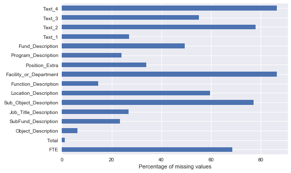
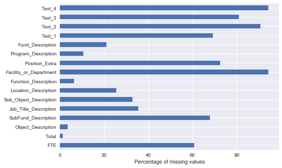

## School budgets  (multi-class-multi-label classification)

- [Problem description](#problem-description)
- [Exploratory data analysis and preprocessing](#exploratory-data-analysis-and-preprocessing)
- [Modelling](#modelling)

### Problem description 

The goal is to predict the probability that a certain label is attached to a budget line item. Each row in the budget has mostly free-form text features, except for two that are noted as float. Any of the fields may or may not be empty.

**Features**

- FTE (float) - If an employee, the percentage of full-time that the employee works.
- Facility_or_Department - If expenditure is tied to a department/facility, that department/facility.
- Function_Description - A description of the function the expenditure was serving.
- Fund_Description - A description of the source of the funds.
- Job_Title_Description - If this is an employee, a description of that employee's job title.
- Location_Description - A description of where the funds were spent.
- Object_Description - A description of what the funds were used for.
- Position_Extra - Any extra information about the position that we have.
- Program_Description - A description of the program that the funds were used for.
- SubFund_Description - More detail on Fund_Description
- Sub_Object_Description - More detail on Object_Description
- Text_1 - Any additional text supplied by the district.
- Text_2 - Any additional text supplied by the district.
- Text_3 - Any additional text supplied by the district.
- Text_4 - Any additional text supplied by the district.
- Total (float) - The total cost of the expenditure.

**Labels**
    
Function:

- Aides Compensation
- Career & Academic Counseling
- Communications
- Curriculum Development
- Data Processing & Information Services
- Development & Fundraising
- Enrichment
- Extended Time & Tutoring
- Facilities & Maintenance
- Facilities Planning
- Finance, Budget, Purchasing & Distribution
- Food Services
- Governance
- Human Resources
- Instructional Materials & Supplies
- Insurance
- Legal
- Library & Media
- NO_LABEL
- Other Compensation
- Other Non-Compensation
- Parent & Community Relations
- Physical Health & Services
- Professional Development
- Recruitment
- Research & Accountability
- School Administration
- School Supervision
- Security & Safety
- Social & Emotional
- Special Population Program Management & Support
- Student Assignment
- Student Transportation
- Substitute Compensation
- Teacher Compensation
- Untracked Budget Set-Aside
- Utilities

Object_Type:

- Base Salary/Compensation
- Benefits
- Contracted Services
- Equipment & Equipment Lease
- NO_LABEL
- Other Compensation/Stipend
- Other Non-Compensation
- Rent/Utilities
- Substitute Compensation
- Supplies/Materials
- Travel & Conferences

Operating_Status:

- Non-Operating (If Non-Operating, all other labels must be NO LABEL)
- Operating, Not PreK-12
- PreK-12 Operating

Position_Type:

- (Exec) Director
- Area Officers
- Club Advisor/Coach
- Coordinator/Manager
- Custodian
- Guidance Counselor
- Instructional Coach
- Librarian
- NO_LABEL
- Non-Position
- Nurse
- Nurse Aide
- Occupational Therapist
- Other
- Physical Therapist
- Principal
- Psychologist
- School Monitor/Security
- Sec/Clerk/Other Admin
- Social Worker
- Speech Therapist
- Substitute
- TA
- Teacher
- Vice Principal

Pre_K:

- NO_LABEL
- Non PreK
- PreK

Reporting:

- NO_LABEL
- Non-School
- School

Sharing:

- Leadership & Management
- NO_LABEL
- School Reported
- School on Central Budgets
- Shared Services

Student_Type:

- Alternative
- At Risk
- ELL
- Gifted
- NO_LABEL
- Poverty
- PreK
- Special Education
- Unspecified

Use:

- Business Services
- ISPD
- Instruction
- Leadership
- NO_LABEL
- O&M
- Pupil Services & Enrichment
- Untracked Budget Set-Aside

**Evaluation metric**

In this competition we have multiple variables, and each of these variables can take on one of multiple labels. The evaluation metric will be: 

Multi-multiclass log loss $$= \frac{1}{K}\sum_{k=1}^{K} \left[ - \frac{1}{N} \sum_{n=0}^{N} \sum_{c=1}^{C} y_{k, c, n} \log(\hat{y}_{k, c, n}) \right]$$ 

In this calculation, *K* is the number of dependent variables, *N* is the number of rows being evaluated, and *C* is the number of class values *k* can take on. 

### Exploratory data analysis and preprocessing


```python
import pandas as pd
import numpy as np
import matplotlib.pyplot as plt
import seaborn as sns
import datetime as dt
```


```python
df_train = pd.read_csv('data/TrainingData.csv',index_col=0)
df_test = pd.read_csv('data/TestData.csv',index_col=0)
print(df_train.info())
print(df_test.info())
```

<pre style="background-color:white"><code>
	<class 'pandas.core.frame.DataFrame'>
    Int64Index: 400277 entries, 134338 to 415831
    Data columns (total 25 columns):
    Function                  400277 non-null object
    Use                       400277 non-null object
    Sharing                   400277 non-null object
    Reporting                 400277 non-null object
    Student_Type              400277 non-null object
    Position_Type             400277 non-null object
    Object_Type               400277 non-null object
    Pre_K                     400277 non-null object
    Operating_Status          400277 non-null object
    Object_Description        375493 non-null object
    Text_2                    88217 non-null object
    SubFund_Description       306855 non-null object
    Job_Title_Description     292743 non-null object
    Text_3                    179964 non-null object
    Text_4                    53746 non-null object
    Sub_Object_Description    91603 non-null object
    Location_Description      162054 non-null object
    FTE                       126071 non-null float64
    Function_Description      342195 non-null object
    Facility_or_Department    53886 non-null object
    Position_Extra            264764 non-null object
    Total                     395722 non-null float64
    Program_Description       304660 non-null object
    Fund_Description          202877 non-null object
    Text_1                    292285 non-null object
    dtypes: float64(2), object(23)
    memory usage: 79.4+ MB
    None
</code></pre>


```python
labels = ['Function','Object_Type','Operating_Status','Position_Type','Pre_K','Reporting','Sharing','Student_Type','Use']
#nolabels = [c for c in df_train.columns if c not in labels]
X_train = df_train[nolabels].copy()
y_train = df_train[labels].copy()
X_test = df_test[nolabels].copy()
```


```python
((X_train.isnull().sum())/X_train.shape[0]*100).plot(kind='barh')
plt.xlabel('Percentage of missing values')
plt.show()
```




We do the same for the test set.




**y_train: dummy encoding of labels**


```python
y_train = pd.get_dummies(y_train,prefix_sep='__')
print(y_train.columns)
```

    Index(['Function__Aides Compensation',
           'Function__Career & Academic Counseling', 'Function__Communications',
           'Function__Curriculum Development',
           'Function__Data Processing & Information Services',
           'Function__Development & Fundraising', 'Function__Enrichment',
           'Function__Extended Time & Tutoring',
           'Function__Facilities & Maintenance', 'Function__Facilities Planning',
           ...
           'Student_Type__Special Education', 'Student_Type__Unspecified',
           'Use__Business Services', 'Use__ISPD', 'Use__Instruction',
           'Use__Leadership', 'Use__NO_LABEL', 'Use__O&M',
           'Use__Pupil Services & Enrichment', 'Use__Untracked Budget Set-Aside'],
          dtype='object', length=104)


```python
from sklearn.model_selection import train_test_split
X_tr, X_val, y_tr, y_val = train_test_split(X_train, y_train, test_size=0.2,random_state=42)
```


```python
# Check that all labels are represented in the train set
y_tr.sum().min()
```


<pre style="background-color:white"><code>24</code></pre>


```python
X_tr = X_tr.copy()
X_val = X_val.copy()
```

**Feature: FTE**


```python
X_tr.loc[:,'FTE'] = np.clip(X_tr['FTE'],0,1)
X_val.loc[:,'FTE'] = np.clip(X_val['FTE'],0,1)
X_test.loc[:,'FTE'] = np.clip(X_test['FTE'],0,1)
```

**Impute numeric columns and join text columns**


```python
from sklearn.preprocessing import Imputer
num_columns = ['FTE','Total']
text_columns = [c for c in X_tr.columns if c not in num_columns]

imputer = Imputer()
X_tr[num_columns]=imputer.fit_transform(X_tr[num_columns])

X_tr[text_columns] = X_tr[text_columns].fillna("")  
text_tr = X_tr[text_columns].apply(lambda x:" ".join(x), axis=1)
X_tr['text_data'] = text_tr
X_tr = X_tr.drop(text_columns, axis=1)
```


```python
X_val[num_columns]=imputer.transform(X_val[num_columns])

X_val[text_columns] = X_val[text_columns].fillna("")
text_val = X_val[text_columns].apply(lambda x:" ".join(x), axis=1)
X_val['text_data'] = text_val
X_val = X_val.drop(text_columns, axis=1)


X_test[num_columns]=imputer.transform(X_test[num_columns])

X_test[text_columns] = X_test[text_columns].fillna("")
text_test = X_test[text_columns].apply(lambda x:" ".join(x), axis=1)
X_test['text_data'] = text_test
X_test = X_test.drop(text_columns, axis=1)
```


```python
X_tr.head()
```


<table border="1" class="dataframe">
  <thead>
    <tr style="text-align: right;">
      <th></th>
      <th>FTE</th>
      <th>Total</th>
      <th>text_data</th>
    </tr>
  </thead>
  <tbody>
    <tr>
      <th>444691</th>
      <td>0.420536</td>
      <td>218.450000</td>
      <td>EMPLOYEE BENEFITS  GENERAL FUND Teacher, Eleme...</td>
    </tr>
    <tr>
      <th>250816</th>
      <td>0.420536</td>
      <td>3126.332668</td>
      <td>Salaries And Wages For Teachers And Other Prof...</td>
    </tr>
    <tr>
      <th>393405</th>
      <td>0.420536</td>
      <td>674.710000</td>
      <td>EXTRA DUTY PAY-INSTRUCTIONAL     TEACHER, VE  ...</td>
    </tr>
    <tr>
      <th>299533</th>
      <td>0.420536</td>
      <td>286.688429</td>
      <td>Salaries And Wages For Teachers And Other Prof...</td>
    </tr>
    <tr>
      <th>357445</th>
      <td>0.420536</td>
      <td>221.843840</td>
      <td>ADDITIONAL/EXTRA DUTY PAY/STIP  FEDERAL GDPG F...</td>
    </tr>
  </tbody>
</table>


```python
X_val.head()
```


<table border="1" class="dataframe">
  <thead>
    <tr style="text-align: right;">
      <th></th>
      <th>FTE</th>
      <th>Total</th>
      <th>text_data</th>
    </tr>
  </thead>
  <tbody>
    <tr>
      <th>139668</th>
      <td>0.420536</td>
      <td>420.28</td>
      <td>EMPLOYER PD MED CONTRIBUTION  GENERAL FUND Tea...</td>
    </tr>
    <tr>
      <th>446779</th>
      <td>0.420536</td>
      <td>-1265.07</td>
      <td>CONTRA BENEFITS  GENERAL FUND Teacher Secondar...</td>
    </tr>
    <tr>
      <th>224958</th>
      <td>0.420536</td>
      <td>5320.20</td>
      <td>PURCHASED PROFESSIONAL AND TECH SVCS-OTHER FEE...</td>
    </tr>
    <tr>
      <th>386138</th>
      <td>0.420536</td>
      <td>1299.79</td>
      <td>SUPPLIES  SCHOOL-WIDE SCHOOL PGMS FOR TITLE GR...</td>
    </tr>
    <tr>
      <th>440032</th>
      <td>0.420536</td>
      <td>1145.50</td>
      <td>EMPLOYEE BENEFITS TRANSPORTATION GENERAL FUND ...</td>
    </tr>
  </tbody>
</table>


**NLP**


```python
import nltk
import string
from nltk.tokenize import RegexpTokenizer
from nltk.corpus import stopwords
from nltk.stem import WordNetLemmatizer
lem = WordNetLemmatizer()
stem = nltk.stem.SnowballStemmer('english')

def nlp(s):
    s = s.replace( "K-", "K" ) # K-12 and K-8 
    tokenizer = RegexpTokenizer('(?u)\\b\\w\\w+\\b')
    tokens = tokenizer.tokenize(s.lower())
    #filtered_words = [word for word in tokens if word not in stopwords.words('english')]
    stem_words = [lem.lemmatize(word) for word in tokens]
    return " ".join(stem_words)
```


```python
X_tr['text_data'] = X_tr['text_data'].apply(nlp)
print('done NLP train')
X_val['text_data'] = X_val['text_data'].apply(nlp)
print('done NLP validation')
X_test['text_data'] = X_test['text_data'].apply(nlp)
```


```python
X_tr.head()
```


<table border="1" class="dataframe">
  <thead>
    <tr style="text-align: right;">
      <th></th>
      <th>FTE</th>
      <th>Total</th>
      <th>text_data</th>
    </tr>
  </thead>
  <tbody>
    <tr>
      <th>444691</th>
      <td>0.420536</td>
      <td>218.450000</td>
      <td>employee benefit general fund teacher elementa...</td>
    </tr>
    <tr>
      <th>250816</th>
      <td>0.420536</td>
      <td>3126.332668</td>
      <td>salary and wage for teacher and other professi...</td>
    </tr>
    <tr>
      <th>393405</th>
      <td>0.420536</td>
      <td>674.710000</td>
      <td>extra duty pay instructional teacher ve school...</td>
    </tr>
    <tr>
      <th>299533</th>
      <td>0.420536</td>
      <td>286.688429</td>
      <td>salary and wage for teacher and other professi...</td>
    </tr>
    <tr>
      <th>357445</th>
      <td>0.420536</td>
      <td>221.843840</td>
      <td>additional extra duty pay stip federal gdpg fu...</td>
    </tr>
  </tbody>
</table>


```python
X_val.head()
```


<table border="1" class="dataframe">
  <thead>
    <tr style="text-align: right;">
      <th></th>
      <th>FTE</th>
      <th>Total</th>
      <th>text_data</th>
    </tr>
  </thead>
  <tbody>
    <tr>
      <th>139668</th>
      <td>0.420536</td>
      <td>420.28</td>
      <td>employer pd med contribution general fund teac...</td>
    </tr>
    <tr>
      <th>446779</th>
      <td>0.420536</td>
      <td>-1265.07</td>
      <td>contra benefit general fund teacher secondary ...</td>
    </tr>
    <tr>
      <th>224958</th>
      <td>0.420536</td>
      <td>5320.20</td>
      <td>purchased professional and tech svcs other fee...</td>
    </tr>
    <tr>
      <th>386138</th>
      <td>0.420536</td>
      <td>1299.79</td>
      <td>supply school wide school pgms for title grant...</td>
    </tr>
    <tr>
      <th>440032</th>
      <td>0.420536</td>
      <td>1145.50</td>
      <td>employee benefit transportation general fund b...</td>
    </tr>
  </tbody>
</table>


**Process text_data**


```python
from sklearn.feature_extraction.text import CountVectorizer
from sklearn.feature_selection import chi2, SelectKBest

count_1gram = CountVectorizer(ngram_range=(1,1),token_pattern='(?u)\\b\\w\\w+\\b',stop_words='english',min_df=10)
Xt_tr = count_1gram.fit_transform(X_tr['text_data'])
features_1gram = np.array(count_1gram.get_feature_names())
print(features_1gram.shape)

with open("train_vocab_1gram.txt", "w") as output:
    for i in features_1gram:
        output.write(i+'\n')

count_train = CountVectorizer(ngram_range=(1,2),token_pattern='(?u)\\b\\w\\w+\\b',stop_words='english',min_df=10)
Xt_tr = count_train.fit_transform(X_tr['text_data'])
features_train = np.array(count_train.get_feature_names())
print(features_train.shape)

with open("train_vocab_2gram.txt", "w") as output:
    for i in features_train:
        output.write(i+'\n')

kbest = SelectKBest(chi2, k=1000)
Xt_tr = kbest.fit_transform(Xt_tr,y_tr.values)

features_train_selected = features_train[kbest.get_support()]
print(features_train_selected.shape)
print(features_train_selected)

with open("train_vocab_select.txt", "w") as output:
    for i in features_train_selected:
        output.write(i+'\n')
```

    (1954,)
    (12726,)
    (1000,)
    ['12' 'academic student' 'accounting' 'acq' 'acquisition' 'activiti'
     'activiti cocurricular' 'activity' 'activity non' 'activity related'
     'activity transportation' 'additional' 'additional extra' 'addl'
     'addl regular' 'admin' 'admin school' 'admin service' 'administration'
     'administration year' 'administrative' 'administrative support'
     'administrator' 'administrator legal' 'administrator support' 'adult'
     'adult voc' 'advisor' 'advisor high' 'afterschool' 'afterschool program'
     'aide' 'allotment' 'allotment teacher' 'allowance'
     'alternative opportunity' 'alternative school' 'arra' 'arra education'
     'arra professional' 'arra stimulus' 'art sport' 'assessment'
     'assessment instructional' 'assessment research' 'assessment specialist'
     'assignment' 'assignment regular' 'assignment team' 'assistance'
     'assistance esea' 'assistance title' 'assistant' 'assistant clinic'
     'assistant nurse' 'assistant principal' 'asst' 'asst high'
     'asst principal' 'athletic' 'athletic supplement' 'athletics'
     'athletics pupil' 'athletics sport' 'athletics student' 'attorney'
     'attorney non' 'bachelor' 'bachelor title' 'based' 'based ece' 'basic'
     'basic educational' 'basic program' 'benefit' 'benefit custodial'
     'benefit employee' 'benefit food' 'benefit general' 'benefit human'
     'benefit itemgd' 'benefit personnel' 'benefit safety' 'benefit teacher'
     'benefit transportation' 'bilingual' 'bilingual education' 'blank'
     'blank regular' 'bldg' 'bldg service' 'board' 'board education' 'bond'
     'bonding' 'bonding cost' 'book' 'book periodical' 'book textbook'
     'breakfast' 'breakfast lunch' 'budget' 'budget school' 'building' 'bus'
     'bus compute' 'bus driver' 'cafeteria' 'cafeteria employee' 'campus'
     'campus overtime' 'campus payroll' 'campus security' 'capital'
     'capital reserve' 'care' 'care upkeep' 'center' 'center educational'
     'center general' 'central' 'certificated' 'certificated employee'
     'certificated salary' 'certified' 'certified regular'
     'certified substitute' 'chair' 'chair supp' 'charter' 'charter basic'
     'charter school' 'child' 'child nutrition' 'child targeted' 'childhood'
     'childhood education' 'childhood regular' 'choice' 'choice non'
     'classroom supply' 'clerical' 'clinic' 'clinic aide' 'clinic assistant'
     'coach' 'coach athletics' 'coach instructional' 'coaching'
     'coaching supplement' 'cocurricular' 'cocurricular ed' 'communication'
     'community' 'community relation' 'community service' 'comp' 'comp general'
     'comp title' 'compute' 'computer' 'computer technology' 'construction'
     'contra' 'contra benefit' 'contracted' 'conversion' 'conversion charter'
     'cooperating' 'cooperating teacher' 'coordinator' 'cost insurance'
     'counsel' 'counsel school' 'counseling' 'counselor' 'counselor high'
     'craft' 'craft trade' 'critical' 'critical need' 'cu' 'cu super'
     'curricular' 'curricular spo' 'curriculum' 'curriculum development'
     'curriculum teacher' 'custodial' 'custodial department' 'custodial helper'
     'custodial school' 'custodian' 'custodian asst' 'custodian operation'
     'custodian regular' 'customer' 'customer relation' 'day' 'day school'
     'degreed' 'degreed substitute' 'department' 'department bus'
     'department chair' 'department cu' 'department police' 'deputy general'
     'dev' 'dev eval' 'dev human' 'development' 'development service'
     'director' 'director undistributed' 'disability' 'disadvantaged'
     'disadvantaged child' 'disadvantaged youth' 'district'
     'district objective' 'district special' 'district wide' 'driver'
     'driver reg' 'driver transportation' 'driver undistributed' 'driver yr'
     'duty' 'duty pay' 'early' 'early childhood' 'early education' 'ece'
     'ece paraprofessional' 'ece professional' 'ed' 'ed activity'
     'ed allotment' 'ed art' 'ed opportunity' 'ed para' 'education'
     'education adult' 'education itinerant' 'education ot' 'education pt'
     'education regular' 'education special' 'education stabilitazion'
     'educational' 'educational medium' 'educational service' 'effectiveness'
     'ela' 'ela general' 'ela teaching' 'electricity' 'elementary'
     'elementary education' 'elementary regular' 'elementary spec' 'elpa'
     'elpa eng' 'elpa preschool' 'employee' 'employee adult'
     'employee allowance' 'employee assessment' 'employee benefit'
     'employee custodial' 'employee food' 'employee general'
     'employee miscellaneous' 'employee personnel' 'employee safety'
     'employee salary' 'employee teacher' 'employee transportation'
     'end allocation' 'eng' 'eng lang' 'equipment' 'equipment bus' 'eval'
     'eval general' 'extended' 'extended day' 'extended week' 'extended year'
     'extra' 'extra curricular' 'extra duty' 'extracurricular'
     'extracurricular activity' 'extracurricular supp' 'facilitator'
     'facilitator elem' 'facilitator sec' 'facility' 'facility acq'
     'facility maintenance' 'facsimile' 'facsimile service' 'federal'
     'federal gdpg' 'fee' 'field' 'field trip' 'food' 'food nutrition'
     'food preparation' 'food serv' 'food service' 'fund' 'fund blank'
     'fund bus' 'fund campus' 'fund child' 'fund cooperating' 'fund custodial'
     'fund custodian' 'fund early' 'fund ela' 'fund elementary'
     'fund facilitator' 'fund field' 'fund food' 'fund fy' 'fund growth'
     'fund library' 'fund manager' 'fund nurse' 'fund occupational'
     'fund overtime' 'fund physical' 'fund principal' 'fund psychologist'
     'fund regular' 'fund risk' 'fund secretary' 'fund security' 'fund social'
     'fund speech' 'fund student' 'fund supt' 'fund teacher' 'fy'
     'fy facilitator' 'fy occupational' 'fy speech' 'garage' 'garage non'
     'gdpg' 'gdpg fund' 'general' 'general administration' 'general assignment'
     'general counsel' 'general elementary' 'general fund' 'general ledger'
     'general operating' 'general purpose' 'general supply' 'gifted'
     'gifted talented' 'grade' 'grade program' 'grant service' 'growth'
     'growth planning' 'guard' 'guidance' 'guidance service' 'health'
     'health service' 'helper' 'helper day' 'high' 'human' 'human resource'
     'humanity' 'idea' 'ii' 'ii regular' 'improvement' 'improvement instr'
     'improving' 'improving basic' 'information' 'information service' 'inst'
     'inst staff' 'instr' 'instr serv' 'instruction' 'instruction campus'
     'instruction certificated' 'instruction curriculum'
     'instruction instruction' 'instruction primary' 'instruction regular'
     'instruction sped' 'instruction substitute' 'instructional'
     'instructional early' 'instructional general' 'instructional gifted'
     'instructional guidance' 'instructional instructional'
     'instructional itemgb' 'instructional literacy' 'instructional male'
     'instructional nursing' 'instructional psychological'
     'instructional social' 'instructional special' 'instructional staff'
     'insurance' 'insurance bonding' 'itemgb' 'itemgd' 'itemgd preschool'
     'itemgg' 'itinerant' 'itinerant professional' 'k12 conversion'
     'k12 general' 'lang prof' 'language' 'language general'
     'language pathologst' 'leadership' 'leadership campus' 'learning'
     'learning leadership' 'ledger' 'ledger accounting' 'legal'
     'legal department' 'legal service' 'librarian' 'librarian elem' 'library'
     'library medium' 'library service' 'library tech' 'literacy'
     'literacy coach' 'lunch' 'lunch program' 'maint' 'maint plant'
     'maintenance' 'maintenance operating' 'maintenance operation' 'male'
     'male athletics' 'man' 'man undistributed' 'manager' 'manager food'
     'material' 'material community' 'math' 'math science' 'medium'
     'medium center' 'medium service' 'midd' 'midd sch' 'middle' 'mild'
     'mild moderate' 'misc' 'misc general' 'misc school' 'miscellaneous'
     'miscellaneous admin' 'moderate' 'monitoring' 'monitoring service'
     'multilingual' 'multilingual outreach' 'national' 'national school'
     'natural gas' 'need' 'new' 'new teacher' 'non' 'non certificated'
     'non project' 'non public' 'nurse' 'nurse general' 'nurse regular'
     'nurse school' 'nurse service' 'nursing' 'nursing service' 'nutrition'
     'nutrition cafeteria' 'nutrition fund' 'nutrition misc' 'nutrition reg'
     'nutrition service' 'objective' 'objective salary' 'occupational'
     'occupational therapist' 'office' 'office administrative'
     'office principal' 'office superintendent' 'officer' 'officer extra'
     'officer regular' 'officer resource' 'officer safety' 'officer sub'
     'operating' 'operating fund' 'operating misc' 'operation'
     'operation child' 'operation clerical' 'operation computer'
     'operation counselor' 'operation custodial' 'operation custodian'
     'operation maint' 'operation plant' 'operation security'
     'operation student' 'operation teacher' 'operation transportation'
     'operation utility' 'opp' 'opportunity' 'opportunity arra'
     'opportunity school' 'ot' 'ot special' 'outreach' 'outreach general'
     'outreach state' 'overtime' 'overtime support' 'para' 'para regular'
     'paraprofessional' 'paraprofessional early' 'paraprofessional general'
     'paraprofessional special' 'parent' 'participant' 'participant teacher'
     'pathologst' 'pathologst special' 'patrol' 'patrol man' 'pay'
     'pay overtime' 'pay public' 'pay smoothed' 'pay stip' 'payroll'
     'payroll degreed' 'payroll principal' 'payroll teacher' 'periodical'
     'periodical medium' 'personal' 'personal service' 'personnel'
     'personnel child' 'personnel operation' 'personnel school'
     'personnel service' 'personnel unallocated' 'personnel undistributed'
     'physical' 'physical therapist' 'planning' 'planning dev' 'plant'
     'plant general' 'police' 'police patrol' 'pool' 'pool basic' 'pool salary'
     'pre' 'preparation' 'preparation serving' 'preschool' 'preschool prog'
     'preschool program' 'primary' 'primary grade' 'principal' 'principal asst'
     'principal elementary' 'principal undistributed' 'prof act' 'professi'
     'professi operation' 'professi school' 'professi state' 'professi title'
     'professional' 'professional information' 'professional instructional'
     'professional operation' 'professional security' 'professional state'
     'professional tech' 'professional technical' 'prog'
     'prog paraprofessional' 'prog professional' 'program' 'program 12'
     'program early' 'program general' 'program instruction'
     'program miscellaneous' 'program summer' 'program teacher' 'project'
     'project administrator' 'project craft' 'project office'
     'project professional' 'project undesignated' 'psychological'
     'psychological service' 'psychologist' 'psychologist psychological'
     'psychologist regular' 'psychologist special' 'pt special' 'public'
     'public school' 'public utility' 'pupil' 'pupil activity'
     'pupil transportation' 'purchase' 'purchase equipment' 'purchased'
     'purchased professional' 'purchased service' 'purpose' 'purpose school'
     'reading writing' 'record' 'recruitment' 'recruitment district'
     'recruitment professional' 'reg' 'reg transportation' 'registration'
     'regular' 'regular ela' 'regular elpa' 'regular employee'
     'regular extended' 'regular general' 'regular instruction' 'regular non'
     'regular pay' 'regular special' 'regular state' 'regular title'
     'regular tuition' 'regular unalloc' 'related' 'related state' 'relation'
     'relation department' 'repair' 'repair maintenance' 'reqd misc' 'research'
     'research ela' 'research general' 'reserve' 'reserve fund' 'resource'
     'resource new' 'resource non' 'resource officer' 'resource recruitment'
     'retirement' 'retrd' 'retrd shrt' 'revenue' 'revenue fund' 'run'
     'run extra' 'safety' 'safety security' 'salary' 'salary regular'
     'salary time' 'salary wage' 'sch' 'school' 'school admin'
     'school administration' 'school arra' 'school attorney' 'school breakfast'
     'school choice' 'school counselor' 'school facility' 'school food'
     'school general' 'school guidance' 'school instruction'
     'school leadership' 'school library' 'school nurse' 'school nutrition'
     'school principal' 'school professional' 'school resource'
     'school security' 'school service' 'schoolwide' 'schoolwide activity'
     'science' 'sea' 'second' 'second run' 'secondary' 'secondary high'
     'secretary' 'secretary ii' 'secretary regular' 'security'
     'security department' 'security general' 'security monitoring'
     'security non' 'security officer' 'security operation' 'security safety'
     'security security' 'security service' 'serv' 'serv undistributed'
     'service' 'service business' 'service care' 'service central'
     'service charter' 'service child' 'service community' 'service district'
     'service employee' 'service food' 'service fund' 'service improvement'
     'service instructional' 'service medium' 'service miscellaneous'
     'service non' 'service operation' 'service police' 'service pupil'
     'service school' 'service security' 'service special' 'service student'
     'service sub' 'service substitute' 'service support' 'service teacher'
     'service title' 'service transportation' 'service worker' 'serving'
     'serving food' 'severe' 'sewer' 'short' 'short term' 'shrt' 'shrt term'
     'skill' 'skill specialist' 'smoothed' 'social' 'social work'
     'social worker' 'spec' 'spec ed' 'special' 'special ed'
     'special education' 'special instruction' 'special revenue'
     'special trust' 'specialist' 'sped' 'speech' 'speech language'
     'speech therapist' 'spo' 'sport' 'sport activiti' 'sport sea'
     'stabilitazion' 'staff' 'staff dev' 'staff service' 'staff training'
     'state' 'state comp' 'state ed' 'state elpa' 'state gifted' 'stimulus'
     'stimulus teacher' 'stip' 'stip assessment' 'stip athletics' 'stip human'
     'stip teacher' 'stipend' 'student' 'student activity' 'student advisor'
     'student assessment' 'student service' 'student transportation' 'sub'
     'sub general' 'sub human' 'sub regular' 'sub teacher'
     'subsistence employee' 'substitute' 'substitute basic' 'substitute pool'
     'substitute professional' 'substitute teacher' 'summer' 'summer ed'
     'sunday' 'sunday pay' 'super' 'super sub' 'super undistributed'
     'superintendent' 'superintendent general' 'supp' 'supp extra' 'supplement'
     'supply' 'supply community' 'supply material' 'supply medium'
     'supply primary' 'supply school' 'support' 'support personnel'
     'support school' 'support service' 'support support' 'support team' 'supt'
     'supt instructional' 'svcs' 'svcs fee' 'talented' 'talented general'
     'talented professional' 'talented regular' 'talented state' 'targeted'
     'targeted assistance' 'teacher' 'teacher bachelor' 'teacher certified'
     'teacher effectiveness' 'teacher elementary' 'teacher instruction'
     'teacher learning' 'teacher librarian' 'teacher professi'
     'teacher recruitment' 'teacher regular' 'teacher retirement'
     'teacher retrd' 'teacher school' 'teacher secondary' 'teacher short'
     'teacher stipend' 'teacher sub' 'teacher substitute' 'teacher super'
     'teaching' 'team' 'team general' 'team non' 'tech' 'tech svcs' 'technical'
     'technical service' 'technology' 'technology specialist' 'telephone'
     'telephone facsimile' 'temp' 'term' 'term sub' 'textbook'
     'textbook periodical' 'therapist' 'therapist special' 'tif' 'time'
     'time employee' 'title' 'title arra' 'title disadvantaged' 'title ii'
     'title improving' 'title schoolwide' 'trade' 'trade service' 'training'
     'training instructional' 'training svcs' 'transportation'
     'transportation bus' 'transportation department' 'transportation general'
     'transportation operation' 'transportation pupil' 'transportation second'
     'transportation service' 'transportation transportation' 'travel'
     'travel allowance' 'travel employee' 'travel registration' 'trip' 'trust'
     'tuition' 'tuition based' 'unalloc' 'unalloc budget' 'unallocated'
     'unallocated extracurricular' 'unallocated security'
     'unallocated transportation' 'undesignated' 'undesignated care'
     'undesignated employee' 'undesignated general' 'undistributed'
     'undistributed general' 'undistributed national'
     'undistributed transportation' 'upkeep' 'upkeep bldg' 'utility'
     'utility general' 'utility local' 'voc' 'voc ed' 'wage'
     'wage disadvantaged' 'wage substitute' 'wage support' 'wage teacher'
     'water' 'week' 'week school' 'wide resource' 'work' 'work service'
     'worker' 'worker ii' 'worker regular' 'worker social'
     'worker undistributed' 'workshop' 'workshop participant' 'year' 'youth'
     'youth title' 'yr' 'yr garage']


**Find similar words**


```python
from sklearn.feature_extraction.text import CountVectorizer

count_val = CountVectorizer(ngram_range=(1,1),token_pattern='(?u)\\b\\w\\w+\\b',stop_words='english',min_df=10)
Xt_val = count_val.fit_transform(X_val['text_data'])
features_val = np.array(count_val.get_feature_names())
print(features_val.shape)

features_new_val = set(features_val)-set(features_1gram)
print(len(features_new_val))
print(features_new_val)

with open("val_vs_train.txt", "w") as output:
    for i in features_new_val:
        output.write(i+'\n')

#selected_features_missing = set(features_train_selected)-set(features_val)
#print(len(selected_features_missing))
#print(selected_features_missing)
```

    (1361,)
    1
    {'provide'}


```python
import difflib

def find_similar_val(s):
    tokenizer = RegexpTokenizer('(?u)\\b\\w\\w+\\b')
    tokens = tokenizer.tokenize(s)
    tokens2 = []
    for word in tokens:
        if word in features_new_val:
            word = " ".join(difflib.get_close_matches(word,features_1gram,1,0.8))
        tokens2.append(word)
    return " ".join(tokens2)
```


```python
sim_list = []
with open("similar_val.txt", "w") as output:
    not_found_val = 0
    for i in features_new_val:
        sim_word = " ".join(difflib.get_close_matches(i,features_1gram,1,0.8))
        sim_list.append(sim_word)
        output.write(i+" "+sim_word+'\n')
        if not sim_word:
            not_found_val = not_found_val + 1 

print(sim_list)
print(list(set(sim_list) & set(features_train_selected)))
```

    ['provided']
    []


```python
X_val['text_data'] = X_val['text_data'].apply(find_similar_val)
```

**


```python
from sklearn.feature_extraction.text import CountVectorizer

count_test = CountVectorizer(ngram_range=(1,1),token_pattern='(?u)\\b\\w\\w+\\b',stop_words='english',min_df=10)
Xt_test = count_test.fit_transform(X_test['text_data'])
features_test = np.array(count_test.get_feature_names())
print(features_test.shape)

features_new_test = set(features_test)-set(features_train)
print(len(features_new_test))
print(features_new_test)

with open("test_vs_train.txt", "w") as output:
    for i in features_new_test:
        output.write(i+'\n')
```

    (1145,)
    140
    {'nwsppr', 'sc', 'cl', 'chem', 'beh', 'inclus', 'alarm', 'abc', 'occup', 'house', '6th', 'im', 'faci', 'theater', 'footbl', 'digital', 'proc', 'consulting', 'theat', 'cell', 'abd', 'overcrowding', 'diagnosticia', 'meal', 'tv', 'chi', 'spe', 'cate', 'vfb', 'mariachi', 'grds', 'nondisciplinary', 'volleyb', 'ther', 'astii', 'lan', 'dose', 'cdr', 'wastewater', 'spiii', 'bb', 'se', 'services', 'au', 'specia', 'score', 'lssp', 'struggler', 'geography', 'dramatics', 'volly', 'pri', 'inn', 'detention', 'ad', 'supprt', 'ahc', 'adapt', 'vh', 'bil', 'publication', 'cor', 'theatre', 'baccalaureate', 'trainr', 'equity', 'sb', 'cycle', 'phone', 'jr', 'tm', 'netwrk', 'srvc', 'ssig', 'aep', 'volbl', 'yrbk', 'trustee', 'unacceptable', 'ely', 'prod', 'laundry', 'honor', 'busn', 'independence', 'pal', 'cch', 'wrest', 'trainee', 'agricul', 'acctg', 'fac', 'op', 'includes', 'footbll', 'uil', 'architect', 'jrvar', 'government', 'delta', 'bsktbl', 'commercial', 'attend', 'analy', 'mn', 'signing', 'fr', 'kin', 'sk', 'nat', 'emotional', 'carry', 'housekeeping', 'groundskeeper', 'money', 'ni', 'reproduction', 'badge', 'ml', 'nvfb', 'journalism', 'dram', 'priority', 'courier', 'used', 'ah', 'coun', 'room', 'hc', 'dropout', 'refreshment', 'expend', 'ofcr', 'culinary', 'varfb', 'englsh', 'facil', 'demonstration', 'fto', 'baseb'}


```python
import difflib

def find_similar_test(s):
    tokenizer = RegexpTokenizer('(?u)\\b\\w\\w+\\b')
    tokens = tokenizer.tokenize(s)
    tokens2 = []
    for word in tokens:
        if word in features_new_test:
            word = " ".join(difflib.get_close_matches(word,features_1gram,1,0.8))
        tokens2.append(word)
    return " ".join(tokens2)
```


```python
X_test['text_data'] = X_test['text_data'].apply(find_similar_test)
```


```python
Xt_val = count_train.transform(X_val['text_data'])
Xt_test = count_train.transform(X_test['text_data'])

Xt_val = kbest.transform(Xt_val)
Xt_test = kbest.transform(Xt_test)
```


**Combine numeric and text data**


```python
from scipy import sparse
from scipy.sparse import hstack

X_tr_num = sparse.csr_matrix(X_tr[num_columns].values)
X_tr = hstack([Xt_tr,X_tr_num])

X_val_num = sparse.csr_matrix(X_val[num_columns].values)
X_val = hstack([Xt_val,X_val_num])

X_test_num = sparse.csr_matrix(X_test[num_columns].values)
X_test = hstack([Xt_test,X_test_num])
```


**MaxAbsScaler**


```python
from sklearn.preprocessing import MaxAbsScaler

scaler = MaxAbsScaler()
X_tr = scaler.fit_transform(X_tr)
X_val = scaler.transform(X_val)
X_test = scaler.transform(X_test)
```


```python
print(X_tr.shape)
print(y_tr.shape)

print(X_val.shape)
print(y_val.shape)

print(X_test.shape)
```

<pre style="background-color:white"><code>(320221, 1002)
(320221, 104)
(80056, 1002)
(80056, 104)
(50064, 1002)</code></pre>


### Modelling


```python
import xgboost as xgb
from sklearn.externals import joblib

t0 = dt.datetime.now()
    
b=[0,37,48,51,76,79,82,87,96,104]
scores=[]
pred_prob_val = np.ones((X_val.shape[0],104))
pred_prob_test = np.ones((X_test.shape[0],104))

for i in np.arange(9):

    print('\n\nRound '+str(i+1)+':\n\n')
    
    w = b[i+1]-b[i]
    opt_params = {'booster' : 'gbtree',
              'objective': 'multi:softprob',
              'eval_metric': 'mlogloss',
              'learning_rate': 0.2,
              'n_estimators':1000,
              'colsample_bytree': 0.3,
              'max_depth':5,
              'min_child_weight':32,
              'reg_lambda':1,
              'subsample':0.9,
              'n_jobs':1,
              'silent':True,
              'num_class' : w}
    
    y_tr_i = y_tr.iloc[:,b[i]:b[i+1]].values
    y_val_i = y_val.iloc[:,b[i]:b[i+1]].values
    y_tr_i = np.argmax(y_tr_i, axis=1)
    y_val_i = np.argmax(y_val_i, axis=1)
                     
    dtrain = xgb.DMatrix(X_tr, label=y_tr_i)
    dvalid = xgb.DMatrix(X_val, label=y_val_i)
    dtest = xgb.DMatrix(X_test)
                     
    watchlist = [(dtrain, 'train'), (dvalid, 'valid')]
                     
    model_xgb = xgb.train(opt_params, dtrain, 200, watchlist, early_stopping_rounds=20, 
                          maximize=False, verbose_eval=10)
                     
    pred_prob_test[:,b[i]:b[i+1]] = model_xgb.predict(dtest,ntree_limit=model_xgb.best_ntree_limit).reshape(X_test.shape[0],w)
    pred_prob_val[:,b[i]:b[i+1]] = model_xgb.predict(dvalid,ntree_limit=model_xgb.best_ntree_limit).reshape(X_val.shape[0],w)
    scores.append(model_xgb.best_score)
    joblib.dump(model_xgb, 'xgb_less_sim_2gram'+str(i+1)+'.model')
    
t1 = dt.datetime.now()

print("scores = {}".format(scores))

print('\n'+str((t1 - t0).seconds/60)+' minutes')
```

    
<pre style="background-color:white"><code>scores = [0.192463, 0.067384, 0.047313, 0.092311, 0.030696, 0.110794, 0.153392, 0.099932, 0.168922]
    
123.71666666666667 minutes
</code></pre>


**Evaluation metric**


```python
from multiloss import *

print(multimultiloss(y_val.values,pred_prob_val))
```
<pre style="background-color:white"><code>0.107023050371</code></pre>


