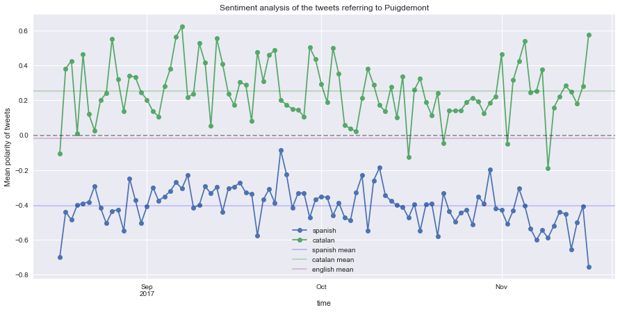

## Catalonia's political crisis on Twitter

<a href="#top" class="mybtn">Go to top</a>

### Introduction

In this project we analyse Twitter data related to Catalonia's political crisis.  

In particular, we will focus on the tweets about the Catalan ex-president, Carles Puigdemont. This is a perfect opportunity to try some sentiment analysis and word embedding models and see if the results we get are in accordance with our intuition.

The flow of this project is the following:

- Scraping data from Twitter's website
- Cleaning the data 
- Analysis of the data (including sentiment analysis and Word2Vec modelling).

Feel free to skip to the part you are interested in :)

Before anything else, here's a quick summary of the key political events for some context:

- **9 June 2017**: Catalan government calls an independence referendum for October 2017
- **7 September 2017**: the Spanish constitutional court suspends a referendum law introduced by the Catalan regional government, declaring the upcoming referendum illegal. 
- **1 October 2017**: referendum day. Thousands of Catalans take to the street to occupy polling stations and keep them open amid police crackdown to supress referendum.
- **17 October 2017**: Spain’s national court orders the imprisonment of Jordi Sànchez and Jordi Cuixart, two leading Catalan separatist politicians.
- **27 October 2017**: Catalan parliament meets and unilaterally declares independence, in a vote boycotted by the opposition.
- **28 October 2017**: the Spanish Senate suspends the Autonomous Catalan Government with the application of Article 155 of the Spanish Constitution. Prime Minister Mariano Rajoy calls snap regional elections for 21 December.
- **30 October 2017**: Puigdemont and four of his ministers slip out of Spain and stay in Brussels escaping Spanish justice.
- **2 November 2017**: nine of Puigdemont's former ministers who did not leave with him are imprisoned.
- **3 November 2017**: Spain issues arrest warrant for Puigdemont and his ministers.

**Current situation (1 December 2017)**: despite the arrest warrant issued by Spain, the Belgian court has defered ruling on Carles Puidgemont extradition and the case will resume on 4 December. Puigdemont will repeat as his party's top candidate in the regional elections on 21 December.

### Scraping data from Twitter's website

Since Twitter's official API doesn't allow us to look for tweets which are older than a week, we opt for doing some web scraping. However, we still won't be able to get as much data as we want to, since gathering too much data will get our IP blocked by Twitter.

To save us some time, we take advantage of a great [tool](https://github.com/Jefferson-Henrique/GetOldTweets-python) written in Python which does exactly that. Thanks to the author!

I did some tweaks to improve some things and adapt it to my needs. You can find the code [here](). 

We will gather 500 tweets each day from **17th August to 16th November 2017**. These tweets will be the top tweets of the day that either reply to tweets of Puigdemont (his user is @KRLS on Twitter) or that mention him (by using the mention tag @KRLS).

Since we are planning on doing some sentiment analysis of the tweets later, we hope that these tweets reflect people's sentiment toward Puigdemont (or rather, his political decisions). 

We will now import all the tweets we collected in csv files into a pandas dataframe.

 ```python
 import pandas as pd
 import numpy as np
 import matplotlib.pyplot as plt
 plt.style.use('seaborn')
 from IPython.display import display
 import re
 import glob
 pd.set_option('display.max_colwidth', -1)
 ```


 ```python
 import pandas as pd
 csv_files = glob.glob('tweets_data/*.csv')

 tweets = []
 for csv in csv_files:
     df = pd.read_csv(csv,encoding='utf_8')
         tweets.append(df)

 df = pd.concat(tweets)
 ```


 ```python
 df.date = pd.to_datetime(df.date)
 df = df.set_index('date')
 df = df.sort_index()
 ```


 ```python
 df.info()
 ```

<pre style="background-color:white"><code><class 'pandas.core.frame.DataFrame'>
DatetimeIndex: 48000 entries, 2017-07-01 20:06:15 to 2017-11-16 21:37:37
Data columns (total 7 columns):
text        47640 non-null object
RTs         48000 non-null int64
FAVs        48000 non-null int64
mentions    13984 non-null object
geo         30267 non-null object
replyto     47983 non-null object
hashtags    4347 non-null object
dtypes: int64(2), object(5)
memory usage: 2.9+ MB
</code></pre>

 
Totally, we have collected 48000 tweets. For each one of them, we have the content of the tweet, the RTs and FAVs, the mentions, the geographical location of the author of the tweet, the users it was adressed to (in case it was a reply tweet), and the hashtags used in the tweet.
 
 ```python
 df.tail()
 ```


 <table border="1" class="dataframe">
   <thead>
     <tr style="text-align: right;">
       <th></th>
       <th>text</th>
       <th>RTs</th>
       <th>FAVs</th>
       <th>mentions</th>
       <th>geo</th>
       <th>replyto</th>
       <th>hashtags</th>
     </tr>
     <tr>
       <th>date</th>
       <th></th>
       <th></th>
       <th></th>
       <th></th>
       <th></th>
       <th></th>
       <th></th>
     </tr>
   </thead>
   <tbody>
     <tr>
       <th>2017-11-16 17:40:04</th>
       <td>"Spain looks at unity like a religion, it's not a political matter" @KRLS talks to @AlexSalmond ​ on @AlexSalmondShow . pic.twitter.com/kvBQEXiUSL</td>
       <td>53</td>
       <td>61</td>
       <td>@KRLS @AlexSalmond @AlexSalmondShow</td>
       <td>London, England</td>
       <td>KRLS AlexSalmond AlexSalmondShow</td>
       <td>NaN</td>
     </tr>
     <tr>
       <th>2017-11-16 19:03:42</th>
       <td>@KRLS @AlexSalmond Wat de Passage beim Kuaffer am Breisseler Exil esou ausmecht. Dat Biedert um Nationalist kennt exponentiell zum Virschein</td>
       <td>0</td>
       <td>1</td>
       <td>@KRLS @AlexSalmond</td>
       <td>Luxembourg &amp; Saarland</td>
       <td>KRLS AlexSalmond</td>
       <td>NaN</td>
     </tr>
     <tr>
       <th>2017-11-16 19:55:33</th>
       <td>I imagine @AlexSalmond was ordered by the Kremlin to interview @KRLS . There can be no other logical explanation... Here you can see thousands of Russian hackers at last Saturday demo in Barcelona! pic.twitter.com/GHq2tLnJuk</td>
       <td>16</td>
       <td>34</td>
       <td>@AlexSalmond @KRLS</td>
       <td>Catalan Republic, EFTA</td>
       <td>JulianAssange AlexSalmond KRLS</td>
       <td>NaN</td>
     </tr>
     <tr>
       <th>2017-11-16 20:20:04</th>
       <td>Would any of the Scottish MSM foaming at the mouth over @AlexSalmond appearing on RT like to explain why his extended interview with @KRLS was the first in English since Catalan UDI?</td>
       <td>111</td>
       <td>135</td>
       <td>@AlexSalmond @KRLS</td>
       <td>Planet Sol 3</td>
       <td>AlexSalmond KRLS</td>
       <td>NaN</td>
     </tr>
     <tr>
       <th>2017-11-16 21:37:37</th>
       <td>Anarchist Puigdemont &amp;Komplizen sind Delinquenten!Kein Politiker darf Verfassung/Gesetze des Landes unbestraft brechen.Die Verfassung legt das Strafmaß fest.Wer zahlt seine Luxusreise? Solche Populisten spalten Nation und EU.</td>
       <td>0</td>
       <td>0</td>
       <td>NaN</td>
       <td>NaN</td>
       <td>rolo1714 derfreitag KRLS</td>
       <td>NaN</td>
     </tr>
   </tbody>
 </table>


We will convert date times to Spain's time zone:

 ```python
 df.index = pd.Series(df.index).apply(lambda x: x - pd.Timedelta('9 hours'))
 ```


### Cleaning the data

We will make several steps to clean the tweets:

- remove unprintable characters
- remove punctuation
- delete numbers
- delete links
- convert everything to lowercase

 ```python
 df.text = df.text.apply(lambda x: ''.join(k for k in x if k.isprintable()))
 
 # delete punctuation
 punctuation = string.punctuation + '’“”€↓↑…¿' 
 translator = str.maketrans(punctuation, ' '*len(punctuation))
 df.text = df.text.apply(lambda x: x.translate(translator)) 
 
 df.text = df.text.apply(lambda x: re.sub(r"\d+", "", x)) # delete numbers
 
 # delete links
 df.text = df.text.apply(lambda x: re.sub(r"https://.*", "", x)) 
 df.text = df.text.apply(lambda x: re.sub(r"http://.*", "", x)) 
 df.text = df.text.apply(lambda x: re.sub(r"pic\.twitter\.*", "", x)) 
 
 df.text = df.text.apply(lambda x: x.lower()) # lowercase
 ```

We can see some of the tweets' text after cleaning:


<pre style="background-color:white"><code>date
2017-07-01 11:06:15    a mi el president carles puigdemont em té guanyat   krls reconec l encert del mas en la tria                                                                                                                                                                                        
2017-07-01 11:09:11    com els rescats a empreses privades o les traves impediments per votar desde l exterior  ah  espera que això ho fan altres governs                                                                                                                                                  
2017-07-01 11:14:55    a ver  krls tú das miedo pero no por el intento de referéndum sino por tu corte de pelo  gañan                                                                                                                                                                                      
2017-07-01 11:20:10    i tant  pots estar ben segur q votarem                                                                                                                                                                                                                                              
2017-11-16 02:07:13    mentira   y calentando como siempre a la gente para causar todavia más odio entre españa de cataluña y el resto    vergonzoso    deberias estár ya en chirona por causar tanto daño a nuestro pais                                                                                  
2017-11-16 02:07:51    y ganarán los partidos indepes como de costumbre                                                                                                                                                                                                                                    
2017-11-16 02:08:09    spain does not change  mentally it continues in the century xviii  xix                                                                                                                                                                                                              
2017-11-16 02:08:19    algu vol renunciar a la llibertat    arturmasfanclub  lluis llach  pdemocratacat  annasimo  krls  forcadellcarme  gabrielrufian  emparmoliner  aleixsarri  esquerra erc  estanislaufons  soler toni  albanodante  raholaoficial                                                     
2017-11-16 02:09:52    este  pamplinas  habra hipotecado su casa para poder aportar en la  caja de resistencia  y pagar las multas a los que lo han engañado                                                                                                                                               
2017-11-16 02:10:12    soy andaluz  esa epoca fuimos bastantes perjudicados trabajo en el sector transporte y cada vez q salgo de despeñaperros para arriba me doy cuenta de que nosotros si tenemos motivos para quejarnos los cataluña lo hacen comoniños consentidos por los diferentes gobiernos españa
2017-11-16 02:10:26    te crees que somos tontos                                                                                                                                                                                                                                                           
2017-11-16 02:10:57    demencial                                                                                                                                                                                                                                                                           
2017-11-16 02:11:08    nosaltres a qui vol marxar el deixem  no obrigem a ningu a quedar se on no vol  martarovira  cridademocracia  assemblea  annasimo  pdemocratacat  krls  krls  raulromeva  soler toni  emparmoliner  gabrielrufian  raholaoficial                                                    
2017-11-16 02:11:16    aviso  tant me fot si hi ha alguna sigla al capdavant  per entremig o per sota  la llista que tindrà el meu vot serà aquella en la qual figuri el president de la república  krls   ras i curt  i qui no li agradi  que no miri  tu                                                 
2017-11-16 02:11:20    los miles de heridos están en la imaginación de  gabrielrufian y de  krls                                                                                                                                                                                                           
2017-11-16 02:11:21    krls he llegit la seva entrevista al punt som molts i molts que estem al seu costat tant políticament com personalment                                                                                                                                                             
2017-11-16 02:11:32    interesting  carles puigdemont    krls   speaks exclusively to  rt com  catalunya  catalanreferendum  catalonia  catalanreferedendum  cataloniareferendum  carlespuigdemont  spain  barcelona com txfhdrcxr                                                                         
2017-11-16 07:40:03    alexsalmond  meets  krls in brussels on the first episode of  alexsalmondshow    check it out on rt uk at   com jaxtlczkm                                                                                                                                                        
2017-11-16 08:40:04    spain looks at unity like a religion  it s not a political matter   krls talks to  alexsalmond  on  alexsalmondshow   com kvbqexiusl                                                                                                                                               
2017-11-16 10:03:42    krls  alexsalmond wat de passage beim kuaffer am breisseler exil esou ausmecht  dat biedert um nationalist kennt exponentiell zum virschein                                                                                                                                        
2017-11-16 12:37:37    anarchist puigdemont  komplizen sind delinquenten kein politiker darf verfassung gesetze des landes unbestraft brechen die verfassung legt das strafmaß fest wer zahlt seine luxusreise  solche populisten spalten nation und eu                               </code></pre>

### Analysis of the data

**Language**

First, we will analyse the languages of the tweets addressed to Puigdemont. For that, we will use a natural language package for python called *polyglot*. Polyglot supports language detection for more than 196 languages. It also tells us the confidence of the detection.

 ```python
 from polyglot.detect import Detector
 
 df['language'] = df.text.apply(lambda x: Detector(x,quiet=True).language.name)
 df['confidence'] = df.text.apply(lambda x: Detector(x,quiet=True).language.confidence)
 ```
We will set a threshold and filter out tweets with a confidence value below 90%.


 ```python
 df = df[df.confidence>90]
 ```

We will use the *plotly* package for producing our plots.

<object type="text/html" data="images/cat/pieplot.html" width="100%" height="500"></object>


<details>
<summary>Click to see the code for the plot above.</summary>
<pre><code>import plotly.offline as py
 import plotly.graph_objs as go
 py.init_notebook_mode(connected=True)
 
 others = df.language.value_counts().sum() - df.language.value_counts().head(3).sum()

 labels = df.language.value_counts().head(3).index.tolist() + ['Others']
 values = df.language.value_counts().head(3).values.tolist() + [others]

 trace = go.Pie(labels=labels, values=values)

 py.iplot([trace])</code></pre>
</details>
 

As expected, Spanish and Catalan are the most used languages in these tweets, followed by English. Puigdemont himself also tweets in these three languages.
We see that the frequency of Spanish is twice that of Catalan, which is not surprising, since
a lot of the people addressing their tweets to Puigdemont are not Catalan or d

**Polarity**

Next, we will analyse the polarity of the tweets addressed to Puigdemont. The polarity refers to the emotion expressed in a sentence, this can be either positive, negative or neutral. *Polyglot* does this with the help of sentiment lexicons, that is, lists of words with a positive or negative feeling. The sentiment lexicons implemented come from the research on this [paper](http://aclweb.org/anthology/P14-2063).

Specifically, what *polyglot* does, is to sum the polarity of the words in a sentence and divide it by the number of words with polarity different than zero in that sentence. In that way, we always get a value between -1 and 1.

Using these kind of sentiment lexicons is convenient and easy to implement but it brings with it some problems. First, because of the way these lexicons are built, they don't provide a lot of coverage for colloquial words. I tried to improve on this by extending the lexicons with some extra colloquial words. Another problem we encounter is that this approach will fail to detect irony and sarcasm. Nevertheless, this approach is good enough to draw some insights from our data as we will see now.

To obtain the polarity value of a sentence with *polyglot*, we do:
 ```python
 from polyglot.text import Text
    
 df['polarity'] = df.text.apply(lambda x: Text(x).polarity)
 ```

We can also implement, a slightly different polarity metric, that won't be constrained between -1 and 1. We call this, *polarity2*.

 ```python
 def polarity2(s):
     pol = 0
     words = Text(s).words
     for w in words:
         pol += w.polarity
     return pol
	 
    
 df['polarity2'] = df.text.apply(polarity2)
 ```

Also, we can create a polarity metric that measures the absolute polarity of a tweet.

 ```python
 def polarity_abs(s):
     pol = 0
     words = Text(s).words
     for w in words:
         pol += abs(w.polarity)
     return pol
	 
 df['polarity_abs'] = df.text.apply(polarity_abs)
 ```
 
 My **hypothesis** is that the mean polarity of the tweets written in Catalan will be positive and above the mean polarity of the tweets written in Spanish. We will check if that is true.

 We will separate our dataframe of tweets by language.
 
 ```python
 df_es = df[df.language=='Spanish']
 df_cat = df[df.language=='Catalan']
 ```

Next, we will calculate the daily mean of the tweets in each language.

 ```python
 df_es_day = df_es.resample('D').agg({'polarity': np.mean,'polarity2': np.mean})
 df_cat_day = df_cat.resample('D').agg({'polarity': np.mean, 'polarity2': np.mean})
 df_en_day = df_en.resample('D').agg({'polarity': np.mean, 'polarity2': np.mean})
```




<details>
<summary>Click to see the code for the plot above.</summary>
<pre style="background-color:white"><code> plt.style.use('seaborn')
 plt.subplots(figsize=(15,6))
 df_es_day.polarity2.plot(label='spanish',style='o-')
 df_cat_day.polarity2.plot(label='catalan',style='o-')
 plt.axhline(y=0, color='black', linestyle='--',alpha=0.4,label='null polarity')
 plt.axhline(y=df_es_day.polarity.mean(), color='blue', linestyle='-',linewidth=2,alpha=0.2,label='spanish mean')
 plt.axhline(y=df_cat_day.polarity.mean(), color='green', linestyle='-',linewidth=2,alpha=0.2,label='catalan mean')
 plt.axhline(y=df_en_day.polarity.mean(), color='purple', linestyle='-',linewidth=2,alpha=0.2,label='english mean')
 plt.legend()
 plt.xlabel('time')
 plt.ylabel('Mean polarity of tweets')
 plt.title('Sentiment analysis of the tweets referring to Puigdemont')
 plt.show()</code></pre>
</details>

As we can see, our hypothesis is true. In fact, the mean polarity of the tweets written in Catalan is *on any day* of the dates studied higher than the mean polarity of the tweets in Spanish. We also see that the mean polarity of the tweets written in English (purple line) is almost 0 (neutral).

(to be continued)