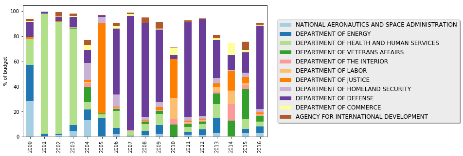

https://public.enigma.com/browse/u-s-government-spending-contracts/1a932abc-8398-47ff-ad33-d1eb9a8958cc


```python
import pandas as pd
import numpy as np
```


```python
cols = ['maj_agency_cat','unique_transaction_id','base_and_all_options_value','base_and_exercised_options_value']
```


```python
import matplotlib.pyplot as plt
g_cat.plot.bar(stacked=True,figsize=(15,5),colormap='Paired')
ax = plt.subplot(111)
chartBox = ax.get_position()
ax.set_position([chartBox.x0, chartBox.y0, chartBox.width*0.6, chartBox.height])
ax.legend(loc='right', bbox_to_anchor=(1.8, 0.5), shadow=True, ncol=1,prop={'size': 12})
plt.ylabel('% of budget')
plt.show()
```


image 2: 


