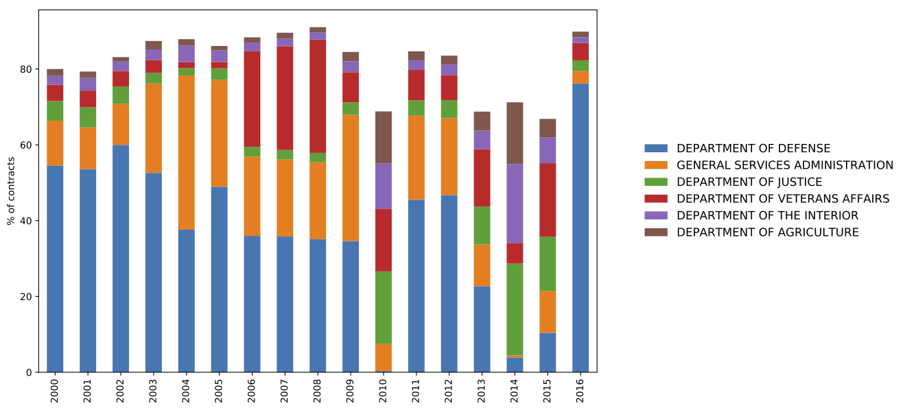

https://public.enigma.com/browse/u-s-government-spending-contracts/1a932abc-8398-47ff-ad33-d1eb9a8958cc

Code:

```python
import matplotlib.pyplot as plt
g_cat.plot.bar(stacked=True,figsize=(15,5),colormap='Paired')
ax = plt.subplot(111)
chartBox = ax.get_position()
ax.set_position([chartBox.x0, chartBox.y0, chartBox.width*0.6, chartBox.height])
ax.legend(loc='right', bbox_to_anchor=(1.8, 0.5), shadow=True, ncol=1,prop={'size': 12})
plt.ylabel('% of budget')
plt.show()
```


Plots: 

<a href="images/gov/percentage_contracts_per_agency.png" ></a>

<a href="images/gov/percentage_contracts_per_agency.png" ></a>


<a href="images/gov/cat.png" ></a>


Video:

<video src="videos/states.mp4" poster="videos/poster-states.png" style="max-width:100%" controls preload></video>
