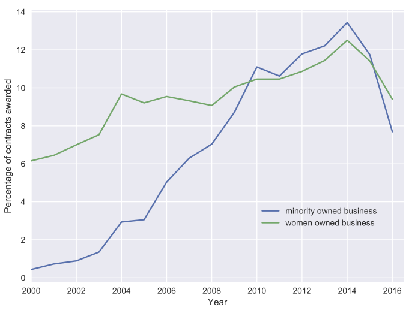

## Government Spending Contracts

The Government Spending Contracts dataset includes over 15 years of contracts, from 2000-2016, with the federal government. The data is publicly available at <https://www.usaspending.gov> and [here](https://public.enigma.com/browse/u-s-government-spending-contracts/1a932abc-8398-47ff-ad33-d1eb9a8958cc).
These contracts are mutually binding agreements between the federal government and another party (the seller) that obligates the seller to furnish supplies and services for the direct benefit of the government and obligates the government to pay for these services.

###  Contracts per agency


<details>
<summary>Click to see the complete list of agencies</summary>
<pre style="background-color:white"><code>ind_agency,name_agency
1100, Executive Office of the President
1145, Peace Corps
1153, Trade and Development Agency
1200, Department of Agriculture
1300, Department of Commerce
1400, Department of the Interior 
1500, Department of Justice
1600, Department of Labor
1900, Department of State
2000, Department of the Treasury
2400, Office of Personnel Management
2700, Federal Communications Commission
2800, Social Security Administration
2900, Federal Trade Commission
3100, Nuclear Regulatory Commission
3300, Smithsonian Institution
3352, J. F. Kennedy Center for the Performing Arts
3355, National Gallery of Art
3400, International Trade Commission
3600, Department of Veterans Affairs
4100, Merit Systems Protection Board
4500, Equal Employment Opportunity Commission
4700, General Services Administration
4900, National Science Foundation
5000, Securities and Exchange Commission
5800, Federal Emergency Management Agency
5900, National Foundation on the Arts and the Humanities
5920, National Endowment for the Arts
5940, National Endowment for the Humanities
6000, Railroad Retirement Board
6100, Consumer Product Safety Commission
6300, National Labor Relations Board
6400, Tennessee Valley Authority
6500, Federal Maritime Commission
6800, Environmental Protection Agency
6900, Department of Transportation
7000, Department of Homeland Security 
7200, Agency for International Development
7300, Small Business Administration
7400, American Battle Monuments Commission
7500, Department of Health and Human Services
8000, National Aeronautics and Space Administration
8400, United States Soldiers' and Airmen's Home
84af, Armed forces Retirement Home
8600, Department of Housing and Urban Development
8800, National Archives and Records Administration
8900, Department of Energy
8961, Federal Energy Regulatory Commission
9000, Selective Service System
9100, Department of Education
9506, Federal Election Commission
9514, Occupational Safety and Health Review Commission
9516, Defense Nuclear Facilities Safety Board
9517, Commission on Civil Rights
9524, National Mediation Board
9531, United States Holocaust Memorial Museum
9568, Broadcasting Board of Governors
9577, Corporation for National and Community Service
9594, Court Services and offender Supervision Agency
9700, Department of Defense</code></pre>
</details>


```python
dep = ['9700', '4700', '1500', '3600', '1400', '1200']
list_df = [df00,df01,df02,df03,df04,df05,df06,df07,df08,df09,df10,df11,df12,df13,df14,df15,df16]
list_g = []
for df in list_df:
    g_cat = df.groupby('maj_agency_cat').unique_transaction_id.count().reset_index()
    g_cat['ind_agency'] = g_cat.maj_agency_cat.apply(lambda x: x.split(':')[0])
    g_cat['name_agency'] = g_cat.maj_agency_cat.apply(lambda x: x.split(':')[1])
    g_cat = g_cat.groupby('ind_agency').unique_transaction_id.sum().sort_values(ascending=False).reset_index()
    g_cat['percentage'] = g_cat.unique_transaction_id/(g_cat.unique_transaction_id.sum())*100
    g_cat = g_cat[g_cat.ind_agency != ''].copy()
    g_cat = g_cat.drop('unique_transaction_id',axis=1)
    g_cat = g_cat.set_index('ind_agency')
    g_cat = g_cat.loc[dep]
    g_cat = g_cat.reset_index()
    g_cat['name_agency'] = g_cat['ind_agency'].apply(lambda x: dict_agency[x])
    g_cat = g_cat[['name_agency','percentage']].set_index('name_agency')
    list_g.append(g_cat)
```


**Percentage of contracts per agency**

<a href="images/gov/percentage_contracts_per_agency-100.png" ></a>

**Percentage of budget per agency**

<a href="images/gov/percentage_budget_per_agency-100.png" ></a>

### Contracts for women and minorities



###  Contracts per state

**Percentage of contracts per state over time**

<video src="videos/states.mp4" poster="videos/poster-states.png" style="max-width:100%" controls preload></video>


