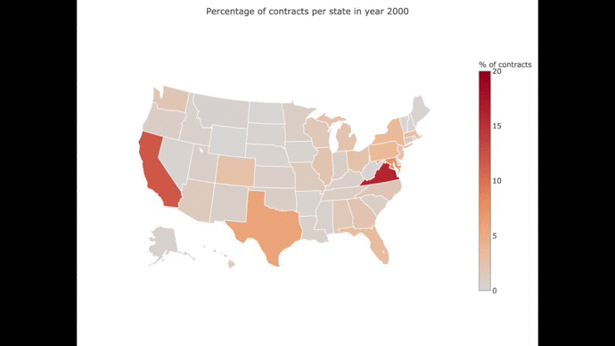

# Projects

1. [New York City Taxi Trip Duration - Kaggle](nyc.md)

Competition based on building a model that predicts the total ride duration of taxi trips in New York City. The dataset is one released by the NYC Taxi and Limousine Commission, which includes pickup time, geo-coordinates, number of passengers, and several other variables.
- Exploratory data analysis of the dataset (1.5 million trip records, 8 features).
- Feature extraction and engineering (24 features in my final submission).
- Modelling using gradient boosted trees (implementation in xgboost in Python, hyperparameter tuning using random search from scikit-learn).

2. [Box-Plots for Education - DrivenData](boxplots.md)

This competition features a multi-class-multi-label classification problem. The goal is attaching canonical labels to the freeform text in school budget items, which helps to compare budget or expenditure data across districts.
My approach consisted in processing the text data with regular natural language processing techniques (lemmatization, removal of stop words, etc) and a word count vectorizer. For the modelling I used a gradient boosted tree classifier.

3. [Government Spending Contracts](bud.html)

The Government Spending Contracts dataset includes over 15 years of contracts, from 2000-2016, with the federal government.    

# Notes

1. Pandas
2. Financial Data in Python
3. Supervised Learning (with scikit-learn)
4. Unsupervised Learning in Python

 

    <video width="99%" height="540" autoplay loop muted>
        <source src="videos/states.mp4" type="video/mp4">
    </video>

