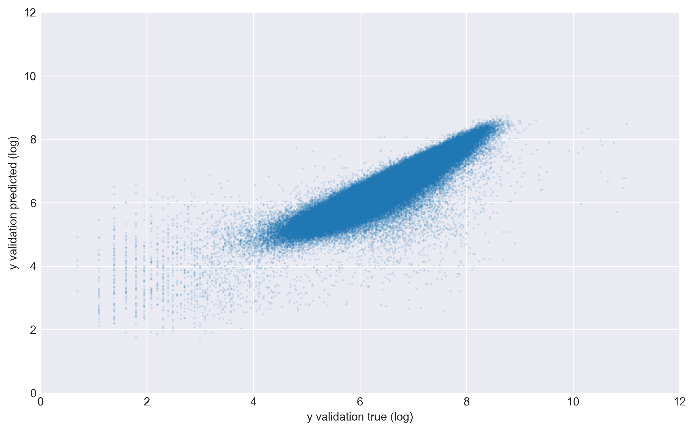

## New York City Taxi Trip Duration 

The objective is to build a model that predicts the total ride duration of taxi trips in New York City. The dataset was released by the NYC Taxi and Limousine Commission, which includes pickup time, geo-coordinates, number of passengers, and several other variables.

This project consists of the following parts: 
- [Exploratory data analysis of the dataset](#exploratory-data-analysis)
- [Feature extraction and engineering](#feature-engineering)
- [Modelling using gradient boosted trees](#modelling)

### Exploratory Data Analysis

Fist of all we import the necessary packages for the analysis.

```python
import numpy as np
import pandas as pd
import matplotlib.pyplot as plt
import seaborn as sns
plt.style.use('seaborn-darkgrid')
```
We read the datasets provided, a training set and a test set, into pandas dataframes.

```python
train_df = pd.read_csv('train.csv',parse_dates=["pickup_datetime"])
test_df = pd.read_csv('test.csv',parse_dates=["pickup_datetime"])
```

```python
print(train_df.shape)
```
<pre style="background-color:white"><code>(1458644, 10)
</code></pre>

The training set consists of 10 features and almost 1.5 million rows. Let's print out the first 5 rows.

```python
train_df.head()
```

<table border="1" class="dataframe">
  <thead>
    <tr style="text-align: right;">
      <th></th>
      <th>id</th>
      <th>vendor_id</th>
      <th>pickup_datetime</th>
      <th>passenger_count</th>
      <th>pickup_longitude</th>
      <th>pickup_latitude</th>
      <th>dropoff_longitude</th>
      <th>dropoff_latitude</th>
      <th>store_and_fwd_flag</th>
      <th>trip_duration</th>
    </tr>
  </thead>
  <tbody>
    <tr>
      <th>0</th>
      <td>id2875421</td>
      <td>2</td>
      <td>2016-03-14 17:24:55</td>
      <td>1</td>
      <td>-73.982155</td>
      <td>40.767937</td>
      <td>-73.964630</td>
      <td>40.765602</td>
      <td>N</td>
      <td>455</td>
    </tr>
    <tr>
      <th>1</th>
      <td>id2377394</td>
      <td>1</td>
      <td>2016-06-12 00:43:35</td>
      <td>1</td>
      <td>-73.980415</td>
      <td>40.738564</td>
      <td>-73.999481</td>
      <td>40.731152</td>
      <td>N</td>
      <td>663</td>
    </tr>
    <tr>
      <th>2</th>
      <td>id3858529</td>
      <td>2</td>
      <td>2016-01-19 11:35:24</td>
      <td>1</td>
      <td>-73.979027</td>
      <td>40.763939</td>
      <td>-74.005333</td>
      <td>40.710087</td>
      <td>N</td>
      <td>2124</td>
    </tr>
    <tr>
      <th>3</th>
      <td>id3504673</td>
      <td>2</td>
      <td>2016-04-06 19:32:31</td>
      <td>1</td>
      <td>-74.010040</td>
      <td>40.719971</td>
      <td>-74.012268</td>
      <td>40.706718</td>
      <td>N</td>
      <td>429</td>
    </tr>
    <tr>
      <th>4</th>
      <td>id2181028</td>
      <td>2</td>
      <td>2016-03-26 13:30:55</td>
      <td>1</td>
      <td>-73.973053</td>
      <td>40.793209</td>
      <td>-73.972923</td>
      <td>40.782520</td>
      <td>N</td>
      <td>435</td>
    </tr>
  </tbody>
</table>

We can get a concise summary of the dataframe with the *info()* method.

```python
train_df.info()
```
<pre style="background-color:white"><code><class 'pandas.core.frame.DataFrame'>
RangeIndex: 1458644 entries, 0 to 1458643
Data columns (total 10 columns):
id                    1458644 non-null object
vendor_id             1458644 non-null int64
pickup_datetime       1458644 non-null datetime64[ns]
passenger_count       1458644 non-null int64
pickup_longitude      1458644 non-null float64
pickup_latitude       1458644 non-null float64
dropoff_longitude     1458644 non-null float64
dropoff_latitude      1458644 non-null float64
store_and_fwd_flag    1458644 non-null object
trip_duration         1458644 non-null int64
dtypes: datetime64[ns](1), float64(4), int64(3), object(2)
memory usage: 111.3+ MB</code></pre>

We see there are no missing values. Out target variable is *trip_duration*.

On the documentation of the competition in Kaggle, we can find the following description for the dataset fields. In this exploratory data analysis we will explore each of them.

**Data fields**
- *id* : a unique identifier for each trip.
- *vendor_id* : a code indicating the provider associated with the trip record.
- *pickup_datetime* : date and time when the meter was engaged.
- *passenger_count* : the number of passengers in the vehicle (driver entered value).
- *pickup_longitude* : the longitude where the meter was engaged.
- *pickup_latitude* : the latitude where the meter was engaged.
- *dropoff_longitude* : the longitude where the meter was disengaged.
- *dropoff_latitude* : the latitude where the meter was disengaged.
- *store_and_fwd_flag* : this flag indicates whether the trip record was held in vehicle memory before sending to the vendor because the vehicle did not have a connection to the server.
- *trip_duration* : duration of the trip in seconds.


**Vendor id**

The vendor id can be 1 or 2. 

```python
train_df['vendor_id'].value_counts().sort_index().plot(kind='bar')
plt.xticks(rotation='horizontal')
plt.ylabel('Frequency')
plt.xlabel('Vendor')
plt.show()
```


We calculate the percentage of trip records corresponding to each vendor.

```python
train_df['vendor_id'].value_counts().sort_index()/sum(train_df['vendor_id'].value_counts().sort_index())*100
```

<pre style="background-color:white"><code>1    46.504973
2    53.495027
Name: vendor_id, dtype: float64
</code></pre>

**Pickup datetime**

We will resample per day counting the records for each day.

```python
train_df.resample('D',on='pickup_datetime').count()['id'].plot(style='o-')
plt.ylabel('Counts per day')
plt.xlabel('Pickup datetime')
plt.show()
```


We see the training data extends from January 2016 to June 2016. There is a significant drop in January. We find out the exact day using the *argmin* function.

```python
np.argmin(train_df.resample('D',on='pickup_datetime').count()['id'])
```

Doing some internet research reveals us that on this date a historic blizzard took place, with snowfall amounts of over 2 feet. There was actually a travel ban in New York City for January 23–24. 


<pre style="background-color:white"><code>Timestamp('2016-01-23 00:00:00', freq='D')
</code></pre>

A natural question to ask now is if the datetime range for the test set is the same, so we resample per day for the test set as well.

```python
test_df.resample('D',on='pickup_datetime').count()['id'].plot(style='o-',c='green')
plt.ylabel('Counts per day')
plt.xlabel('Pickup datetime')
plt.show()
```


Yes, it is indeed. These are good news, because it allow us to use algorithms as decision trees which are not well-suited if the time range was different.

**Pickup longitude & pickup latitude**

We plot the pickup coordinates together. 

```python
plt.figure(figsize=(15,10))
plt.scatter(train_df.pickup_longitude,train_df.pickup_latitude,s=0.3,alpha=0.3)
plt.xlim(-74.03, -73.75)
plt.ylim(40.63, 40.85)
plt.xlabel('Pickup longitude')
plt.ylabel('Pickup latitude')
plt.show()
```


We can easily recognize Manhattan with its typical rectangular grid plan. We also can see the two nearest airports, JFK and LaGuardia Airports.

**Dropoff longitude & dropoff latitude**

We do the same for the dropoff locations. 

```python
plt.figure(figsize=(15,10))
plt.scatter(train_df.dropoff_longitude,train_df.dropoff_latitude,s=0.3,alpha=0.2)
plt.xlim(-74.03, -73.75)
plt.ylim(40.63, 40.85)
plt.xlabel('Dropoff longitude')
plt.ylabel('Dropoff latitude')
plt.show()
```


We get something really similar. The dropoff locations are a little bit more spread out, but also focused in Manhattan.

**Passenger count**


```python
train_df['passenger_count'].value_counts().sort_index().plot(kind='bar')
plt.ylabel('Frequency')
plt.xlabel('Number of passengers')
plt.show()
```


We see most of the trips have 1 or 2 passengers. The exact counts are:

```python
train_df['passenger_count'].value_counts().sort_index()
```

<pre style="background-color:white"><code>0         60
1    1033540
2     210318
3      59896
4      28404
5      78088
6      48333
7          3
8          1
9          1
Name: passenger_count, dtype: int64
</code></pre>


**Store and forward flag**

```python
train_df['store_and_fwd_flag'].value_counts().sort_index().plot(kind='bar')
plt.xticks(rotation='horizontal')
plt.ylabel('Frequency')
plt.xlabel('Store and forward flag')
plt.show()
```


Only in a very few cases, the store and forward flag is positive, meaning that the trip record was not directly sent to the server but held in memory before forwarding (due to a faulty connection to the server). We calculate the percentage of trip records with each flag.

```python
train_df['store_and_fwd_flag'].value_counts().sort_index()/sum(train_df['store_and_fwd_flag'].value_counts().sort_index())*100
```

<pre style="background-color:white"><code>N    99.44846
Y     0.55154
Name: store_and_fwd_flag, dtype: float64
</code></pre>

**Trip duration**

Trip duration is our target variable. It is continuous, which makes this problem a regression problem. 

```python
np.log(train_df['trip_duration']).plot(kind='hist',bins=200,figsize=(15,5))
plt.xlabel('log(trip duration)')
plt.show()
```


```python
print("Maximum trip duration (in hours): {}".format(max(train_df['trip_duration'])//3600))
```

<pre style="background-color:white"><code>Maximum trip duration (in hours): 979
</code></pre>

```python
df = train_df[train_df.trip_duration < np.exp(11)]
plt.hist(np.log(df.trip_duration),bins=100)
plt.xlabel('log(trip duration)')
plt.ylabel('Frequency')
plt.show()
```


### Feature Engineering


**Remove outliers (trip duration)**


```python
train_df = train_df[train_df.trip_duration < np.exp(11)]
max(np.log(train_df.trip_duration))
```


    10.99958000240877


**Concatenate train and test data**


```python
df = pd.concat((train_df, test_df))
```

**Get dummies**


```python
df = pd.get_dummies(df, columns=['vendor_id','store_and_fwd_flag'],drop_first=True)
df.head()
```


<div>
<style>
    .dataframe thead tr:only-child th {
        text-align: right;
    }

    .dataframe thead th {
        text-align: left;
    }

    .dataframe tbody tr th {
        vertical-align: top;
    }
</style>
<table border="1" class="dataframe">
  <thead>
    <tr style="text-align: right;">
      <th></th>
      <th>dropoff_latitude</th>
      <th>dropoff_longitude</th>
      <th>id</th>
      <th>passenger_count</th>
      <th>pickup_datetime</th>
      <th>pickup_latitude</th>
      <th>pickup_longitude</th>
      <th>trip_duration</th>
      <th>vendor_id_2</th>
      <th>store_and_fwd_flag_Y</th>
    </tr>
  </thead>
  <tbody>
    <tr>
      <th>0</th>
      <td>40.765602</td>
      <td>-73.964630</td>
      <td>id2875421</td>
      <td>1</td>
      <td>2016-03-14 17:24:55</td>
      <td>40.767937</td>
      <td>-73.982155</td>
      <td>455.0</td>
      <td>1</td>
      <td>0</td>
    </tr>
    <tr>
      <th>1</th>
      <td>40.731152</td>
      <td>-73.999481</td>
      <td>id2377394</td>
      <td>1</td>
      <td>2016-06-12 00:43:35</td>
      <td>40.738564</td>
      <td>-73.980415</td>
      <td>663.0</td>
      <td>0</td>
      <td>0</td>
    </tr>
    <tr>
      <th>2</th>
      <td>40.710087</td>
      <td>-74.005333</td>
      <td>id3858529</td>
      <td>1</td>
      <td>2016-01-19 11:35:24</td>
      <td>40.763939</td>
      <td>-73.979027</td>
      <td>2124.0</td>
      <td>1</td>
      <td>0</td>
    </tr>
    <tr>
      <th>3</th>
      <td>40.706718</td>
      <td>-74.012268</td>
      <td>id3504673</td>
      <td>1</td>
      <td>2016-04-06 19:32:31</td>
      <td>40.719971</td>
      <td>-74.010040</td>
      <td>429.0</td>
      <td>1</td>
      <td>0</td>
    </tr>
    <tr>
      <th>4</th>
      <td>40.782520</td>
      <td>-73.972923</td>
      <td>id2181028</td>
      <td>1</td>
      <td>2016-03-26 13:30:55</td>
      <td>40.793209</td>
      <td>-73.973053</td>
      <td>435.0</td>
      <td>1</td>
      <td>0</td>
    </tr>
  </tbody>
</table>
</div>


**datetime features**


```python
import datetime as dt
df['weekday']=df['pickup_datetime'].dt.weekday
df['hour']=df['pickup_datetime'].dt.hour
df['minute']=df['pickup_datetime'].dt.minute
df['dt'] = (df['pickup_datetime'] - df['pickup_datetime'].min()).dt.total_seconds()

df['hourfloat']=df.hour+df.minute/60.0

df['x_hour']=np.sin(2.*np.pi*df.hourfloat/24.)
df['y_hour']=np.cos(2.*np.pi*df.hourfloat/24.)

df['x_weekday']=np.sin(2.*np.pi*df.weekday/7)
df['y_weekday']=np.cos(2.*np.pi*df.weekday/7)
```

**coordinate features**


```python
from sklearn.decomposition import PCA

pca = PCA(n_components=2)

X = np.vstack((df[['pickup_latitude', 'pickup_longitude']], 
               df[['dropoff_latitude', 'dropoff_longitude']]))

#remove abnormal locations
min_lat, min_lng = np.array([40.7493,-73.9894]) - 1*X.std(axis=0)
max_lat, max_lng = np.array([40.7493,-73.9894]) + 1*X.std(axis=0)
X = X[(X[:,0] > min_lat) & (X[:,0] < max_lat) & (X[:,1] > min_lng) & (X[:,1] < max_lng)]


pca.fit(X)
X_pca = pca.transform(X)

df['pickup_pca0'] = pca.transform(df[['pickup_latitude', 'pickup_longitude']])[:,0]
df['pickup_pca1'] = pca.transform(df[['pickup_latitude', 'pickup_longitude']])[:,1]

df['dropoff_pca0'] = pca.transform(df[['dropoff_latitude', 'dropoff_longitude']])[:,0]
df['dropoff_pca1'] = pca.transform(df[['dropoff_latitude', 'dropoff_longitude']])[:,1]
```


```python
plt.style.use('seaborn-darkgrid')
plt.figure(figsize=(15,10))
plt.scatter(df.loc[:,'pickup_pca0'],df.loc[:,'pickup_pca1'],s=0.4,alpha=0.1,color='green')
plt.xlim(-0.15, 0.1)
plt.ylim(-0.25, 0.1)
plt.xlabel('longitude')
plt.ylabel('latitude')
plt.show()
```


**Manhattan distance**


```python
df['manhattan_pca'] = \
    (df['dropoff_pca0'] - df['pickup_pca0']).abs() + \
    (df['dropoff_pca1'] - df['pickup_pca1']).abs()
```

**Haversine distance**


```python
def haversine_np(lon1, lat1, lon2, lat2):
    """
    Calculate the great circle distance between two points
    on the earth (specified in decimal degrees)

    All args must be of equal length.    

    """
    lon1, lat1, lon2, lat2 = map(np.radians, [lon1, lat1, lon2, lat2])

    dlon = lon2 - lon1
    dlat = lat2 - lat1

    a = np.sin(dlat/2.0)**2 + np.cos(lat1) * np.cos(lat2) * np.sin(dlon/2.0)**2

    c = 2 * np.arcsin(np.sqrt(a))
    km = 6367 * c
    return km
```


```python
df['haversine'] = haversine_np(
    df['pickup_latitude'], df['pickup_longitude'], 
    df['dropoff_latitude'], df['dropoff_longitude'])
```

**bearing**


```python
def arrays_bearing(lats1, lngs1, lats2, lngs2, R=6371):
    lats1_rads = np.radians(lats1)
    lats2_rads = np.radians(lats2)
    lngs1_rads = np.radians(lngs1)
    lngs2_rads = np.radians(lngs2)
    lngs_delta_rads = np.radians(lngs2 - lngs1)
    
    y = np.sin(lngs_delta_rads) * np.cos(lats2_rads)
    x = np.cos(lats1_rads) * np.sin(lats2_rads) - np.sin(lats1_rads) * np.cos(lats2_rads) * np.cos(lngs_delta_rads)
    
    return np.degrees(np.arctan2(y, x))
```


```python
df['bearing'] = arrays_bearing(
    df['pickup_latitude'], df['pickup_longitude'], 
    df['dropoff_latitude'], df['dropoff_longitude'])
```

**clusters**


```python
from sklearn.cluster import MiniBatchKMeans

X = np.vstack((df[['pickup_latitude', 'pickup_longitude']], 
               df[['dropoff_latitude', 'dropoff_longitude']]))

#remove abnormal locations
min_lat, min_lng = X.mean(axis=0) - 2.5*X.std(axis=0)
max_lat, max_lng = X.mean(axis=0) + 2.5*X.std(axis=0)
X = X[(X[:,0] > min_lat) & (X[:,0] < max_lat) & (X[:,1] > min_lng) & (X[:,1] < max_lng)]


kmeans = MiniBatchKMeans(n_clusters=50)
kmeans.fit(X)

df['pickup_cluster'] = kmeans.predict(df[['pickup_latitude', 'pickup_longitude']])
df['dropoff_cluster'] = kmeans.predict(df[['dropoff_latitude', 'dropoff_longitude']])
```


```python
X = np.vstack((df[['pickup_latitude', 'pickup_longitude']], 
               df[['dropoff_latitude', 'dropoff_longitude']]))
min_lat, min_lng = X.mean(axis=0) - 4*X.std(axis=0)
max_lat, max_lng = X.mean(axis=0) + 4*X.std(axis=0)
X = X[(X[:,0] > min_lat) & (X[:,0] < max_lat) & (X[:,1] > min_lng) & (X[:,1] < max_lng)]
x = kmeans.cluster_centers_[:,1]
y = kmeans.cluster_centers_[:,0]
plt.figure(figsize=(10,6))
plt.scatter(X[:,1],X[:,0], s=2, lw=0, 
            c=kmeans.predict(X), cmap='tab20')
for i in np.arange(50):
        plt.annotate(i,xy=(x[i],y[i]),fontsize=10)    
plt.xlim(-74.03, -73.75)
plt.ylim(40.63, 40.85)
plt.show()
```

<a href="images/nyc/cluster_map-300.png" ></a>

**counts per cluster and hour and weekday**


```python
df_pickup_counts = df \
    .set_index('pickup_datetime') \
    .groupby(['pickup_cluster','hour','weekday']).agg({'id': 'count'}) \
    .reset_index() \
    .rename(columns={'id': 'pickup_cluster_hourcount'})
```


```python
df_pickup_counts.head()
```


<div>
<style>
    .dataframe thead tr:only-child th {
        text-align: right;
    }

    .dataframe thead th {
        text-align: left;
    }

    .dataframe tbody tr th {
        vertical-align: top;
    }
</style>
<table border="1" class="dataframe">
  <thead>
    <tr style="text-align: right;">
      <th></th>
      <th>pickup_cluster</th>
      <th>hour</th>
      <th>weekday</th>
      <th>pickup_cluster_hourcount</th>
    </tr>
  </thead>
  <tbody>
    <tr>
      <th>0</th>
      <td>0</td>
      <td>0</td>
      <td>0</td>
      <td>92</td>
    </tr>
    <tr>
      <th>1</th>
      <td>0</td>
      <td>0</td>
      <td>1</td>
      <td>78</td>
    </tr>
    <tr>
      <th>2</th>
      <td>0</td>
      <td>0</td>
      <td>2</td>
      <td>106</td>
    </tr>
    <tr>
      <th>3</th>
      <td>0</td>
      <td>0</td>
      <td>3</td>
      <td>139</td>
    </tr>
    <tr>
      <th>4</th>
      <td>0</td>
      <td>0</td>
      <td>4</td>
      <td>178</td>
    </tr>
  </tbody>
</table>
</div>


```python
df = df.merge(df_pickup_counts,on=['hour','weekday','pickup_cluster'],how='left')
df['pickup_cluster_hourcount'] = df['pickup_cluster_hourcount'].fillna(0)
```

**


```python
df_dropoff_counts = df \
    .set_index('pickup_datetime') \
    .groupby(['dropoff_cluster','hour','weekday']).agg({'id': 'count'}) \
    .reset_index() \
    .rename(columns={'id': 'dropoff_cluster_hourcount'})
```


```python
df_dropoff_counts.head()
```


<div>
<style>
    .dataframe thead tr:only-child th {
        text-align: right;
    }

    .dataframe thead th {
        text-align: left;
    }

    .dataframe tbody tr th {
        vertical-align: top;
    }
</style>
<table border="1" class="dataframe">
  <thead>
    <tr style="text-align: right;">
      <th></th>
      <th>dropoff_cluster</th>
      <th>hour</th>
      <th>weekday</th>
      <th>dropoff_cluster_hourcount</th>
    </tr>
  </thead>
  <tbody>
    <tr>
      <th>0</th>
      <td>0</td>
      <td>0</td>
      <td>0</td>
      <td>164</td>
    </tr>
    <tr>
      <th>1</th>
      <td>0</td>
      <td>0</td>
      <td>1</td>
      <td>150</td>
    </tr>
    <tr>
      <th>2</th>
      <td>0</td>
      <td>0</td>
      <td>2</td>
      <td>219</td>
    </tr>
    <tr>
      <th>3</th>
      <td>0</td>
      <td>0</td>
      <td>3</td>
      <td>261</td>
    </tr>
    <tr>
      <th>4</th>
      <td>0</td>
      <td>0</td>
      <td>4</td>
      <td>366</td>
    </tr>
  </tbody>
</table>
</div>


```python
df = df.merge(df_dropoff_counts,on=['hour', 'dropoff_cluster','weekday'],how='left')
df['dropoff_cluster_hourcount'] = df['dropoff_cluster_hourcount'].fillna(0)
```

**general traffic**


```python
df_counts = df.set_index('pickup_datetime')[['id']].sort_index()
df_counts['count_60min'] = df_counts.isnull().rolling('60min').count()['id']
df = df.merge(df_counts, on='id', how='left')
```


```python
df_counts['count_60min'].head(8000).plot(figsize=(15,5))
plt.show()
```


```python
df.columns
```


    Index(['dropoff_latitude', 'dropoff_longitude', 'id', 'passenger_count',
           'pickup_datetime', 'pickup_latitude', 'pickup_longitude',
           'trip_duration', 'vendor_id_2', 'store_and_fwd_flag_Y', 'weekday',
           'hour', 'minute', 'dt', 'hourfloat', 'x_hour', 'y_hour', 'x_weekday',
           'y_weekday', 'pickup_pca0', 'pickup_pca1', 'dropoff_pca0',
           'dropoff_pca1', 'manhattan_pca', 'haversine', 'bearing',
           'pickup_cluster', 'dropoff_cluster', 'pickup_cluster_hourcount',
           'dropoff_cluster_hourcount', 'count_60min'],
          dtype='object')


```python
features = ['dropoff_latitude', 'dropoff_longitude', 'passenger_count',
           'pickup_latitude', 'pickup_longitude', 'vendor_id_2',
           'store_and_fwd_flag_Y', 'dt', 'hour', 'weekday','x_hour', 'y_hour', 'x_weekday',
           'y_weekday', 'pickup_pca0', 'pickup_pca1', 'dropoff_pca0',
           'dropoff_pca1', 'manhattan_pca','haversine', 'bearing',
            'count_60min','dropoff_cluster_hourcount','pickup_cluster_hourcount',
           'pickup_cluster','dropoff_cluster','id']
```


```python
X_train = df[df['trip_duration'].notnull()][features]
y_train = df[df['trip_duration'].notnull()]['trip_duration']

X_test = df[df['trip_duration'].isnull()][features]
```


```python
X_train.head()
```


<div>
<style>
    .dataframe thead tr:only-child th {
        text-align: right;
    }

    .dataframe thead th {
        text-align: left;
    }

    .dataframe tbody tr th {
        vertical-align: top;
    }
</style>
<table border="1" class="dataframe">
  <thead>
    <tr style="text-align: right;">
      <th></th>
      <th>dropoff_latitude</th>
      <th>dropoff_longitude</th>
      <th>passenger_count</th>
      <th>pickup_latitude</th>
      <th>pickup_longitude</th>
      <th>vendor_id_2</th>
      <th>store_and_fwd_flag_Y</th>
      <th>dt</th>
      <th>hour</th>
      <th>weekday</th>
      <th>...</th>
      <th>dropoff_pca1</th>
      <th>manhattan_pca</th>
      <th>haversine</th>
      <th>bearing</th>
      <th>count_60min</th>
      <th>dropoff_cluster_hourcount</th>
      <th>pickup_cluster_hourcount</th>
      <th>pickup_cluster</th>
      <th>dropoff_cluster</th>
      <th>id</th>
    </tr>
  </thead>
  <tbody>
    <tr>
      <th>0</th>
      <td>40.765602</td>
      <td>-73.964630</td>
      <td>1</td>
      <td>40.767937</td>
      <td>-73.982155</td>
      <td>1</td>
      <td>0</td>
      <td>6369878.0</td>
      <td>17</td>
      <td>0</td>
      <td>...</td>
      <td>-0.003243</td>
      <td>0.024605</td>
      <td>1.948753</td>
      <td>99.970196</td>
      <td>578.0</td>
      <td>532</td>
      <td>625</td>
      <td>39</td>
      <td>8</td>
      <td>id2875421</td>
    </tr>
    <tr>
      <th>1</th>
      <td>40.731152</td>
      <td>-73.999481</td>
      <td>1</td>
      <td>40.738564</td>
      <td>-73.980415</td>
      <td>0</td>
      <td>0</td>
      <td>14085798.0</td>
      <td>0</td>
      <td>6</td>
      <td>...</td>
      <td>-0.000700</td>
      <td>0.027418</td>
      <td>2.130839</td>
      <td>-117.153768</td>
      <td>651.0</td>
      <td>617</td>
      <td>431</td>
      <td>43</td>
      <td>36</td>
      <td>id2377394</td>
    </tr>
    <tr>
      <th>2</th>
      <td>40.710087</td>
      <td>-74.005333</td>
      <td>1</td>
      <td>40.763939</td>
      <td>-73.979027</td>
      <td>1</td>
      <td>0</td>
      <td>1596907.0</td>
      <td>11</td>
      <td>1</td>
      <td>...</td>
      <td>-0.010568</td>
      <td>0.074362</td>
      <td>3.356930</td>
      <td>-159.680165</td>
      <td>547.0</td>
      <td>351</td>
      <td>494</td>
      <td>39</td>
      <td>5</td>
      <td>id3858529</td>
    </tr>
    <tr>
      <th>3</th>
      <td>40.706718</td>
      <td>-74.012268</td>
      <td>1</td>
      <td>40.719971</td>
      <td>-74.010040</td>
      <td>1</td>
      <td>0</td>
      <td>8364734.0</td>
      <td>19</td>
      <td>2</td>
      <td>...</td>
      <td>-0.007713</td>
      <td>0.018576</td>
      <td>0.475220</td>
      <td>-172.737700</td>
      <td>776.0</td>
      <td>318</td>
      <td>430</td>
      <td>38</td>
      <td>5</td>
      <td>id3504673</td>
    </tr>
    <tr>
      <th>4</th>
      <td>40.782520</td>
      <td>-73.972923</td>
      <td>1</td>
      <td>40.793209</td>
      <td>-73.973053</td>
      <td>1</td>
      <td>0</td>
      <td>7392638.0</td>
      <td>13</td>
      <td>5</td>
      <td>...</td>
      <td>0.014284</td>
      <td>0.015109</td>
      <td>0.328255</td>
      <td>179.473585</td>
      <td>609.0</td>
      <td>560</td>
      <td>405</td>
      <td>7</td>
      <td>33</td>
      <td>id2181028</td>
    </tr>
  </tbody>
</table>
<p>5 rows × 27 columns</p>
</div>


**speed**


```python
speed_pickdrop = X_train[['pickup_cluster','dropoff_cluster','id']].copy()
speed_pickdrop['avg_speed'] = X_train['haversine']/y_train

speed_pickdrop = speed_pickdrop[speed_pickdrop['avg_speed'] < 30]

speed_pickdrop = speed_pickdrop.groupby(['pickup_cluster','dropoff_cluster']).agg({'avg_speed': 'median','id':'count'})\
                .reset_index()
speed_pickdrop = speed_pickdrop[speed_pickdrop.avg_speed<30]
speed_pickdrop = speed_pickdrop[speed_pickdrop.id>10]
```


```python
speed_pickdrop.head()
```


<div>
<style>
    .dataframe thead tr:only-child th {
        text-align: right;
    }

    .dataframe thead th {
        text-align: left;
    }

    .dataframe tbody tr th {
        vertical-align: top;
    }
</style>
<table border="1" class="dataframe">
  <thead>
    <tr style="text-align: right;">
      <th></th>
      <th>pickup_cluster</th>
      <th>dropoff_cluster</th>
      <th>avg_speed</th>
      <th>id</th>
    </tr>
  </thead>
  <tbody>
    <tr>
      <th>0</th>
      <td>0</td>
      <td>0</td>
      <td>0.002572</td>
      <td>1928</td>
    </tr>
    <tr>
      <th>1</th>
      <td>0</td>
      <td>1</td>
      <td>0.001889</td>
      <td>22</td>
    </tr>
    <tr>
      <th>2</th>
      <td>0</td>
      <td>2</td>
      <td>0.001588</td>
      <td>14</td>
    </tr>
    <tr>
      <th>3</th>
      <td>0</td>
      <td>3</td>
      <td>0.009034</td>
      <td>21</td>
    </tr>
    <tr>
      <th>4</th>
      <td>0</td>
      <td>4</td>
      <td>0.005275</td>
      <td>100</td>
    </tr>
  </tbody>
</table>
</div>


```python
speed_pickdrop['avg_speed'].describe()
```


    count    2311.000000
    mean        0.003655
    std         0.002138
    min         0.000544
    25%         0.002009
    50%         0.003137
    75%         0.004579
    max         0.011081
    Name: avg_speed, dtype: float64


```python
speed_pickdrop['avg_speed'].plot(kind='hist',bins=50)
plt.show()
```


```python
speed_pickdrop.drop(['id'],axis=1,inplace=True)
speed_pickdrop.sort_values(['avg_speed'],ascending=False).head()
```


<div>
<style>
    .dataframe thead tr:only-child th {
        text-align: right;
    }

    .dataframe thead th {
        text-align: left;
    }

    .dataframe tbody tr th {
        vertical-align: top;
    }
</style>
<table border="1" class="dataframe">
  <thead>
    <tr style="text-align: right;">
      <th></th>
      <th>pickup_cluster</th>
      <th>dropoff_cluster</th>
      <th>avg_speed</th>
    </tr>
  </thead>
  <tbody>
    <tr>
      <th>503</th>
      <td>10</td>
      <td>3</td>
      <td>0.011081</td>
    </tr>
    <tr>
      <th>512</th>
      <td>10</td>
      <td>12</td>
      <td>0.010649</td>
    </tr>
    <tr>
      <th>2161</th>
      <td>43</td>
      <td>41</td>
      <td>0.010574</td>
    </tr>
    <tr>
      <th>2123</th>
      <td>43</td>
      <td>3</td>
      <td>0.010423</td>
    </tr>
    <tr>
      <th>2167</th>
      <td>43</td>
      <td>47</td>
      <td>0.010372</td>
    </tr>
  </tbody>
</table>
</div>


```python
X_train = X_train.merge(speed_pickdrop,on=['pickup_cluster','dropoff_cluster'],how='left')
X_train['avg_speed'] = X_train['avg_speed'].fillna(np.mean(speed_pickdrop.avg_speed))
X_train.drop(['id','pickup_cluster','dropoff_cluster'],axis=1,inplace=True)


X_test = X_test.merge(speed_pickdrop,on=['pickup_cluster','dropoff_cluster'],how='left')
X_test['avg_speed'] = X_test['avg_speed'].fillna(np.mean(speed_pickdrop.avg_speed))
X_test.drop(['id','pickup_cluster','dropoff_cluster'],axis=1,inplace=True)
```


```python
X_train.head()
```


<div>
<style>
    .dataframe thead tr:only-child th {
        text-align: right;
    }

    .dataframe thead th {
        text-align: left;
    }

    .dataframe tbody tr th {
        vertical-align: top;
    }
</style>
<table border="1" class="dataframe">
  <thead>
    <tr style="text-align: right;">
      <th></th>
      <th>dropoff_latitude</th>
      <th>dropoff_longitude</th>
      <th>passenger_count</th>
      <th>pickup_latitude</th>
      <th>pickup_longitude</th>
      <th>vendor_id_2</th>
      <th>store_and_fwd_flag_Y</th>
      <th>dt</th>
      <th>hour</th>
      <th>weekday</th>
      <th>...</th>
      <th>pickup_pca1</th>
      <th>dropoff_pca0</th>
      <th>dropoff_pca1</th>
      <th>manhattan_pca</th>
      <th>haversine</th>
      <th>bearing</th>
      <th>count_60min</th>
      <th>dropoff_cluster_hourcount</th>
      <th>pickup_cluster_hourcount</th>
      <th>avg_speed</th>
    </tr>
  </thead>
  <tbody>
    <tr>
      <th>0</th>
      <td>40.765602</td>
      <td>-73.964630</td>
      <td>1</td>
      <td>40.767937</td>
      <td>-73.982155</td>
      <td>1</td>
      <td>0</td>
      <td>6369878.0</td>
      <td>17</td>
      <td>0</td>
      <td>...</td>
      <td>0.011280</td>
      <td>-0.021187</td>
      <td>-0.003243</td>
      <td>0.024605</td>
      <td>1.948753</td>
      <td>99.970196</td>
      <td>578.0</td>
      <td>532</td>
      <td>625</td>
      <td>0.003244</td>
    </tr>
    <tr>
      <th>1</th>
      <td>40.731152</td>
      <td>-73.999481</td>
      <td>1</td>
      <td>40.738564</td>
      <td>-73.980415</td>
      <td>0</td>
      <td>0</td>
      <td>14085798.0</td>
      <td>0</td>
      <td>6</td>
      <td>...</td>
      <td>-0.009795</td>
      <td>0.027752</td>
      <td>-0.000700</td>
      <td>0.027418</td>
      <td>2.130839</td>
      <td>-117.153768</td>
      <td>651.0</td>
      <td>617</td>
      <td>431</td>
      <td>0.003397</td>
    </tr>
    <tr>
      <th>2</th>
      <td>40.710087</td>
      <td>-74.005333</td>
      <td>1</td>
      <td>40.763939</td>
      <td>-73.979027</td>
      <td>1</td>
      <td>0</td>
      <td>1596907.0</td>
      <td>11</td>
      <td>1</td>
      <td>...</td>
      <td>0.006275</td>
      <td>0.047260</td>
      <td>-0.010568</td>
      <td>0.074362</td>
      <td>3.356930</td>
      <td>-159.680165</td>
      <td>547.0</td>
      <td>351</td>
      <td>494</td>
      <td>0.002471</td>
    </tr>
    <tr>
      <th>3</th>
      <td>40.706718</td>
      <td>-74.012268</td>
      <td>1</td>
      <td>40.719971</td>
      <td>-74.010040</td>
      <td>1</td>
      <td>0</td>
      <td>8364734.0</td>
      <td>19</td>
      <td>2</td>
      <td>...</td>
      <td>-0.000430</td>
      <td>0.054422</td>
      <td>-0.007713</td>
      <td>0.018576</td>
      <td>0.475220</td>
      <td>-172.737700</td>
      <td>776.0</td>
      <td>318</td>
      <td>430</td>
      <td>0.001261</td>
    </tr>
    <tr>
      <th>4</th>
      <td>40.782520</td>
      <td>-73.972923</td>
      <td>1</td>
      <td>40.793209</td>
      <td>-73.973053</td>
      <td>1</td>
      <td>0</td>
      <td>7392638.0</td>
      <td>13</td>
      <td>5</td>
      <td>...</td>
      <td>0.021582</td>
      <td>-0.028101</td>
      <td>0.014284</td>
      <td>0.015109</td>
      <td>0.328255</td>
      <td>179.473585</td>
      <td>609.0</td>
      <td>560</td>
      <td>405</td>
      <td>0.003051</td>
    </tr>
  </tbody>
</table>
<p>5 rows × 25 columns</p>
</div>


```python
X_train = X_train.drop(['dropoff_latitude', 'dropoff_longitude', 'passenger_count',
           'pickup_latitude', 'pickup_longitude','hour','weekday'],axis=1)

X_test = X_test.drop(['dropoff_latitude', 'dropoff_longitude', 'passenger_count',
           'pickup_latitude', 'pickup_longitude','hour','weekday'],axis=1)
```

**Correlation**


```python
% matplotlib inline
features = X_train.columns.tolist()
correlation_values = []
labels = []
l = np.arange(0,X_train.shape[1])
for i in l:
    if X_train.iloc[:,i].nunique() > 1:
        correlation_values.append(np.corrcoef(X_train.iloc[:,i], y_train)[0,1])
        labels.append(features[i])
    else:
        pass
corr = pd.DataFrame({'correlation_values': correlation_values},index=labels).sort_values('correlation_values')
corr.plot(kind='barh',figsize=(6,4.5),legend=None)
plt.savefig('correlation_values.pdf', bbox_inches='tight')
plt.show()
```


```python
# correlation matrix
train = pd.concat([X_train, y_train], axis=1)
corrmat = train.corr()

# Generate a mask for the upper triangle
mask = np.zeros_like(corrmat, dtype=np.bool)
mask[np.triu_indices_from(mask)] = True
```


```python
f, ax = plt.subplots(figsize=(6, 4.5))
sns.heatmap(corrmat, mask=mask, vmax=.8, square=True)
plt.savefig('correlation_map.pdf', bbox_inches='tight')
plt.show()
```


### Modelling

```python
import numpy as np
import pandas as pd
import xgboost as xgb
from sklearn.model_selection import train_test_split
import datetime as dt
import matplotlib.pyplot as plt

X_train = pd.read_csv('X_train.csv')
X_test = pd.read_csv('X_test.csv')
y_train = pd.read_csv('y_train.csv',squeeze=True)

opt_params = {'booster' : 'gbtree',
'colsample_bytree': 0.4,
'learning_rate': 0.1,
'max_depth':20,
'min_child_weight':150,
'n_estimators':1000,
'n_jobs':1,
'objective':'reg:linear',
'reg_lambda':2,
'silent':True,
'subsample':0.9}

t0 = dt.datetime.now()

y_train_log = np.log(y_train.values + 1)

Xtr, Xv, ytr_log, yv_log = train_test_split(X_train, y_train_log, test_size=0.2, random_state=42)
dtrain = xgb.DMatrix(Xtr, label=ytr_log)
dvalid = xgb.DMatrix(Xv, label=yv_log)
dtest = xgb.DMatrix(X_test)
watchlist = [(dtrain, 'train'), (dvalid, 'valid')]

model = xgb.train(opt_params, dtrain, 10000, watchlist, early_stopping_rounds=100,
                  maximize=False, verbose_eval=50)

print('Modeling best RMSE: %.5f' % model.best_score)

ytr_pred_log = model.predict(dtrain,ntree_limit=model.best_ntree_limit)
yv_pred_log = model.predict(dvalid,ntree_limit=model.best_ntree_limit)

ytest_pred_log = model.predict(dtest,ntree_limit=model.best_ntree_limit)

ypredlog = pd.DataFrame({'log prediction': ytest_pred_log})
ypredlog.to_csv('web/ypredlog.csv',index=False)
ytest_pred_log[ytest_pred_log<0]=0

t1 = dt.datetime.now()
print('XGB time: %i seconds' % (t1 - t0).seconds)
```

```
[0]	train-rmse:5.41337	valid-rmse:5.41232
Multiple eval metrics have been passed: 'valid-rmse' will be used for early stopping.

Will train until valid-rmse hasn't improved in 100 rounds.
[50]	train-rmse:0.32018	valid-rmse:0.342499
[100]	train-rmse:0.291905	valid-rmse:0.330681
[150]	train-rmse:0.282829	valid-rmse:0.32874
[200]	train-rmse:0.278097	valid-rmse:0.328308
[250]	train-rmse:0.274564	valid-rmse:0.328012
[300]	train-rmse:0.271481	valid-rmse:0.327854
[350]	train-rmse:0.268262	valid-rmse:0.327751
[400]	train-rmse:0.265581	valid-rmse:0.327746
[450]	train-rmse:0.263218	valid-rmse:0.327961
Stopping. Best iteration:
[359]	train-rmse:0.267784	valid-rmse:0.327704

Modeling best RMSE: 0.32770
XGB time: 1477 seconds
```


```python
plt.figure(figsize=(15,10))
plt.scatter(yv_log, yv_pred_log, s=1, alpha=0.1)
plt.xlim(0,12)
plt.ylim(0,12)
plt.xlabel('y validation true (log)')
plt.ylabel('y validation predicted (log)')
plt.show()
```




```python
xgb.plot_importance(model, height=0.8)
```


